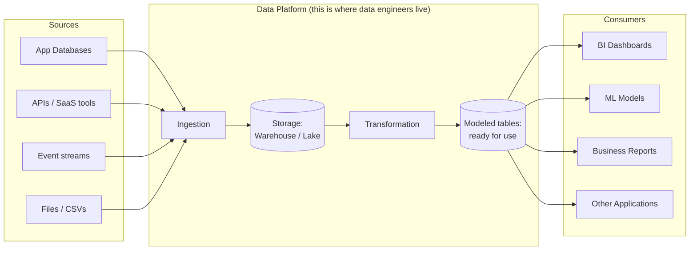

# Part 0 — Orientation

Welcome! Before we write a single line of SQL, let's answer three questions:
*what is data engineering, why is SQL central to it, and how do you get a working
SQL environment on your own machine in the next 15 minutes?*

## What is data engineering?

> **New term — data engineering**: the discipline of building and maintaining the
> systems that collect, move, store, and prepare data so that other people —
> analysts, data scientists, applications, executives — can reliably use it.

Think of it like plumbing for a city. Nobody at home thinks about the pipes until
the water doesn't come out of the tap. Data engineers build and maintain the
"pipes" that get data from where it's created (a website, a payment processor, a
mobile app) to where it's needed (a dashboard, a machine learning model, a
finance report) — cleanly, reliably, on time, securely, and without breaking the
bank.

A useful mental model of where data engineers work:



## Why SQL, specifically?

**SQL (Structured Query Language)** is how you talk to almost every storage
system a data engineer touches: transactional application databases, cloud data
warehouses (BigQuery, Snowflake, Redshift), and even modern data lakes
(via engines like Databricks SQL or Spark SQL). It has been the standard
language for working with structured data since the 1970s, and — unlike most
programming languages from that era — it is *more* relevant today than ever,
because every major cloud data platform released in the last decade chose SQL
as its primary interface.

> **New term — SQL**: a *declarative* language for asking questions of data.
> "Declarative" means you describe *what* result you want, not *how* to compute
> it step by step — the database figures out the "how" for you. This is
> different from most programming languages, which are *imperative* (you
> specify each step). You'll feel this difference the moment you write your
> first `SELECT`.

You will use SQL in this repo to:

- **Explore and query data** (Part 1)
- **Solve harder analytical problems** (Part 2)
- **Design schemas for both applications and analytics** (Part 3)
- **Build actual data pipelines** (Part 4)
- **Make everything fast and cheap at scale** (Part 5)
- **Keep everything secure and compliant** (Part 6)
- **Do all of the above on real cloud platforms** (Part 7)

## What this repo does *not* cover (and why)

To keep this focused and genuinely "zero to hero" instead of "zero to
overwhelmed," we deliberately do not teach a general-purpose programming
language (Python, Scala), a specific orchestration tool's full API, or
infrastructure-as-code. We introduce *concepts* like orchestration (Part 4) and
mention where tools like Airflow and dbt fit, because you need to recognize
them and know how SQL fits alongside them — but installing and mastering those
tools is a great "what's next" step, covered in
[Part 9 — Further Resources](../09-career-prep/04-further-resources/).

## Setting up your environment

We'll use **PostgreSQL** — a free, open-source, industry-standard relational
database — for every hands-on exercise in Parts 1–6. It's the best learning
choice because it closely follows the ANSI SQL standard, so what you learn
transfers directly to almost any other SQL system, including the cloud
platforms in Part 7.

> **New term — RDBMS**: a Relational Database Management System — software
> that stores data in tables and lets you query it with SQL. PostgreSQL,
> MySQL, SQL Server, and Oracle are all RDBMSs.

Pick **one** of these two paths:

### Option A — Install PostgreSQL locally (recommended)

1. Download the installer for your OS from
   [postgresql.org/download](https://www.postgresql.org/download/) and run it.
   Accept the defaults, and **remember the password** you set for the `postgres`
   superuser — you'll need it every time you connect.
2. Verify it's running:
   ```bash
   psql --version
   ```
3. Connect to the default database:
   ```bash
   psql -U postgres -h localhost
   ```

### Option B — Run PostgreSQL in Docker (if you already use Docker)

```bash
docker run --name northstar-postgres -e POSTGRES_PASSWORD=learning123 -p 5432:5432 -d postgres:16
psql -h localhost -U postgres
```

### Get a graphical client (optional but recommended for beginners)

A GUI makes it much easier to browse tables and see results as grids instead of
plain text. Any of these are free and work well:

- [DBeaver](https://dbeaver.io/) — works with every database in this repo, including
  the cloud platforms in Part 7. **This is what we recommend.**
- [pgAdmin](https://www.pgadmin.org/) — ships with the PostgreSQL installer, Postgres-only.
- [Azure Data Studio](https://learn.microsoft.com/sql/azure-data-studio/) — great if you're on Windows.

## Load the sample dataset

Every lesson in this repo uses one shared dataset — a fictional e-commerce
business called **NorthStar Retail**. Full details, an ER diagram, and setup
instructions are in [`datasets/`](../datasets/). Do that now:

```bash
psql -U postgres -h localhost -f ../datasets/postgres/00_schema.sql
psql -U postgres -h localhost -f ../datasets/postgres/01_seed_data.sql
```

## ✅ Try it yourself

Once loaded, run your very first query to confirm everything works:

```sql
SET search_path TO northstar;

SELECT first_name, last_name, country, signup_date
FROM customers
ORDER BY signup_date
LIMIT 5;
```

You should see five customers, sorted by who joined earliest. If you see
that — **congratulations, your environment works.** You're ready for
[Part 1, Module 1: Databases 101](../01-sql-foundations/01-databases-101/).

<details>
<summary>🤔 Didn't work? Click for common fixes</summary>

- **`psql: command not found`** — the PostgreSQL `bin` folder isn't on your
  PATH. On Windows, search for "psql.exe" in your PostgreSQL install
  directory (typically `C:\Program Files\PostgreSQL\<version>\bin`) and add
  that folder to your PATH environment variable, then open a new terminal.
- **`password authentication failed`** — double check the password you set
  during installation; on Docker, it's whatever you passed to `POSTGRES_PASSWORD`.
- **`relation "customers" does not exist`** — you forgot `SET search_path TO
  northstar;`, or the seed scripts didn't run successfully. Re-run
  `00_schema.sql` then `01_seed_data.sql` and check for red error text.
- **Still stuck?** Open an issue on this repo describing exactly what command
  you ran and the exact error message.

</details>

## 🧠 Quick check

<details>
<summary>Q: Why did we install PostgreSQL instead of using SQLite for a beginner repo?</summary>

SQLite is simpler to set up (no server, just a file), but it's missing several
features data engineers rely on daily — full window function support, proper
user/role management, stored procedures, and more. PostgreSQL gives you a
setup that is genuinely representative of professional environments, so
nothing you learn here needs to be "unlearned" later.
</details>

<details>
<summary>Q: Is SQL a programming language?</summary>

It depends who you ask! SQL can create logic (with `CASE`, functions, and
procedural extensions), but on its own it's not "Turing complete" in the way
languages like Python are — you don't write loops and general algorithms in
plain SQL. Most people call it a **query language** or **declarative
language**, and that distinction is important context, not just trivia: it's
*why* SQL is easier to learn than a general-purpose language, and *why* the
database — not you — decides how to actually execute your query (this becomes
very important in [Part 5 — Performance](../05-performance-and-optimization/)).
</details>

---
⬅ [Back to README](../README.md) | ➡ Next: [Part 1 — SQL Foundations](../01-sql-foundations/01-databases-101/)
