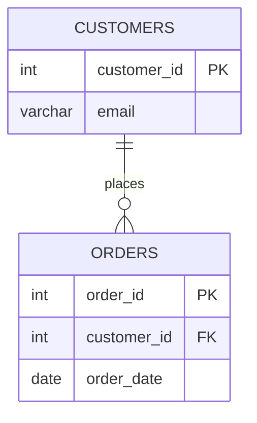
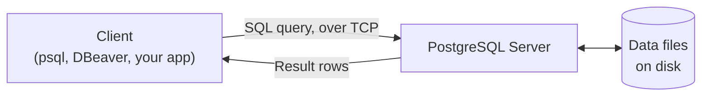

# 01. Databases 101

*Part of [Part 1 — SQL Foundations](../). Previous: [Orientation](../../00-orientation/).*

## What is a database?

> **New term — database**: an organized collection of data, stored electronically,
> designed to be easily accessed, managed, and updated.

That's deliberately broad — a spreadsheet is technically a tiny database. What
makes the databases we use in data engineering different is that they're built
to handle **far more data than fits in memory**, **many people/programs reading
and writing at once**, and to **guarantee your data doesn't get corrupted** even
if the power goes out mid-write. That's what dedicated database software gives you.

## RDBMS: the kind of database this repo teaches

> **New term — RDBMS (Relational Database Management System)**: software that
> stores data as a set of **tables**, where tables can be linked together
> ("related") through shared values. PostgreSQL, MySQL, SQL Server, Oracle,
> Snowflake, and BigQuery are all RDBMSs (or close enough for our purposes).

The word "relational" doesn't mean "tables relate to each other" (though they
do) — it comes from *relation*, the formal mathematical term for a table. The
theory behind RDBMSs was invented in 1970 by Edgar F. Codd at IBM, and it has
proven so useful that, over 50 years later, it's still how most of the world's
structured data is stored.

### Anatomy of a table

Here's the `customers` table from our sample dataset:

| customer_id | first_name | last_name | email | country | signup_date | is_active |
|---|---|---|---|---|---|---|
| 1 | Emma | Smith | emma.smith1@example.com | Canada | 2022-03-14 | true |
| 2 | Liam | Johnson | liam.johnson2@example.com | Germany | 2022-07-02 | true |
| 3 | Olivia | Brown | olivia.brown3@example.com | Spain | 2023-01-19 | false |

- **New term — row** (also called a *record* or *tuple*): one complete entry —
  here, one customer. Reading across a row tells you everything about that one thing.
- **New term — column** (also called a *field* or *attribute*): one property
  shared by every row — here, `email` is a column every customer has a value for.
- **New term — schema** (table sense): the structure of a table — its column
  names, data types, and constraints — *before* any data is in it. (Confusingly,
  "schema" also means "a named group of tables" — like our `northstar` schema.
  You'll learn to tell which meaning is intended from context; we'll flag it
  when it matters.)

### Data types

Every column has a declared **data type**, which controls what values it can
hold and how it's stored and compared. Here are the ones you'll see constantly:

| Data type | Stores | Example |
|---|---|---|
| `INTEGER` / `SERIAL` | Whole numbers (`SERIAL` also auto-increments — perfect for IDs) | `42` |
| `NUMERIC(p,s)` | Exact decimal numbers — always use this for money, never floating point | `19.99` |
| `VARCHAR(n)` / `TEXT` | Text, `VARCHAR(n)` caps the length at `n` characters | `'Emma'` |
| `DATE` | A calendar date, no time | `2024-03-14` |
| `TIMESTAMP` | Date and time together | `2024-03-14 09:30:00` |
| `BOOLEAN` | True or false | `true` |
| `JSONB` | Semi-structured JSON data (covered in [Part 2](../../02-intermediate-advanced-sql/06-json-and-semistructured-data/)) | `{"key": "value"}` |

> **New term — constraint**: a rule the database enforces automatically, so bad
> data can never even be saved. `NOT NULL` (a value is required), `UNIQUE` (no
> duplicates allowed), and `CHECK` (a custom rule, e.g. `quantity > 0`) are all
> constraints you saw already in [`datasets/postgres/00_schema.sql`](../../datasets/postgres/00_schema.sql).

### Keys and relationships

> **New term — primary key (PK)**: the column (or columns) that uniquely
> identifies each row in a table. No two rows can share one, and it can never
> be `NULL`. `customer_id` is the primary key of `customers`.

> **New term — foreign key (FK)**: a column in one table that refers to the
> primary key of another table, creating a link between them. `orders.customer_id`
> is a foreign key pointing at `customers.customer_id` — it's how the database
> knows *which customer* placed *which order*.

This is the relational part of RDBMS in action:



Read `||--o{` as "exactly one, to zero-or-many": one customer can place many
orders (or none yet), but every order belongs to exactly one customer. You'll
use this exact notation throughout the repo — see the full dataset diagram in
[`datasets/README.md`](../../datasets/README.md).

## Client-server architecture

When you run `psql` or open DBeaver, you are not "opening a file" the way you'd
open a spreadsheet. You are a **client** connecting over the network (even if
it's just `localhost`) to a **server** process (`postgres`) that owns the actual
data files on disk and is the only thing allowed to touch them directly.



This matters because **many clients can connect to the same server at once** —
your laptop, a colleague's laptop, and a production application can all query
the same database simultaneously. The server coordinates all of that safely,
which is a huge part of what "database management system" means.

## ✅ Try it yourself

Connect to the sample database and inspect a table's structure directly:

```sql
SET search_path TO northstar;

-- List every column in the products table, with its data type
SELECT column_name, data_type, is_nullable
FROM information_schema.columns
WHERE table_name = 'products';
```

> **New term — `information_schema`**: a built-in set of views every ANSI-SQL
> database provides, describing the database's own structure — its tables,
> columns, and constraints. Querying your database *about itself* is a real
> data engineering skill (it's how automated tooling discovers schemas).

If you're using a GUI client like DBeaver, you can also just browse to the
`northstar` schema in the sidebar and expand `products` to see the same thing
visually — try both approaches.

### Exercise

1. Using `information_schema.columns`, list the columns of the `orders` table.
2. Identify which column is the primary key and which two columns are foreign
   keys (hint: compare the names to what you know about `customers` and `employees`).

<details>
<summary>💡 Solution</summary>

```sql
SELECT column_name, data_type, is_nullable
FROM information_schema.columns
WHERE table_name = 'orders';
```

- Primary key: `order_id`
- Foreign keys: `customer_id` (references `customers.customer_id`) and
  `employee_id` (references `employees.employee_id`)

You can verify constraint names explicitly with:

```sql
SELECT conname, contype, conrelid::regclass AS table_name
FROM pg_constraint
WHERE conrelid = 'northstar.orders'::regclass;
```

(`contype = 'p'` is a primary key, `'f'` is a foreign key — this queries
PostgreSQL's own internal catalog, one level deeper than `information_schema`.)
</details>

## 🧠 Quick check

<details>
<summary>Q: Can a foreign key column contain a value that doesn't exist in the referenced table?</summary>

No — that's the entire point of declaring it as a foreign key. The database
will reject (with an error) any `INSERT` or `UPDATE` that would create an
`orders.customer_id` value that doesn't exist in `customers.customer_id`. This
guarantee is called **referential integrity**, and it's one of the most
valuable things an RDBMS does for you automatically.
</details>

<details>
<summary>Q: Why is NUMERIC preferred over floating point (REAL/FLOAT) for money?</summary>

Floating-point types store an *approximation* of decimal numbers in binary,
which can cause tiny rounding errors (`0.1 + 0.2` famously doesn't equal
`0.3` in floating point). `NUMERIC` stores exact decimal digits, so
`19.99 + 5.01` is guaranteed to be exactly `25.00`. Never use floating point
for currency.
</details>

---
⬅ [Back to Part 1](../) | ➡ Next: [02. Basic Queries](../02-basic-queries/)
