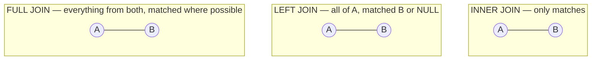

# 05. Joins

*Part of [Part 1 — SQL Foundations](../). Previous: [04. Aggregations](../04-aggregations/).*

This is arguably the single most important module in Part 1. **Joins are how
you combine data that's spread across multiple tables** — and in a properly
normalized database (see [Part 3](../../03-database-design-and-modeling/01-normalization-and-keys/)),
almost everything you want to ask requires one.

> **New term — join**: a SQL operation that combines rows from two (or more)
> tables based on a related column between them.

## Why data lives in separate tables at all

Our `orders` table doesn't store the customer's name or email — just a
`customer_id`. This is deliberate (you'll learn exactly why in
[Part 3 — Normalization](../../03-database-design-and-modeling/01-normalization-and-keys/)):
it avoids repeating the customer's info on every single one of their orders.
The tradeoff is that answering "which **customer** placed order #57?" now
requires *joining* `orders` to `customers`.

## Grain: know what one row means, before you join

> **New term — grain** (recap from [`datasets/README.md`](../../datasets/README.md)):
> what a single row in a table represents.

This is the #1 thing to check before writing any join. If you join
`orders` (grain: one order) to `order_items` (grain: one line item within an
order), your result's grain becomes **one line item** — meaning a single order
with 3 items will appear as 3 rows in your joined result, each repeating the
order's details. This is correct and expected, but it's a classic beginner
trap when someone then runs `SUM(order_total)` on the joined result and gets
inflated totals from unintentional duplication.

## `INNER JOIN`: only matching rows from both sides

```sql
SET search_path TO northstar;

SELECT
    o.order_id,
    c.first_name,
    c.last_name,
    o.order_date
FROM orders AS o
INNER JOIN customers AS c
    ON o.customer_id = c.customer_id
ORDER BY o.order_id
LIMIT 10;
```

- `ON o.customer_id = c.customer_id` is the **join condition** — it tells the
  database how rows in `orders` relate to rows in `customers`.
- `o` and `c` are table aliases — essential once you're joining tables whose
  columns might collide, and just good practice always.
- `INNER JOIN` (often written just `JOIN`) keeps **only** rows where the join
  condition matches on both sides. An order with a `customer_id` that somehow
  doesn't exist in `customers` would be silently dropped (though our foreign
  key constraint from [Module 01](../01-databases-101/) makes that impossible here).

## The join types, visually



Think of it in terms of a left table `A` and a right table `B`:

| Join type | Keeps |
|---|---|
| `INNER JOIN` | Only rows where the condition matches in **both** tables |
| `LEFT JOIN` | **All** rows from the left table, matched columns from the right (or `NULL` if no match) |
| `RIGHT JOIN` | **All** rows from the right table, matched columns from the left (or `NULL` if no match) |
| `FULL JOIN` | **All** rows from both tables, `NULL` on whichever side didn't match |
| `CROSS JOIN` | Every possible combination of rows from both tables (no condition) |

> 💡 In practice, `RIGHT JOIN` is rarely used — anything you can write with
> `RIGHT JOIN` you can write more readably as a `LEFT JOIN` by swapping which
> table you list first. Most style guides (including this repo's) prefer
> sticking to `LEFT JOIN` for that reason.

## `LEFT JOIN`: keep everything on the left, even without a match

This is how you answer "which customers have placed **zero** orders?" —
something an `INNER JOIN` can never tell you, because it only shows matches.

```sql
SELECT
    c.customer_id,
    c.first_name,
    c.last_name,
    o.order_id
FROM customers AS c
LEFT JOIN orders AS o
    ON c.customer_id = o.customer_id
WHERE o.order_id IS NULL;     -- customers with NO matching order at all
```

Notice the pattern: `LEFT JOIN` + `WHERE <right_table>.<col> IS NULL` is the
standard idiom for "find things in A with no matching row in B." It works
because unmatched left rows get `NULL` in every right-table column.

> 🪤 **Common pitfall**: if you filter on a right-table column in `WHERE`
> using anything *other* than `IS NULL`/`IS NOT NULL` (e.g. `WHERE
> o.order_status = 'delivered'`), you accidentally turn your `LEFT JOIN` back
> into something that behaves like an `INNER JOIN` — because unmatched rows
> have `NULL` there, and `NULL = 'delivered'` is `UNKNOWN`, which `WHERE`
> discards. If you need to filter the right side while still keeping
> unmatched left rows, put that condition in the `ON` clause instead:

```sql
-- Keeps ALL customers; only counts delivered orders for those who have any
SELECT
    c.customer_id,
    o.order_id
FROM customers AS c
LEFT JOIN orders AS o
    ON c.customer_id = o.customer_id
    AND o.order_status = 'delivered';   -- condition on the JOIN, not WHERE
```

## `FULL JOIN`: everything from both sides

Rarely needed with foreign-key-linked tables like ours (every order really
does have a customer), but essential when reconciling two independent
datasets that *should* overlap but might not perfectly — a very common data
engineering task (e.g., comparing yesterday's export to today's).

```sql
SELECT COALESCE(a.category, b.category) AS category, a.num_products, b.num_orders
FROM (SELECT category, COUNT(*) AS num_products FROM products GROUP BY category) a
FULL JOIN (SELECT p.category, COUNT(*) AS num_orders
           FROM order_items oi JOIN products p ON oi.product_id = p.product_id
           GROUP BY p.category) b
    ON a.category = b.category;
```

(Don't worry about the subqueries here yet — that's next module. Focus on the `FULL JOIN` itself.)

## `SELF JOIN`: joining a table to itself

A self join is just a regular join where both tables happen to be the same
table, given two different aliases. It's how you traverse the manager
hierarchy in `employees`:

```sql
SELECT
    e.full_name  AS employee,
    m.full_name  AS manager
FROM employees AS e
LEFT JOIN employees AS m
    ON e.manager_id = m.employee_id
ORDER BY manager NULLS FIRST, employee;
```

We use `LEFT JOIN` (not `INNER JOIN`) because the CEO has `manager_id IS
NULL` — an `INNER JOIN` would silently drop her from the results entirely.

## `CROSS JOIN`: every combination

```sql
-- Every possible (category, country) pairing — useful for building a
-- complete grid to later LEFT JOIN real data onto, so gaps show up as
-- explicit zeros instead of missing rows.
SELECT DISTINCT p.category, c.country
FROM products p
CROSS JOIN customers c;
```

If `products` has 40 rows and `customers` has 200, this returns up to 8,000
rows — `CROSS JOIN` has no condition, so it's every row of A paired with
every row of B. Used deliberately (like the grid example above) it's a
genuinely useful tool; used by accident (forgetting a join condition) it's
one of the most common and expensive beginner mistakes, especially once
tables have thousands or millions of rows.

## Joining more than two tables

Chain joins one after another — order rarely matters for correctness (though
it can matter for performance, see [Part 5](../../05-performance-and-optimization/)):

```sql
SELECT
    o.order_id,
    c.first_name || ' ' || c.last_name AS customer_name,
    p.product_name,
    oi.quantity,
    oi.unit_price,
    (oi.quantity * oi.unit_price) AS line_total
FROM orders AS o
JOIN customers AS c    ON o.customer_id = c.customer_id
JOIN order_items AS oi ON o.order_id = oi.order_id
JOIN products AS p     ON oi.product_id = p.product_id
ORDER BY o.order_id
LIMIT 10;
```

## ✅ Try it yourself

```sql
SET search_path TO northstar;

-- Total revenue per customer, including customers with $0 (no orders yet)
SELECT
    c.customer_id,
    c.first_name,
    c.last_name,
    COALESCE(SUM(oi.quantity * oi.unit_price), 0) AS lifetime_revenue
FROM customers AS c
LEFT JOIN orders AS o      ON c.customer_id = o.customer_id
LEFT JOIN order_items AS oi ON o.order_id = oi.order_id
GROUP BY c.customer_id, c.first_name, c.last_name
ORDER BY lifetime_revenue DESC
LIMIT 10;
```

(`COALESCE` returns its first non-`NULL` argument — covered fully in
[09. CASE & Conditional Logic](../09-case-and-conditional-logic/). Here it
turns `NULL` sums, from customers with zero orders, into `0`.)

### Exercises

1. List every order along with the employee who handled it (full name). Make
   sure orders with **no** assigned employee still appear, with `NULL` for the employee name.
2. Find all products that have **never** been ordered (hint: `LEFT JOIN` +
   `IS NULL`, same idiom as the customers example above).
3. For the org chart self-join example, add a third level: show each
   employee, their manager, and their manager's manager (hint: you'll need
   two self-joins to the same table with two different aliases).

<details>
<summary>💡 Solutions</summary>

```sql
-- 1.
SELECT
    o.order_id,
    e.full_name AS employee_name
FROM orders AS o
LEFT JOIN employees AS e
    ON o.employee_id = e.employee_id
ORDER BY o.order_id;

-- 2.
SELECT p.product_id, p.product_name
FROM products AS p
LEFT JOIN order_items AS oi
    ON p.product_id = oi.product_id
WHERE oi.order_item_id IS NULL;

-- 3.
SELECT
    e.full_name  AS employee,
    m.full_name  AS manager,
    gm.full_name AS grand_manager
FROM employees AS e
LEFT JOIN employees AS m  ON e.manager_id = m.employee_id
LEFT JOIN employees AS gm ON m.manager_id = gm.employee_id
ORDER BY employee;
```
</details>

## 🧠 Quick check

<details>
<summary>Q: You LEFT JOIN orders to order_items and get more rows than orders.count(). Is something broken?</summary>

No — that's expected and correct. The grain of the joined result becomes
"one order item," and most orders have multiple items (1 to 5 in our sample
data), so the row count naturally grows. This is the "grain" concept from
the top of this module in action — always know what grain your join produces.
</details>

<details>
<summary>Q: Why did we put `o.order_status = 'delivered'` in the ON clause instead of WHERE in the LEFT JOIN example?</summary>

Putting it in `WHERE` filters the *final result* after the join, which
discards unmatched left rows (their `NULL` right-side columns can never equal
`'delivered'`), silently turning the `LEFT JOIN` into an `INNER JOIN` in
effect. Putting it in `ON` filters *which right-side rows are eligible to
match* during the join itself, so unmatched left rows are still kept (with
`NULL`s) if no delivered order exists for them.
</details>

---
⬅ [Back to Part 1](../) | ➡ Next: [06. Subqueries & CTEs](../06-subqueries-and-ctes/)
