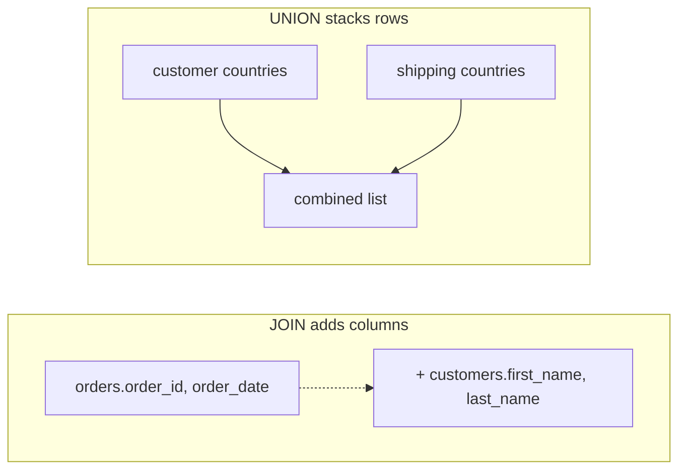

# 07. Set Operations

*Part of [Part 1 — SQL Foundations](../). Previous: [06. Subqueries & CTEs](../06-subqueries-and-ctes/).*

Joins combine tables **side by side** (adding columns). Set operations
combine query results **on top of each other** (stacking or comparing rows).
They come directly from mathematical set theory — union, intersection, and
difference — applied to rows of data.

## The rule for all set operations

Every set operation combines two (or more) `SELECT` statements, and both
sides must have:

1. The **same number of columns**
2. **Compatible data types** in each corresponding position

Column *names* don't need to match — the result takes its column names from
the first `SELECT`.

## `UNION` and `UNION ALL`: stacking rows

```sql
SET search_path TO northstar;

-- All countries that appear either as a customer's home country
-- or as an order's shipping country, no duplicates
SELECT country FROM customers
UNION
SELECT shipping_country FROM orders;
```

`UNION` removes duplicate rows from the combined result (like `DISTINCT`
across both queries' output). `UNION ALL` keeps every row, including duplicates:

```sql
SELECT country FROM customers
UNION ALL
SELECT shipping_country FROM orders;
```

> ⚠️ **Performance note**: `UNION` has to compare every row against every
> other row to remove duplicates, which costs real work. If you already know
> there can't be duplicates (or don't care), **always prefer `UNION ALL`** —
> it's meaningfully faster, especially at scale. This becomes very relevant
> in [Part 5](../../05-performance-and-optimization/).

A realistic use case: combining data of the *same shape* from different
sources — for example, if NorthStar Retail had a legacy `orders_2023` table
and a new `orders_2024` table, `UNION ALL` is exactly how you'd query "all
orders across both years" as one result.

## `INTERSECT`: rows that appear in both queries

```sql
-- Countries that are BOTH a customer's home country AND used as a shipping country
SELECT country FROM customers
INTERSECT
SELECT shipping_country FROM orders;
```

`INTERSECT` keeps only rows that show up in **both** result sets.

## `EXCEPT`: rows in the first query but not the second

```sql
-- Countries customers live in, that have NEVER been used as a shipping destination
SELECT country FROM customers
EXCEPT
SELECT shipping_country FROM orders;
```

(In our data this will likely be empty, since `shipping_country` is copied
from the customer's `country` when orders are placed — a good way to sanity-check
that assumption yourself!)

> 💡 Some databases (MySQL, for example) call this operator `MINUS` instead
> of `EXCEPT` — same concept, different keyword. PostgreSQL, SQL Server, and
> ANSI standard SQL all use `EXCEPT`.

## Set operations vs. joins: when to use which

This is the conceptual question worth internalizing:

| | Joins | Set operations |
|---|---|---|
| Combine... | Columns, side by side | Rows, stacked |
| Requires... | A relationship (`ON` condition) | Same column count/types |
| Answers... | "Show me related data from two tables together" | "Show me rows that are in A, in B, in both, or in one but not the other" |



## `EXCEPT` for data reconciliation — a real data engineering use

Comparing two tables that *should* be identical (say, a source system export
vs. what landed in your warehouse) is a daily data engineering task, and
`EXCEPT` is the cleanest way to find mismatches:

```sql
-- Rows in "expected" but missing (or different) in "actual"
SELECT * FROM expected_snapshot
EXCEPT
SELECT * FROM actual_table;
```

If this returns zero rows, the tables match exactly on every column you
selected. We'll build on this exact pattern in
[Part 4 — Data Quality & Testing](../../04-data-engineering-with-sql/04-data-quality-and-testing/).

## ✅ Try it yourself

```sql
SET search_path TO northstar;

-- Employees who are managers, UNION employees who are NOT managers, but
-- tagged so you can tell which group each row came from
SELECT full_name, 'manager' AS role_type
FROM employees
WHERE employee_id IN (SELECT DISTINCT manager_id FROM employees WHERE manager_id IS NOT NULL)

UNION ALL

SELECT full_name, 'individual_contributor' AS role_type
FROM employees
WHERE employee_id NOT IN (SELECT DISTINCT manager_id FROM employees WHERE manager_id IS NOT NULL)

ORDER BY role_type, full_name;
```

### Exercises

1. Using `UNION`, list every distinct `payment_method` that appears in
   `payments` alongside a made-up second list `SELECT 'crypto'` — confirm
   `'crypto'` shows up even though it's not real payment data (this shows
   `UNION` doesn't care where rows come from, just that the shape matches).
2. Use `EXCEPT` to find any `order_status` values that exist in `orders` but
   were never explicitly documented in a list you provide (e.g., check
   against `VALUES ('placed'), ('shipped'), ('delivered')` — see if
   `'cancelled'` and `'returned'` show up as the difference).
3. Explain in your own words why `UNION ALL` between `orders.order_id` and
   `order_items.order_item_id` would be a meaningless query, even though it
   wouldn't cause a SQL error.

<details>
<summary>💡 Solutions</summary>

```sql
-- 1.
SELECT DISTINCT payment_method FROM payments
UNION
SELECT 'crypto';

-- 2.
SELECT order_status FROM orders
EXCEPT
SELECT * FROM (VALUES ('placed'), ('shipped'), ('delivered')) AS documented(order_status);

-- 3. (conceptual — no query needed)
-- Both are integers, so it wouldn't error, but order_id and order_item_id
-- are identifiers from two entirely different, unrelated entities (an order
-- vs. a line item). Stacking them produces a column of numbers with no
-- coherent meaning — a reminder that set operations require the columns to
-- be the SAME KIND OF THING, not just the same data type.
```
</details>

## 🧠 Quick check

<details>
<summary>Q: When should you use UNION instead of UNION ALL?</summary>

Only when you specifically need duplicates removed and you're willing to pay
the performance cost of that deduplication. If you're unsure whether
duplicates are possible, or don't care, default to `UNION ALL`.
</details>

<details>
<summary>Q: Can you use ORDER BY with a UNION?</summary>

Yes, but only once, at the very end of the whole combined statement — you
can't `ORDER BY` inside each individual `SELECT` that's part of the union
(with the narrow exception of using it inside a subquery combined with
`LIMIT`, which is a different situation).
</details>

---
⬅ [Back to Part 1](../) | ➡ Next: [08. String, Date & Numeric Functions](../08-string-date-numeric-functions/)
