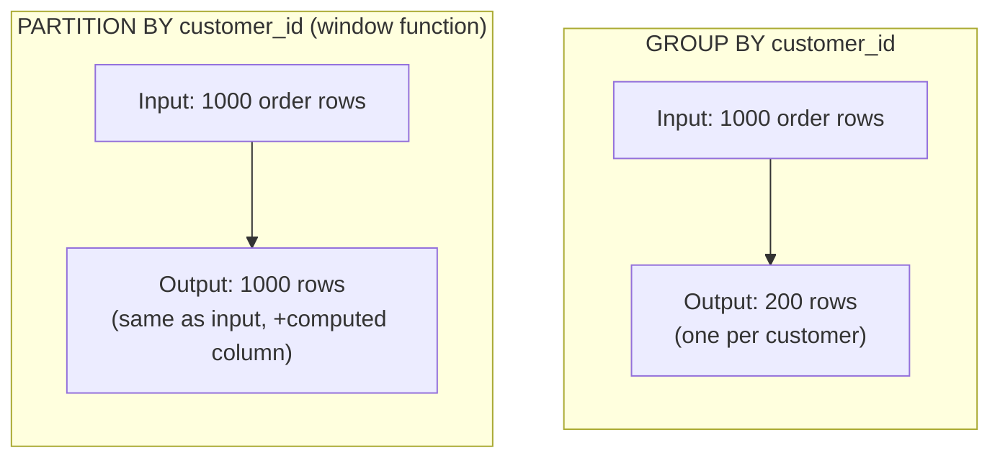
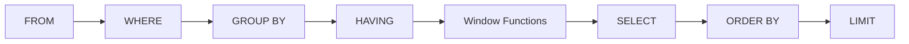

# 01. Window Functions

*Part of [Part 2 — Intermediate & Advanced SQL](../). Previous: [Part 1 — SQL Foundations](../../01-sql-foundations/).*

If there's one topic that instantly signals "this person actually knows SQL"
in an interview, it's window functions. They solve a whole category of
problems that `GROUP BY` fundamentally cannot: **"compute something across a
set of related rows, but still show me every individual row."**

## The problem window functions solve

Recall from [Module 04](../../01-sql-foundations/04-aggregations/) that
`GROUP BY` **collapses** rows — one input group becomes one output row. But
what if you want to know, say, each order's rank by size *and* still see
every order individually, side by side with its rank? `GROUP BY` can't do
that; it would collapse your orders down to one row per group.

> **New term — window function**: a function that performs a calculation
> across a set of rows related to the current row — **without** collapsing
> the result into fewer rows. Each input row stays, with an extra computed
> column added.

## Anatomy of a window function: `OVER()`

```sql
SET search_path TO northstar;

SELECT
    order_id,
    customer_id,
    order_date,
    ROW_NUMBER() OVER (ORDER BY order_date) AS row_num
FROM orders
LIMIT 10;
```

The `OVER (...)` clause is what makes this a window function instead of a
regular one. It defines the "window" — the set of rows the function
considers for each row's calculation. Every window function follows this
shape: `function_name(...) OVER (window_definition)`.

## `PARTITION BY`: resetting the window per group

This is the single most important concept in this module — think of
`PARTITION BY` as "`GROUP BY`, but without collapsing rows":

```sql
SELECT
    order_id,
    customer_id,
    order_date,
    ROW_NUMBER() OVER (PARTITION BY customer_id ORDER BY order_date) AS order_sequence
FROM orders
ORDER BY customer_id, order_date;
```

This numbers each customer's orders `1, 2, 3, ...` **independently per
customer** — customer 5's numbering restarts at 1, regardless of what number
customer 4 reached. Compare this side by side with `GROUP BY`:



## Ranking functions: `ROW_NUMBER`, `RANK`, `DENSE_RANK`

```sql
SELECT
    product_name,
    category,
    unit_price,
    ROW_NUMBER() OVER (PARTITION BY category ORDER BY unit_price DESC) AS row_num,
    RANK()       OVER (PARTITION BY category ORDER BY unit_price DESC) AS rank_num,
    DENSE_RANK() OVER (PARTITION BY category ORDER BY unit_price DESC) AS dense_rank_num
FROM products
ORDER BY category, unit_price DESC;
```

The difference only shows up when there are **ties**:

| Price | `ROW_NUMBER()` | `RANK()` | `DENSE_RANK()` |
|---|---|---|---|
| $100 | 1 | 1 | 1 |
| $100 (tie) | 2 | 1 | 1 |
| $90 | 3 | 3 | 2 |
| $80 | 4 | 4 | 3 |

- `ROW_NUMBER()` always gives unique, sequential numbers — ties are broken
  arbitrarily (by whatever order the database picks among ties, so include
  enough columns in `ORDER BY` to make ties impossible if you need
  determinism, e.g. add `, product_id`).
- `RANK()` gives ties the *same* rank, then **skips** the next number
  (two rows tied for 1st means the next row is ranked 3rd, not 2nd).
- `DENSE_RANK()` gives ties the same rank, but **does not skip** the next number.

A classic real use for `ROW_NUMBER()`: finding the **top N per group** —
something `LIMIT` alone can't do, because plain `LIMIT` applies to the whole
result, not per group:

```sql
-- The single most expensive product in each category
WITH ranked_products AS (
    SELECT
        product_name, category, unit_price,
        ROW_NUMBER() OVER (PARTITION BY category ORDER BY unit_price DESC) AS rn
    FROM products
)
SELECT product_name, category, unit_price
FROM ranked_products
WHERE rn = 1;
```

> 🪤 **Common pitfall**: you cannot use a window function's result directly
> in the same query's `WHERE` clause (`WHERE rn = 1` right after computing
> `rn` in `SELECT` fails) — window functions are evaluated *after* `WHERE`
> in the logical order (see the full diagram below). Wrap the query in a CTE
> or subquery, as above, and filter in the **outer** query instead.

## Offset functions: `LAG` and `LEAD`

These let you look at a **different row** relative to the current one —
extremely useful for period-over-period comparisons:

```sql
WITH monthly_revenue AS (
    SELECT
        DATE_TRUNC('month', o.order_date) AS month,
        SUM(oi.quantity * oi.unit_price)  AS revenue
    FROM orders o
    JOIN order_items oi ON o.order_id = oi.order_id
    GROUP BY DATE_TRUNC('month', o.order_date)
)
SELECT
    month,
    revenue,
    LAG(revenue)  OVER (ORDER BY month) AS prev_month_revenue,
    LEAD(revenue) OVER (ORDER BY month) AS next_month_revenue,
    revenue - LAG(revenue) OVER (ORDER BY month) AS change_vs_prev_month,
    ROUND(
        100.0 * (revenue - LAG(revenue) OVER (ORDER BY month)) / LAG(revenue) OVER (ORDER BY month),
        1
    ) AS pct_change
FROM monthly_revenue
ORDER BY month;
```

`LAG(column, n)` looks `n` rows **back** (default `n = 1`); `LEAD(column, n)`
looks `n` rows **forward**. Both return `NULL` when there's no such row
(e.g., `LAG` on the very first row) — exactly what you want for "no prior
month to compare to."

## Running totals and moving averages: window frames

So far every example uses the *default* frame implicitly. You can control
**exactly which rows** are included relative to the current row with a frame
clause:

```sql
SELECT
    order_date,
    daily_revenue,
    SUM(daily_revenue) OVER (
        ORDER BY order_date
        ROWS BETWEEN UNBOUNDED PRECEDING AND CURRENT ROW
    ) AS running_total,
    AVG(daily_revenue) OVER (
        ORDER BY order_date
        ROWS BETWEEN 6 PRECEDING AND CURRENT ROW
    ) AS trailing_7day_avg
FROM (
    SELECT o.order_date, SUM(oi.quantity * oi.unit_price) AS daily_revenue
    FROM orders o
    JOIN order_items oi ON o.order_id = oi.order_id
    GROUP BY o.order_date
) AS daily
ORDER BY order_date;
```

| Frame clause | Means |
|---|---|
| `ROWS BETWEEN UNBOUNDED PRECEDING AND CURRENT ROW` | Every row from the start up to and including this one — a running total |
| `ROWS BETWEEN 6 PRECEDING AND CURRENT ROW` | This row plus the 6 before it (7 total) — a trailing 7-day window |
| `ROWS BETWEEN CURRENT ROW AND UNBOUNDED FOLLOWING` | This row to the end — a "remaining total" |

> 💡 If you omit the frame clause entirely but include `ORDER BY` inside
> `OVER()`, most databases (including PostgreSQL) default to `RANGE BETWEEN
> UNBOUNDED PRECEDING AND CURRENT ROW` — which is *why* a plain `SUM(x) OVER
> (ORDER BY date)` already behaves like a running total without you writing
> the frame explicitly. Writing the frame out anyway is good practice — it
> makes your intent explicit instead of relying on a default a reader might not know.

## `FIRST_VALUE` and `LAST_VALUE`

```sql
SELECT
    order_id,
    customer_id,
    order_date,
    FIRST_VALUE(order_date) OVER (
        PARTITION BY customer_id ORDER BY order_date
    ) AS first_order_date
FROM orders
ORDER BY customer_id, order_date;
```

This tags every order with that customer's very first order date — handy for
cohort analysis ("group customers by the month of their first purchase").

## Where window functions fit in the logical order



Window functions run **after** `GROUP BY`/`HAVING` but **before** the final
`SELECT`/`ORDER BY`/`LIMIT` — which is exactly why you *can* combine
`GROUP BY` and window functions in one query (aggregate first, then window
over the aggregated groups), but can't filter a window function's result
with `WHERE` directly.

## ✅ Try it yourself

```sql
SET search_path TO northstar;

-- Each customer's orders, with a running total of their spend over time
WITH order_totals AS (
    SELECT
        o.order_id, o.customer_id, o.order_date,
        SUM(oi.quantity * oi.unit_price) AS order_total
    FROM orders o
    JOIN order_items oi ON o.order_id = oi.order_id
    GROUP BY o.order_id, o.customer_id, o.order_date
)
SELECT
    customer_id,
    order_date,
    order_total,
    SUM(order_total) OVER (
        PARTITION BY customer_id ORDER BY order_date
        ROWS BETWEEN UNBOUNDED PRECEDING AND CURRENT ROW
    ) AS running_customer_spend
FROM order_totals
ORDER BY customer_id, order_date;
```

### Exercises

1. For each employee, rank their handled orders by order value (largest
   first), and return only their top 3 highest-value orders.
2. For each product category, compute what percentage of that category's
   total revenue each product represents (hint: `SUM(x) OVER (PARTITION BY
   category)` as the denominator).
3. Using `LAG`, flag every order where the same customer placed **another**
   order within 7 days before it (a simple "repeat purchase burst" signal).

<details>
<summary>💡 Solutions</summary>

```sql
-- 1.
WITH order_values AS (
    SELECT
        o.order_id, o.employee_id,
        SUM(oi.quantity * oi.unit_price) AS order_total,
        ROW_NUMBER() OVER (PARTITION BY o.employee_id ORDER BY SUM(oi.quantity * oi.unit_price) DESC) AS rn
    FROM orders o
    JOIN order_items oi ON o.order_id = oi.order_id
    WHERE o.employee_id IS NOT NULL
    GROUP BY o.order_id, o.employee_id
)
SELECT employee_id, order_id, order_total
FROM order_values
WHERE rn <= 3
ORDER BY employee_id, rn;

-- 2.
WITH product_revenue AS (
    SELECT
        p.product_id, p.product_name, p.category,
        SUM(oi.quantity * oi.unit_price) AS product_revenue
    FROM products p
    JOIN order_items oi ON p.product_id = oi.product_id
    GROUP BY p.product_id, p.product_name, p.category
)
SELECT
    product_name, category, product_revenue,
    ROUND(100.0 * product_revenue / SUM(product_revenue) OVER (PARTITION BY category), 1) AS pct_of_category_revenue
FROM product_revenue
ORDER BY category, pct_of_category_revenue DESC;

-- 3.
SELECT
    order_id, customer_id, order_date,
    LAG(order_date) OVER (PARTITION BY customer_id ORDER BY order_date) AS prev_order_date,
    order_date - LAG(order_date) OVER (PARTITION BY customer_id ORDER BY order_date) AS days_since_prev,
    (order_date - LAG(order_date) OVER (PARTITION BY customer_id ORDER BY order_date)) <= 7 AS is_repeat_burst
FROM orders
ORDER BY customer_id, order_date;
```
</details>

## 🧠 Quick check

<details>
<summary>Q: What's the key difference between GROUP BY and PARTITION BY?</summary>

`GROUP BY` collapses each group into a single output row. `PARTITION BY`
(used inside a window function's `OVER()`) keeps every input row, computing
the value "as if" grouped, but attaching the result back to each individual row.
</details>

<details>
<summary>Q: Why can't you filter directly on a window function's alias in WHERE?</summary>

Because of logical evaluation order: window functions are computed after
`WHERE` (and after `GROUP BY`/`HAVING`) but before the final row list is
finalized. To filter on a window function's result, wrap the query in a CTE
or subquery and filter in the outer query, where the computed column already exists.
</details>

---
⬅ [Back to Part 2](../) | ➡ Next: [02. Advanced Aggregation](../02-advanced-aggregation/)
