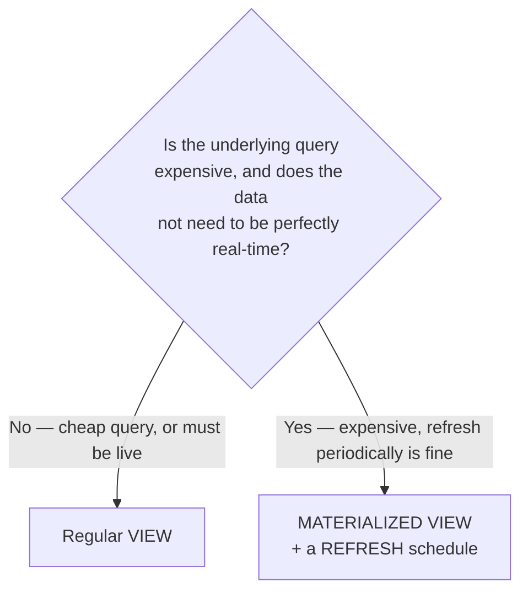

# 04. Views & Materialized Views

*Part of [Part 2 — Intermediate & Advanced SQL](../). Previous: [03. Data Modification & Transactions](../03-data-modification-and-transactions/).*

By now you've probably written the "order total" join-and-aggregate query
several times across different exercises. Repeating complex logic across
many queries is a maintenance headache waiting to happen — views are the fix.

## `CREATE VIEW`: a saved query you can treat like a table

> **New term — view**: a stored `SELECT` query, saved under a name, that you
> can query exactly like a table — but it holds no data of its own. Every
> time you query a view, the database re-runs its underlying query, live,
> against the current data.

```sql
SET search_path TO northstar;

CREATE VIEW order_summary AS
SELECT
    o.order_id,
    o.customer_id,
    o.order_date,
    o.order_status,
    SUM(oi.quantity * oi.unit_price) AS order_total,
    COUNT(oi.order_item_id) AS num_items
FROM orders o
JOIN order_items oi ON o.order_id = oi.order_id
GROUP BY o.order_id, o.customer_id, o.order_date, o.order_status;
```

Now anyone (including future-you) can just do:

```sql
SELECT * FROM order_summary WHERE order_total > 500 ORDER BY order_total DESC;
```

...without ever needing to know or repeat the join and aggregation logic
underneath. That's the core value of a view: **encapsulation** — hiding
complexity behind a simple, stable interface.

## Why use a view instead of just saving the SQL text somewhere?

- **Always current.** Because a view re-runs its query every time, it never
  goes stale the way a saved script's *output* would.
- **Composable.** You can `JOIN` a view to other tables, or build another
  view on top of it, just like a real table.
- **A single source of truth.** If the business logic for "order total"
  changes (e.g., you need to start excluding cancelled orders), you fix it
  in **one place** — the view definition — instead of hunting down every
  query that duplicated that logic.
- **Simpler permissions.** You can grant someone access to a view that only
  exposes certain columns or rows, without granting access to the full
  underlying table — a technique we'll build on heavily in
  [Part 6 — Security](../../06-security/04-data-masking-and-row-column-security/).

## Updating and dropping views

```sql
CREATE OR REPLACE VIEW order_summary AS
SELECT
    o.order_id, o.customer_id, o.order_date, o.order_status,
    SUM(oi.quantity * oi.unit_price) AS order_total,
    COUNT(oi.order_item_id) AS num_items
FROM orders o
JOIN order_items oi ON o.order_id = oi.order_id
WHERE o.order_status != 'cancelled'    -- logic change, applied everywhere at once
GROUP BY o.order_id, o.customer_id, o.order_date, o.order_status;

DROP VIEW order_summary;
```

## The tradeoff: views cost query time, every single time

A view is **not** a performance optimization — it's a readability and
maintainability one. Every time you query `order_summary`, PostgreSQL
re-executes the full join and aggregation underneath, against the live data,
from scratch. If the underlying tables are huge and the view is queried
constantly, that repeated computation adds up.

## `CREATE MATERIALIZED VIEW`: pre-computing and storing the result

> **New term — materialized view**: like a view, but the query's result is
> actually **computed once and stored on disk**, like a real table. Querying
> it is fast (no re-computation), but the data can become **stale** — it
> only reflects the underlying tables as of the last time it was refreshed.

```sql
CREATE MATERIALIZED VIEW monthly_revenue_summary AS
SELECT
    DATE_TRUNC('month', o.order_date) AS month,
    p.category,
    SUM(oi.quantity * oi.unit_price)  AS revenue,
    COUNT(DISTINCT o.order_id)        AS num_orders
FROM orders o
JOIN order_items oi ON o.order_id = oi.order_id
JOIN products p ON oi.product_id = p.product_id
GROUP BY DATE_TRUNC('month', o.order_date), p.category;

-- Querying this is now instant, no matter how complex the underlying joins were:
SELECT * FROM monthly_revenue_summary ORDER BY month, category;
```

When new orders come in, `monthly_revenue_summary` does **not** update
automatically — you must explicitly refresh it:

```sql
REFRESH MATERIALIZED VIEW monthly_revenue_summary;

-- Or, to allow queries to keep reading the old data WHILE the refresh runs
-- (requires a unique index on the materialized view first):
CREATE UNIQUE INDEX ON monthly_revenue_summary (month, category);
REFRESH MATERIALIZED VIEW CONCURRENTLY monthly_revenue_summary;
```

## View vs. materialized view: how to choose



| | Regular View | Materialized View |
|---|---|---|
| Stores data? | No — just the query | Yes — the actual result set |
| Always up to date? | Yes, always live | No — only as of last `REFRESH` |
| Query speed | As slow as the underlying query | Fast — pre-computed |
| Good for | Encapsulating logic, simple/cheap queries, security | Expensive aggregations queried often, dashboards, reports |

This exact tradeoff — freshness vs. speed vs. compute cost — reappears
constantly in data engineering, especially in
[Part 4 — Orchestration](../../04-data-engineering-with-sql/03-orchestration-basics/),
where "refresh this materialized view every hour" becomes a real scheduled
pipeline step, and in [Part 5 — Cloud Cost Optimization](../../05-performance-and-optimization/06-cloud-cost-optimization/),
where re-computing expensive aggregations on every single query can get very expensive.

## ✅ Try it yourself

```sql
SET search_path TO northstar;

CREATE VIEW customer_lifetime_value AS
SELECT
    c.customer_id,
    c.first_name,
    c.last_name,
    c.country,
    COALESCE(SUM(oi.quantity * oi.unit_price), 0) AS lifetime_value,
    COUNT(DISTINCT o.order_id) AS num_orders
FROM customers c
LEFT JOIN orders o ON c.customer_id = o.customer_id
LEFT JOIN order_items oi ON o.order_id = oi.order_id
GROUP BY c.customer_id, c.first_name, c.last_name, c.country;

SELECT * FROM customer_lifetime_value ORDER BY lifetime_value DESC LIMIT 10;
```

### Exercises

1. Create a view `active_product_catalog` that shows only non-discontinued
   products, with their profit margin percentage as an extra column (reuse
   the formula from [Module 08](../../01-sql-foundations/08-string-date-numeric-functions/)).
2. Convert `customer_lifetime_value` above into a materialized view instead,
   then write the `REFRESH` statement you'd run after loading new orders.
3. In your own words: if a dashboard needs to show "revenue in the last 5
   minutes," should it query a materialized view or a regular view? Why?

<details>
<summary>💡 Solutions</summary>

```sql
-- 1.
CREATE VIEW active_product_catalog AS
SELECT
    product_id, product_name, category, unit_price, cost_price,
    ROUND(((unit_price - cost_price) / unit_price) * 100, 1) AS margin_pct
FROM products
WHERE is_discontinued = false;

-- 2.
CREATE MATERIALIZED VIEW customer_lifetime_value_mat AS
SELECT
    c.customer_id, c.first_name, c.last_name, c.country,
    COALESCE(SUM(oi.quantity * oi.unit_price), 0) AS lifetime_value,
    COUNT(DISTINCT o.order_id) AS num_orders
FROM customers c
LEFT JOIN orders o ON c.customer_id = o.customer_id
LEFT JOIN order_items oi ON o.order_id = oi.order_id
GROUP BY c.customer_id, c.first_name, c.last_name, c.country;

REFRESH MATERIALIZED VIEW customer_lifetime_value_mat;

-- 3. (conceptual)
-- A regular view — real-time freshness is the explicit requirement here,
-- and a materialized view is only as fresh as its last REFRESH. A
-- materialized view would need to be refreshed continuously (e.g., every
-- few seconds) to meet a "last 5 minutes" requirement, which usually
-- defeats the purpose of materializing it in the first place.
```
</details>

## 🧠 Quick check

<details>
<summary>Q: Does a view store any data itself?</summary>

No. A regular view is purely a saved query definition — every time you
select from it, the database runs the underlying `SELECT` fresh against the
current data. Only a *materialized* view actually stores a computed result
on disk.
</details>

<details>
<summary>Q: If you REFRESH a materialized view, does it happen automatically on a schedule?</summary>

No — `REFRESH MATERIALIZED VIEW` must be triggered explicitly, either
manually or by something else calling it (a cron job, an orchestration tool
like Airflow, a `dbt` scheduled run). PostgreSQL doesn't auto-refresh
materialized views on its own; you'll see exactly how this fits into a real
pipeline schedule in [Part 4 — Orchestration Basics](../../04-data-engineering-with-sql/03-orchestration-basics/).
</details>

---
⬅ [Back to Part 2](../) | ➡ Next: [05. Stored Procedures, Functions & Triggers](../05-stored-procedures-functions-triggers/)
