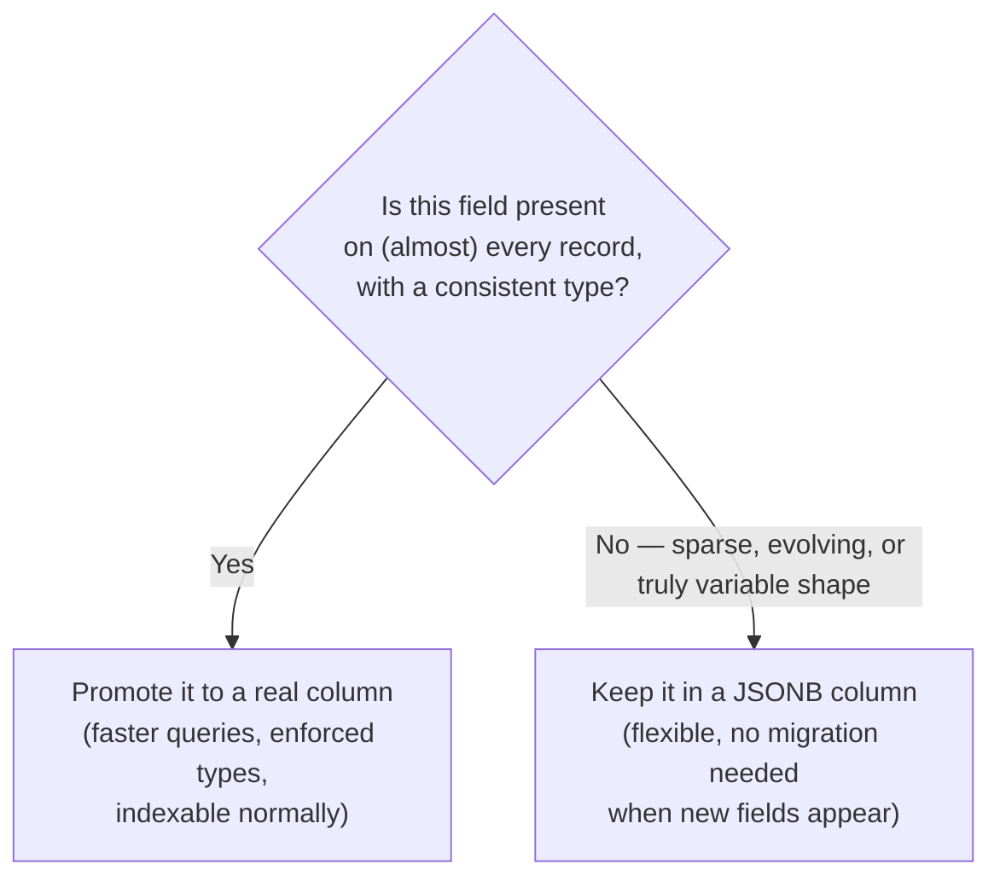

# 06. JSON & Semi-Structured Data

*Part of [Part 2 — Intermediate & Advanced SQL](../). Previous: [05. Stored Procedures, Functions & Triggers](../05-stored-procedures-functions-triggers/).*

Every table so far has had a fixed, rigid shape — every product has exactly
the same columns. Plenty of real-world data doesn't fit that mold: event
logs, API responses, and clickstream data have different fields depending on
the event type. This module covers querying that kind of data directly,
without forcing it into rigid columns first.

## Setup: a new table for this module

```bash
psql -U postgres -h localhost -f ../../datasets/postgres/03_web_events_addon.sql
```

This adds `web_events` — a table simulating clickstream data, where
`page_view`, `add_to_cart`, and `search` events each carry a *differently
shaped* JSON payload. See [`datasets/README.md`](../../datasets/README.md) for details.

## What is JSON, and why does a relational database support it?

> **New term — semi-structured data**: data with some structure (it has
> keys and values, possibly nested), but not a fixed, uniform schema across
> every record — unlike a normal table, where every row has exactly the same columns.

> **New term — JSON (JavaScript Object Notation)**: a lightweight, text-based
> format for representing structured data as key-value pairs and arrays.
> It's become the de facto standard for APIs and event data across the
> entire software industry.

Modern data platforms embraced JSON support specifically because so much
*source* data — API responses, application logs, IoT sensor readings — is
naturally shaped this way, and forcing it into a rigid relational schema
*before* you even land it can lose information or require constant schema
changes every time a new field appears upstream.

## `JSONB` vs `JSON` in PostgreSQL

PostgreSQL has two JSON types: `JSON` stores the exact text you inserted
(preserving whitespace and key order); `JSONB` stores it in a parsed, binary
form that's faster to query and supports indexing. **Almost always use
`JSONB`** — `JSON` exists mainly for cases needing the exact original text preserved.

## Looking at the data

```sql
SET search_path TO northstar;

SELECT event_type, payload
FROM web_events
LIMIT 5;
```

You'll see rows like:

```json
{"url": "/products/17", "referrer": "google", "device": "mobile"}
{"product_id": 8, "quantity": 2}
{"query": "backpack", "results_count": 12}
```

Same column, `payload`, three completely different shapes — this is exactly
the flexibility rigid table columns can't offer.

## Extracting values: `->` and `->>`

```sql
SELECT
    event_id,
    event_type,
    payload -> 'url'          AS url_as_json,     -- returns JSONB
    payload ->> 'url'         AS url_as_text,      -- returns TEXT
    payload ->> 'device'      AS device
FROM web_events
WHERE event_type = 'page_view'
LIMIT 5;
```

| Operator | Returns | When to use |
|---|---|---|
| `->` | `JSONB` | You need to keep drilling into nested JSON |
| `->>` | `TEXT` | You want the final, plain value (to compare, cast, group by) |

For nested JSON, chain `->` until the last step, then use `->>`:

```sql
-- If payload were {"address": {"city": "Berlin"}}, you'd write:
-- payload -> 'address' ->> 'city'
```

## Filtering on JSON fields

```sql
-- Every add_to_cart event for a specific product
SELECT event_id, customer_id, payload
FROM web_events
WHERE event_type = 'add_to_cart'
  AND (payload ->> 'product_id')::INTEGER = 7;

-- Searches that returned zero results — a real "content gap" signal
SELECT payload ->> 'query' AS search_term, COUNT(*) AS num_searches
FROM web_events
WHERE event_type = 'search' AND (payload ->> 'results_count')::INTEGER = 0
GROUP BY payload ->> 'query'
ORDER BY num_searches DESC;
```

> 🪤 **Common pitfall**: `->>` always returns `TEXT`, even for numbers. You
> must explicitly cast it (`::INTEGER`, `::NUMERIC`) before doing numeric
> comparisons or math — `payload ->> 'results_count' = 0` compares text `'0'`
> to an integer and will error or behave unexpectedly depending on context;
> `(payload ->> 'results_count')::INTEGER = 0` is correct.

## `?`: does this key exist?

```sql
-- Page views that included a 'device' field (defensive check —
-- useful when payload shape might vary or evolve over time)
SELECT event_id, payload
FROM web_events
WHERE event_type = 'page_view' AND payload ? 'device';
```

## `@>`: containment — does the JSON include this structure?

```sql
-- Every event where device was specifically 'mobile'
SELECT event_id, payload
FROM web_events
WHERE payload @> '{"device": "mobile"}'::jsonb;
```

`@>` checks whether the left JSONB value "contains" the right one — useful
for matching on one or more key/value pairs at once, and it's the operator a
GIN index (added in the setup script) speeds up dramatically at scale.

## Building JSON: the other direction

Sometimes you need to go from relational rows *into* JSON — for example,
producing an API-friendly export:

```sql
SELECT
    c.customer_id,
    jsonb_build_object(
        'name', c.first_name || ' ' || c.last_name,
        'country', c.country,
        'recent_orders', (
            SELECT jsonb_agg(jsonb_build_object('order_id', o.order_id, 'date', o.order_date))
            FROM orders o
            WHERE o.customer_id = c.customer_id
        )
    ) AS customer_json
FROM customers c
LIMIT 3;
```

`jsonb_build_object` constructs a JSON object from key/value pairs;
`jsonb_agg` aggregates multiple rows into a JSON array — the semi-structured
mirror image of `->`/`->>` pulling values back out.

## Expanding JSON arrays: `jsonb_array_elements`

If a payload contained an array (say, `{"tags": ["sale", "clearance"]}`),
you'd "unnest" it into one row per array element:

```sql
-- Hypothetical example — turns one row with an array into multiple rows
SELECT event_id, tag
FROM web_events, jsonb_array_elements_text(payload -> 'tags') AS tag
WHERE payload ? 'tags';
```

This pattern — unnesting a nested/array structure into rows — comes up
constantly with real API data (e.g., an order with an array of line items
embedded directly in JSON, instead of a separate `order_items` table).

## The bigger question: when should semi-structured data become "real" columns?

This is a genuine, important data modeling decision, not just syntax.



A common, effective real-world pattern: land raw JSON exactly as received
(preserving everything, in case you need a field later), then have your
transformation layer (see [Part 4](../../04-data-engineering-with-sql/))
extract the fields that matter into proper, typed columns for anything
queried often or joined against — getting the flexibility of JSON at
ingestion *and* the performance/clarity of relational columns downstream.
We'll revisit this exact idea as the "bronze → silver" step of the Medallion
architecture in [Part 3](../../03-database-design-and-modeling/04-modern-modeling-patterns/).

## ✅ Try it yourself

```sql
SET search_path TO northstar;

-- Which referrer source drives the most page views?
SELECT
    payload ->> 'referrer' AS referrer,
    COUNT(*) AS num_page_views
FROM web_events
WHERE event_type = 'page_view'
GROUP BY payload ->> 'referrer'
ORDER BY num_page_views DESC;
```

### Exercises

1. Find the average `results_count` for `search` events, grouped by search `query`.
2. Find every `add_to_cart` event where `quantity` was greater than 2, and
   join to `products` to show the product name (hint: cast `product_id` to
   `INTEGER` first).
3. Using `@>`, find every `page_view` event that came from a `'mobile'`
   device **and** had `referrer` equal to `'social'` in one containment check.

<details>
<summary>💡 Solutions</summary>

```sql
-- 1.
SELECT
    payload ->> 'query' AS search_term,
    AVG((payload ->> 'results_count')::INTEGER) AS avg_results
FROM web_events
WHERE event_type = 'search'
GROUP BY payload ->> 'query'
ORDER BY avg_results;

-- 2.
SELECT
    we.event_id,
    p.product_name,
    (we.payload ->> 'quantity')::INTEGER AS quantity
FROM web_events we
JOIN products p ON p.product_id = (we.payload ->> 'product_id')::INTEGER
WHERE we.event_type = 'add_to_cart'
  AND (we.payload ->> 'quantity')::INTEGER > 2;

-- 3.
SELECT event_id, payload
FROM web_events
WHERE event_type = 'page_view'
  AND payload @> '{"device": "mobile", "referrer": "social"}'::jsonb;
```
</details>

## 🧠 Quick check

<details>
<summary>Q: Why does PostgreSQL recommend JSONB over JSON for almost everything?</summary>

`JSONB` stores data in a parsed binary format, which is faster to query and
supports indexing (like the GIN index used in this module's setup script).
Plain `JSON` stores the exact original text (preserving whitespace and key
order), which is rarely useful in practice and is slower to query
repeatedly since it must be re-parsed every time.
</details>

<details>
<summary>Q: When should a JSON field be "promoted" into its own real table column?</summary>

When it's present consistently (on most or all records) with a stable,
predictable type — at that point, a real typed column gives you better
query performance, indexing, and constraint enforcement. Keep genuinely
sparse, variable, or evolving fields in JSONB rather than forcing frequent
schema migrations for data that doesn't have a stable shape yet.
</details>

---
⬅ [Back to Part 2](../) | ➡ Next: [Part 3 — Database Design & Data Modeling](../../03-database-design-and-modeling/)
