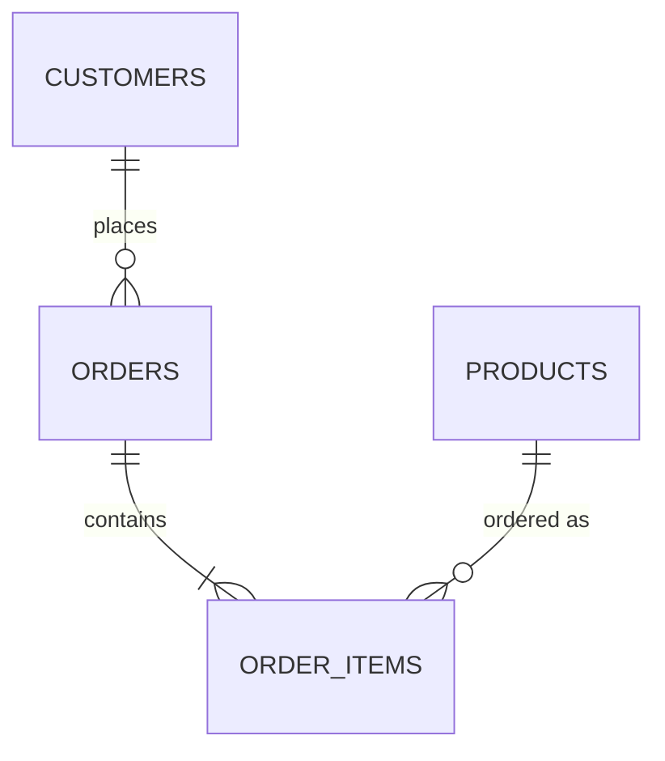
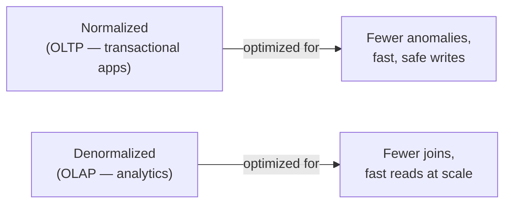

# 01. Normalization & Keys

*Part of [Part 3 — Database Design & Data Modeling](../). Previous: [Part 2 — Intermediate & Advanced SQL](../../02-intermediate-advanced-sql/).*

Up to now, you've been handed a well-designed schema
([`datasets/postgres/00_schema.sql`](../../datasets/postgres/00_schema.sql))
and told to query it. This module teaches you *why* it was designed that
way — the theory of **normalization**, which is the foundation of every
relational schema you'll ever design.

## Start with a bad design, on purpose

Imagine someone designed NorthStar Retail's orders as **one big flat table**
instead of the six tables you've been using:

| order_id | customer_name | customer_email | customer_country | product_name | product_category | quantity | unit_price |
|---|---|---|---|---|---|---|---|
| 1 | Emma Smith | emma@ex.com | Canada | Aurora Blender | Electronics | 2 | 45.00 |
| 1 | Emma Smith | emma@ex.com | Canada | Nimbus Backpack | Sports | 1 | 60.00 |
| 2 | Liam Johnson | liam@ex.com | Germany | Aurora Blender | Electronics | 1 | 45.00 |

This looks convenient — everything in one place, no joins needed! But it has
three serious, named problems:

> **New term — update anomaly**: if Emma changes her email, you must update
> it in **every row** where her order appears — miss one, and now your data
> contradicts itself.

> **New term — insertion anomaly**: you can't record a new customer until
> they place an order, because `customer_name`/`email` only exist attached
> to an order row. What if you want to store a customer the moment they
> sign up, before their first purchase?

> **New term — deletion anomaly**: if order #2 is the *only* order Liam ever
> placed and you delete it, you've accidentally erased all record that Liam
> exists as a customer.

**Normalization is the formal process of restructuring tables to eliminate
these anomalies** — which is exactly why real schemas split data into
`customers`, `products`, `orders`, and `order_items`.

## Keys: the vocabulary you need first

> **New term — candidate key**: any column (or set of columns) that could
> uniquely identify a row. A table can have several — `customers` has both
> `customer_id` and `email` as candidate keys, since either alone uniquely
> identifies a customer.

> **New term — primary key (PK)**: the *one* candidate key you officially
> choose to be the row's identifier (recap from [Part 1, Module 01](../../01-sql-foundations/01-databases-101/)).
> We chose `customer_id` — a surrogate key, explained next — over `email`.

> **New term — surrogate key**: an artificial, meaningless identifier (like
> an auto-incrementing `SERIAL` integer) created purely to identify rows,
> as opposed to a **natural key** — an identifier that already has real-world
> meaning (like `email` or a national ID number).

> 💡 **Best practice**: prefer surrogate keys (`SERIAL`/auto-increment IDs)
> as primary keys over natural keys in most systems. Natural keys can
> change (a customer might change their email), can be inconsistently
> formatted across source systems, and are sometimes not as unique as they
> seem (duplicate emails from data entry errors, for instance). A surrogate
> key never needs to change and never carries surprises — this becomes
> especially important once you build a data warehouse in the next module.

> **New term — composite key**: a primary key made of *multiple* columns
> together. `order_items` doesn't have one in our schema (it has its own
> `order_item_id` surrogate key), but if it didn't, `(order_id, product_id)`
> together could serve as a composite key — assuming a product only appears
> once per order.

## The normal forms

> **New term — normal form**: a formally defined rule about how "clean" a
> table's structure is, with respect to avoiding anomalies. Each normal form
> builds on the one before it.

### First Normal Form (1NF): atomic values, no repeating groups

A table is in 1NF if every column holds a single, indivisible ("atomic")
value — no comma-separated lists crammed into one cell, no repeating groups
of columns like `product_1, product_2, product_3`.

❌ **Violates 1NF:**

| order_id | products |
|---|---|
| 1 | Aurora Blender, Nimbus Backpack |

✅ **Satisfies 1NF** — one row per (order, product) combination, which is
exactly what `order_items` gives you:

| order_id | product_name |
|---|---|
| 1 | Aurora Blender |
| 1 | Nimbus Backpack |

### Second Normal Form (2NF): no partial dependency on a composite key

2NF only matters for tables with a **composite** primary key. It says: every
non-key column must depend on the **whole** composite key, not just part of it.

❌ **Violates 2NF** (imagine a table keyed on `(order_id, product_id)` that
also stores `product_name`):

| order_id | product_id | product_name | quantity |
|---|---|---|---|
| 1 | 5 | Aurora Blender | 2 |
| 2 | 5 | Aurora Blender | 1 |

`product_name` depends only on `product_id` (part of the key), not on the
full `(order_id, product_id)` pair — that's a **partial dependency**, and
it's *why* we store `product_name` in its own `products` table instead,
referenced by `product_id`.

### Third Normal Form (3NF): no transitive dependency

3NF says: every non-key column must depend on the primary key **directly**,
not on another non-key column.

❌ **Violates 3NF** (imagine `orders` also stored `customer_country`):

| order_id | customer_id | customer_country |
|---|---|---|
| 1 | 42 | Canada |

`customer_country` doesn't really depend on `order_id` — it depends on
`customer_id`, which depends on `order_id`. That's a **transitive
dependency** (`order_id → customer_id → customer_country`), and it's exactly
why `country` lives in `customers`, not repeated on every order.

> 💡 **The practical shortcut**: "every non-key column, the whole non-key
> column, and nothing but the non-key column, so help me Codd" is a famous
> mnemonic for 1NF–3NF together. If you're ever unsure whether a column
> belongs in a table, ask: *does this column describe the table's primary
> key directly, completely, and only?*

## Applying this to NorthStar Retail



Every table in [`datasets/postgres/00_schema.sql`](../../datasets/postgres/00_schema.sql)
is in 3NF: `customer` details live only in `customers`, `product` details
live only in `products`, and `order_items` stores only what's specific to
*that* line item (`quantity`, and the `unit_price` *at the time of sale* —
which is deliberately duplicated from `products.unit_price` because it's a
historical fact, not a currently-transitively-dependent value; product
prices change over time, but what a customer actually paid shouldn't
retroactively change with them).

## Constraints: normalization's enforcement mechanism

Good normalization on paper means nothing if the database doesn't enforce
it. This is what constraints (introduced in [Part 1](../../01-sql-foundations/01-databases-101/)) are for:

```sql
CREATE TABLE order_items (
    order_item_id   SERIAL PRIMARY KEY,
    order_id        INTEGER NOT NULL REFERENCES orders(order_id),   -- foreign key: referential integrity
    product_id      INTEGER NOT NULL REFERENCES products(product_id),
    quantity        INTEGER NOT NULL CHECK (quantity > 0),           -- business rule enforced at the DB level
    unit_price      NUMERIC(10,2) NOT NULL CHECK (unit_price >= 0)
);
```

## When to deliberately break the rules: denormalization

Normalization optimizes for **data integrity** and avoiding duplication —
but it requires more joins to reassemble information, which costs query
performance. In analytical systems (data warehouses), it's often
**deliberately** reversed — this is called **denormalization**, and it's the
entire subject of the next module.



> **New term — OLTP vs. OLAP**: **OLTP** (Online Transaction Processing)
> describes systems built for many small, fast reads/writes — like the app
> that takes a customer's order. **OLAP** (Online Analytical Processing)
> describes systems built for large, complex read queries over huge amounts
> of historical data — like a dashboard summarizing a year of sales. Our
> `northstar` schema is designed OLTP-style; [the next module](../02-dimensional-modeling/)
> shows you how to reshape it for OLAP.

## ✅ Try it yourself

```sql
SET search_path TO northstar;

-- Prove referential integrity is enforced: this INSERT should fail
INSERT INTO orders (customer_id, order_date, order_status, shipping_country)
VALUES (999999, CURRENT_DATE, 'placed', 'Nowhere');
-- ERROR: insert or update on table "orders" violates foreign key constraint
```

### Exercises

1. Imagine a table `employee_departments (employee_id, department_name,
   department_budget)`, where `department_budget` is fully determined by
   `department_name` alone. Which normal form does this violate, and how
   would you fix it (what two tables would you split it into)?
2. Look at `datasets/postgres/00_schema.sql` and identify: which table has a
   column that's a deliberate, justified exception to strict normalization
   (duplicated data from another table), and explain why it's justified.
3. Write the `CHECK` constraint you'd add to `orders.order_status` if it
   didn't already have one, restricting it to only the five valid statuses.

<details>
<summary>💡 Solutions</summary>

```text
1. This violates 3NF — department_budget has a transitive dependency
   (employee_id -> department_name -> department_budget), not a direct
   dependency on the table's own key (employee_id). Fix: split into
   `employees (employee_id, department_name)` and
   `departments (department_name, department_budget)`.

2. order_items.unit_price duplicates data conceptually available from
   products.unit_price. It's justified because it captures a historical
   fact — the price actually charged at the time of sale — which must NOT
   change even if products.unit_price changes later. This is a deliberate,
   principled exception, not an accidental violation.
```

```sql
-- 3.
ALTER TABLE orders
ADD CONSTRAINT chk_order_status
CHECK (order_status IN ('placed','shipped','delivered','cancelled','returned'));
```
</details>

## 🧠 Quick check

<details>
<summary>Q: Why do we prefer a surrogate key (customer_id) over a natural key (email) as the primary key?</summary>

Natural keys can change over time (a customer updates their email) and can
have unexpected uniqueness issues (data entry duplicates, case sensitivity).
A surrogate key never needs to change and carries no real-world meaning
that could shift — every foreign key referencing it stays valid regardless
of what happens to the natural-key data.
</details>

<details>
<summary>Q: Is a fully normalized schema always the "best" design?</summary>

No — it's the best design for OLTP systems prioritizing data integrity and
efficient writes. Analytical systems often deliberately denormalize (the
subject of the next module) to minimize the number of joins needed for
large read queries, trading some duplication and write complexity for much
faster reads at scale.
</details>

---
⬅ [Back to Part 3](../) | ➡ Next: [02. Dimensional Modeling](../02-dimensional-modeling/)
