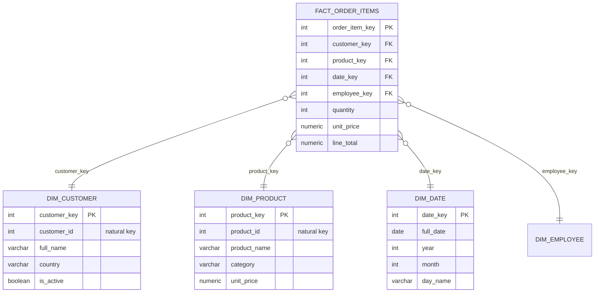
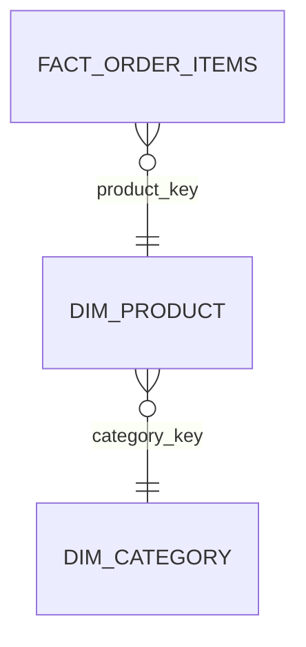

# 02. Dimensional Modeling

*Part of [Part 3 — Database Design & Data Modeling](../). Previous: [01. Normalization & Keys](../01-normalization-and-keys/).*

The `northstar` schema you've used all along is an **OLTP** schema — great
for the application that takes orders, but it forces every analytical query
into multiple joins and aggregations. **Dimensional modeling** is how you
reshape data specifically for fast, intuitive analytics. This is one of the
highest-leverage skills a data engineer can have.

## Facts and dimensions: the two building blocks

> **New term — fact table**: a table storing **measurements** or **events**
> — the numeric things you want to sum, average, or count. Each row is
> typically one event or one transaction. Example: one row per line item sold.

> **New term — dimension table**: a table storing the **descriptive
> context** around a fact — the who/what/where/when you use to filter and
> group facts. Example: customer details, product details, dates.

A useful way to remember the difference: **facts are verbs (things that
happened), dimensions are nouns (things you filter or group by)**. "Revenue"
is a fact. "Customer," "product," and "date" are dimensions.

## The star schema

> **New term — star schema**: a fact table in the center, directly
> connected to multiple dimension tables around it — named for how the
> diagram looks.



Compare this to the fully-normalized `northstar` schema you've used all
along: here, `dim_product` intentionally does **not** split `category` into
a separate `categories` table (which would be a **snowflake schema**,
below) — it's flattened, denormalized, deliberately, for query simplicity.

### Why denormalize for analytics?

Recall from [Module 01](../01-normalization-and-keys/) that normalization
optimizes for write-safety and eliminates duplication, at the cost of more
joins. Analytical queries do the opposite: they read huge amounts of
historical data and are run far less frequently than a transactional
system's writes. A star schema trades some redundancy for **dramatically
simpler and faster queries** — usually just one join per dimension you need,
instead of chains of joins through multiple normalized tables.

```sql
-- Compare this star-schema query...
SELECT dc.country, SUM(f.line_total) AS revenue
FROM fact_order_items f
JOIN dim_customer dc ON f.customer_key = dc.customer_key
GROUP BY dc.country;

-- ...to the equivalent query against the normalized OLTP schema you've used all along:
SELECT c.country, SUM(oi.quantity * oi.unit_price) AS revenue
FROM order_items oi
JOIN orders o ON oi.order_id = o.order_id
JOIN customers c ON o.customer_id = c.customer_id
GROUP BY c.country;
```

Not a huge difference here (our schema is small), but at real scale — with
dozens of dimensions and billions of fact rows — a star schema keeps every
query's join pattern simple and predictable, which matters enormously for
both human understanding and query performance (see [Part 5](../../05-performance-and-optimization/)).

## The snowflake schema: a normalized variant

> **New term — snowflake schema**: like a star schema, but dimension tables
> are further normalized into sub-dimensions (e.g., `dim_product` splits
> into `dim_product` + `dim_category`) — named for how the diagram "branches
> out" like a snowflake.



| | Star schema | Snowflake schema |
|---|---|---|
| Dimension tables | Denormalized (flat) | Normalized (split further) |
| Joins per query | Fewer | More |
| Storage | More redundancy | Less redundancy |
| Query simplicity | Simpler | More complex |

> 💡 **Modern default**: most cloud data warehouses (covered in
> [Part 7](../../07-cloud-data-platforms/)) are optimized for scanning wide,
> flat tables cheaply, and storage is inexpensive relative to compute — so
> the star schema's simplicity usually wins over the snowflake schema's
> storage savings. Snowflake schemas remain useful when a dimension is
> genuinely large and independently updated (e.g., a huge, frequently
> changing product category taxonomy shared across many fact tables).

## The `dim_date` table: a special, always-present dimension

Dates deserve their own dedicated dimension table, pre-built with every
attribute you'd otherwise have to compute repeatedly with functions like
`EXTRACT` ([Module 08](../../01-sql-foundations/08-string-date-numeric-functions/)):

```sql
CREATE TABLE dim_date (
    date_key    INTEGER PRIMARY KEY,     -- e.g., 20240315 for March 15, 2024
    full_date   DATE NOT NULL,
    year        INTEGER NOT NULL,
    quarter     INTEGER NOT NULL,
    month       INTEGER NOT NULL,
    month_name  VARCHAR(10) NOT NULL,
    day_of_month INTEGER NOT NULL,
    day_name    VARCHAR(10) NOT NULL,
    is_weekend  BOOLEAN NOT NULL
);

-- Populate it once, for a wide date range, using generate_series:
INSERT INTO dim_date
SELECT
    TO_CHAR(d, 'YYYYMMDD')::INTEGER,
    d,
    EXTRACT(YEAR FROM d)::INTEGER,
    EXTRACT(QUARTER FROM d)::INTEGER,
    EXTRACT(MONTH FROM d)::INTEGER,
    TO_CHAR(d, 'Month'),
    EXTRACT(DAY FROM d)::INTEGER,
    TO_CHAR(d, 'Day'),
    EXTRACT(DOW FROM d) IN (0, 6)
FROM generate_series('2022-01-01'::DATE, '2026-12-31'::DATE, '1 day') AS d;
```

This turns every "group by quarter" or "is it a weekend" question into a
simple join instead of repeated function calls in every query — and lets you
add fiscal calendars, holiday flags, or promotional periods in one place
that every fact table can share.

## Grain, revisited: the most important decision in dimensional modeling

Recall **grain** from [`datasets/README.md`](../../datasets/README.md) and
[Part 1, Module 05](../../01-sql-foundations/05-joins/). In dimensional
modeling, **declaring the grain of your fact table is the single most
important design decision you make** — everything else follows from it.

Our `fact_order_items` grain is **one line item within an order** (matching
`order_items`). We could instead choose grain = **one order** (matching
`orders`), losing product-level detail but gaining a simpler, smaller table.
Neither is "wrong" — but you must pick deliberately and document it, because
changing the grain later means rebuilding the fact table.

## Types of measures

> **New term — additive measure**: can be summed across *any* dimension
> safely (e.g., `quantity`, `line_total` — summing across customers, dates,
> or products always gives a meaningful total).

> **New term — semi-additive measure**: can be summed across *some*
> dimensions but not others — classic example: an account balance can be
> summed across customers, but summing a single account's balance across
> multiple days gives a meaningless number (you'd want the balance on the
> *last* day, not the sum of every day's balance).

> **New term — non-additive measure**: can never be meaningfully summed —
> a ratio like `profit_margin_pct` must be recalculated from its underlying
> additive components (`SUM(profit) / SUM(revenue)`), never summed or
> averaged directly.

## Slowly Changing Dimensions (SCDs): handling dimension data that changes

This is one of the most important, distinctly "data engineering" concepts in
this entire repo. Real-world dimension data changes: a customer moves
country, a product's category gets reclassified. **How do you handle that in
your dimension table without losing history?**

> **New term — Slowly Changing Dimension (SCD)**: a strategy for handling
> updates to dimension table data over time.

| Type | Strategy | Behavior |
|---|---|---|
| **SCD Type 0** | Never update | The original value is kept forever, even if it becomes outdated |
| **SCD Type 1** | Overwrite | The old value is simply replaced — no history kept |
| **SCD Type 2** | Add a new row | The old row is kept and marked expired; a new row captures the new value — full history preserved |
| **SCD Type 3** | Add a new column | Keeps only the *previous* value in an extra column (e.g., `previous_country`) — limited history |

**SCD Type 1 example** — simplest, but destroys history:

```sql
UPDATE dim_customer SET country = 'Germany' WHERE customer_id = 42;
-- Any past fact rows now implicitly look like this customer was ALWAYS in Germany.
```

**SCD Type 2 example** — the industry-standard way to preserve history:

```sql
CREATE TABLE dim_customer (
    customer_key   SERIAL PRIMARY KEY,   -- surrogate key, changes with each version
    customer_id    INTEGER NOT NULL,     -- natural key, stays the same across versions
    full_name      VARCHAR(100),
    country        VARCHAR(56),
    valid_from     DATE NOT NULL,
    valid_to       DATE,                 -- NULL means "currently active"
    is_current     BOOLEAN NOT NULL
);

-- When customer 42 moves from Canada to Germany on 2024-06-01:
BEGIN;
UPDATE dim_customer
SET valid_to = '2024-05-31', is_current = false
WHERE customer_id = 42 AND is_current = true;

INSERT INTO dim_customer (customer_id, full_name, country, valid_from, valid_to, is_current)
VALUES (42, 'Wei Chen', 'Germany', '2024-06-01', NULL, true);
COMMIT;
```

Now, a fact row from *before* June 2024 correctly joins to the "Canada"
version of customer 42 (using `customer_key`, matched by `valid_from`/`valid_to`
at load time), while current reports correctly show Germany. **This is
exactly why dimension tables use a surrogate `customer_key` distinct from
the natural `customer_id`** — the same real-world customer can have multiple
rows, one per version of their data over time.

> 💡 You'll build this exact SCD Type 2 pattern hands-on, end-to-end, in the
> [Part 8 capstone project](../../08-real-world-projects/01-capstone-mini-warehouse/).

## ✅ Try it yourself

```sql
SET search_path TO northstar;

-- Build a simple, denormalized dim_product as a materialized view
-- (see Part 2, Module 04 for materialized views)
CREATE MATERIALIZED VIEW dim_product_simple AS
SELECT
    product_id AS product_key,
    product_name,
    category,
    unit_price,
    is_discontinued
FROM products;

SELECT * FROM dim_product_simple LIMIT 5;
```

### Exercises

1. Design (on paper — write out the `CREATE TABLE` statements) a
   `dim_employee` table suitable for a star schema, flattening in the
   manager's name directly (denormalized) instead of a separate self-join.
2. Decide: is `order_status` a fact or a dimension attribute? Justify your answer.
3. A `fact_daily_inventory_snapshot` table records each product's stock
   level at the end of every day. Is `stock_level` additive, semi-additive,
   or non-additive? What about summing it across *products* vs. across *days*?

<details>
<summary>💡 Solutions</summary>

```sql
-- 1.
CREATE TABLE dim_employee (
    employee_key   SERIAL PRIMARY KEY,
    employee_id    INTEGER NOT NULL,
    full_name      VARCHAR(100),
    department     VARCHAR(50),
    manager_name   VARCHAR(100)    -- flattened/denormalized, not a separate FK
);
```

```text
2. order_status is a dimension attribute (or sometimes modeled as a small
   "junk dimension" for a handful of low-cardinality flags), not a fact — it
   describes/categorizes an order rather than being a measurement you'd sum
   or average. You'd use it to GROUP BY or filter facts, exactly like
   country or category.

3. stock_level is semi-additive: summing it across PRODUCTS on a given day
   is meaningful (total inventory across all products that day). Summing it
   across DAYS for a single product is meaningless (you'd want the LAST
   day's value, or an average, not a sum of a running stock count over
   time) — same logic as the account balance example above.
```
</details>

## 🧠 Quick check

<details>
<summary>Q: What's the core difference between a star schema and a snowflake schema?</summary>

A star schema keeps dimension tables flat/denormalized (fewer joins, some
redundancy); a snowflake schema further normalizes dimensions into
sub-dimensions (more joins, less redundancy). Star schemas are more common
in modern cloud warehouses because storage is cheap and query simplicity
tends to matter more than storage savings.
</details>

<details>
<summary>Q: Why does an SCD Type 2 dimension table need a surrogate key separate from the natural key?</summary>

Because the same real-world entity (e.g., customer 42) can have multiple
rows over time — one per version of their changing attributes. The natural
key (`customer_id = 42`) stays the same across all versions, but each
version needs its own unique surrogate key (`customer_key`) so fact rows
can reference the *specific version* of that dimension that was true at the
time the fact occurred.
</details>

---
⬅ [Back to Part 3](../) | ➡ Next: [03. Warehouse vs. Lake vs. Lakehouse](../03-warehouse-lake-lakehouse/)
