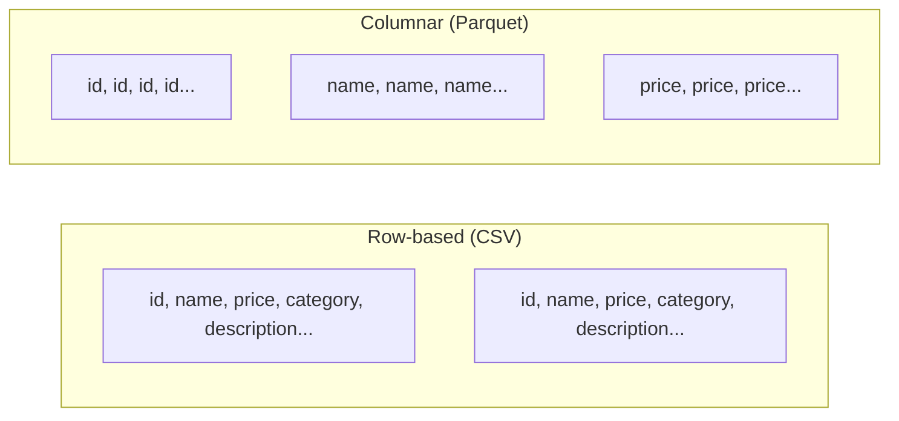
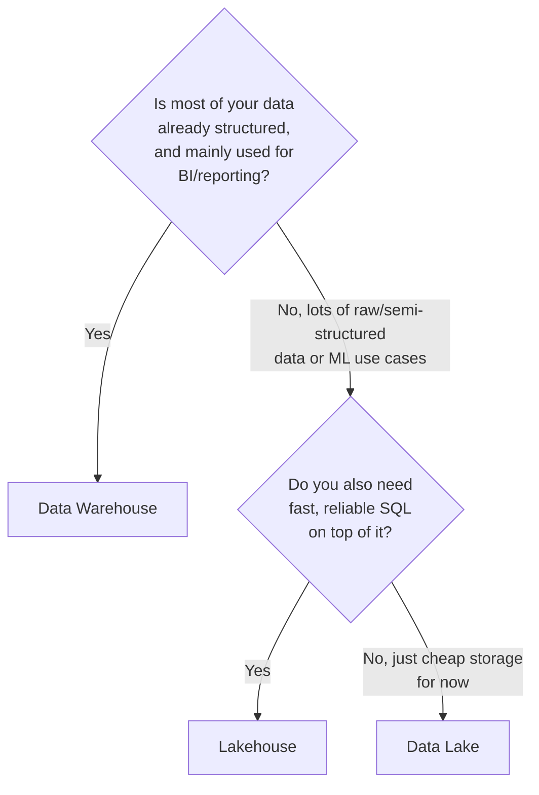

# 03. Warehouse vs. Lake vs. Lakehouse

*Part of [Part 3 — Database Design & Data Modeling](../). Previous: [02. Dimensional Modeling](../02-dimensional-modeling/).*

You now know how to model data for analytics (star schemas). This module
zooms out one level: **where does that modeled data actually live?** These
three terms — warehouse, lake, and lakehouse — describe the major storage
paradigms you'll encounter across every cloud platform in [Part 7](../../07-cloud-data-platforms/).

## Data Warehouse

> **New term — data warehouse**: a system specifically designed to store
> **structured**, modeled data (like the star schemas from the last module)
> for fast analytical querying with SQL.

Warehouses enforce a **schema-on-write** model: you must define a table's
structure before loading any data into it, and the system validates every
row against that structure. This gives you strong guarantees — every row in
a table genuinely has the shape and types you declared.

- **Examples**: Snowflake, Google BigQuery, Amazon Redshift, Azure Synapse Dedicated SQL Pool.
- **Strengths**: fast SQL queries, strong consistency, mature tooling, fine-grained security.
- **Weaknesses**: less flexible for unstructured/semi-structured data
  (images, raw logs, video); traditionally more expensive to store very
  large volumes of raw, rarely-queried data.

## Data Lake

> **New term — data lake**: a storage system that holds data of **any
> format** — structured, semi-structured, or unstructured — cheaply, at
> massive scale, typically as files in object storage.

Lakes use a **schema-on-read** model: raw files (CSV, JSON, Parquet, images,
etc.) are simply stored as-is; you only define structure at the moment you
*read* the data, using a query engine layered on top.

- **Examples**: files in Amazon S3, Azure Data Lake Storage (ADLS), Google Cloud Storage.
- **Strengths**: extremely cheap storage, handles any data type, decouples
  storage from compute, great for storing raw/archival data "just in case."
- **Weaknesses**: no built-in transaction guarantees (see below), can become
  a **data swamp** — an unorganized mess of files nobody can make sense of —
  without discipline; historically weaker SQL performance and consistency than warehouses.

> **New term — data swamp**: the pejorative term for a data lake that's
> devolved into disorganized, undocumented, low-quality files that nobody
> trusts or can effectively query — a real and common failure mode without
> deliberate structure and governance.

### Parquet: the file format that makes lakes queryable

> **New term — Parquet**: a columnar file format designed for analytics —
> instead of storing data row by row (like CSV), it stores each *column*
> together, contiguously. This lets a query engine read only the columns a
> query actually needs, skipping the rest entirely — a massive speed and
> cost win for wide tables where any given query only touches a few columns.



If your query only needs `SUM(price)`, a columnar format reads *only* the
`price` column's data from disk — a row-based format like CSV must read
every column of every row, even ones you don't need. Parquet (and formats
built on it, like Delta Lake and Apache Iceberg) is the standard file format
underlying almost every modern data lake and lakehouse.

## Lakehouse: combining both

> **New term — lakehouse**: an architecture that adds warehouse-like
> features — schema enforcement, ACID transactions, fast SQL querying —
> directly on top of cheap data lake storage, aiming to get the best of both worlds.

- **Examples**: Databricks (using the **Delta Lake** format), Snowflake
  (Iceberg tables), Google BigQuery (BigLake), Apache Iceberg on any object store.
- **Strengths**: one copy of data serves both SQL analytics *and*
  data science/ML workloads (which often need direct file access); cheaper
  storage than a pure warehouse; still gets ACID guarantees and schema enforcement.
- **Weaknesses**: a newer paradigm — tooling and best practices are still
  maturing compared to decades-old warehouse technology; can require more
  engineering effort to set up and govern well.

### Why ACID transactions matter for a data lake

Recall ACID from [Part 2, Module 03](../../02-intermediate-advanced-sql/03-data-modification-and-transactions/).
A plain data lake (just files in object storage) has no built-in concept of
a transaction — if a pipeline writing new files crashes halfway through, a
query running at that exact moment might read a mix of old and new,
inconsistent data. Table formats like **Delta Lake** and **Apache Iceberg**
add a transaction log on top of the raw files specifically to bring ACID
guarantees to lake storage — this is the core innovation that makes the
"lakehouse" concept work at all.

## Comparison table

| | Data Warehouse | Data Lake | Lakehouse |
|---|---|---|---|
| Data types | Structured only | Any (structured, semi-structured, unstructured) | Any, with structured tables layered on top |
| Schema | Schema-on-write | Schema-on-read | Both — enforced schema, flexible underlying storage |
| Storage cost | Higher | Very low | Low |
| SQL performance | Excellent, mature | Historically weaker | Strong, improving fast |
| ACID transactions | Yes, natively | No, by default | Yes, via table formats (Delta Lake, Iceberg) |
| Best for | BI dashboards, structured reporting | Cheap archival, raw data, ML training data | Unified analytics + ML on one copy of data |

## Which one do you actually need?



In practice, most modern organizations use some combination: raw data lands
in a lake (or lakehouse "bronze" layer — see the next module), gets
processed and modeled, and lands in warehouse-style tables (or lakehouse
"gold" layer) for BI consumption. You'll see this exact end-to-end flow in
[Part 4](../../04-data-engineering-with-sql/) and the [capstone project](../../08-real-world-projects/01-capstone-mini-warehouse/).

## ✅ Try it yourself

There's no hands-on SQL for this module — it's architectural. Instead,
answer this for a company you know (a past employer, or a well-known
company): would you guess their core analytics platform is closer to a
warehouse, a lake, or a lakehouse? What clues (the size and variety of their
data, whether they do heavy ML, whether they're cost-sensitive) inform your guess?

### Exercises

1. A startup has almost entirely structured transactional data (orders,
   customers, payments) and just wants dashboards for their small team.
   Which architecture fits best, and why?
2. A media company stores petabytes of video files, sensor logs from IoT
   devices, and some structured billing data, and does heavy machine
   learning on the raw video/sensor data. Which architecture fits best, and why?
3. Explain, in your own words, why a plain data lake (files in object
   storage, no table format) can't safely guarantee that a query never sees
   a half-written batch of new data.

<details>
<summary>💡 Solutions</summary>

```text
1. Data Warehouse. Their data is small, structured, and reporting-focused —
   exactly what warehouses are optimized for, without the extra complexity
   of managing raw file storage and table formats they don't need yet.

2. Lakehouse (or a data lake as a starting point, evolving toward a
   lakehouse). The variety and scale of unstructured data (video, sensor
   logs) rules out a pure warehouse, but they still need reliable structured
   billing analytics — a lakehouse serves both needs from one platform.

3. Without a transaction log/table format, "writing new data" is just
   writing new files (or overwriting old ones) directly. A query reading
   the same location while that write is in progress has no mechanism
   telling it to wait or to see a consistent "before" or "after" snapshot —
   it might see some new files and not others, producing an inconsistent,
   partially-updated result. Table formats like Delta Lake/Iceberg solve
   this exactly the way database transactions solve it for tables.
```
</details>

## 🧠 Quick check

<details>
<summary>Q: What does "schema-on-read" mean, and which storage paradigm uses it?</summary>

"Schema-on-read" means data is stored without an enforced structure
up-front (as raw files); structure is only applied/interpreted at query
time. Data lakes traditionally work this way, in contrast to a data
warehouse's "schema-on-write," where structure is enforced the moment data
is loaded.
</details>

<details>
<summary>Q: What core capability does a table format like Delta Lake or Apache Iceberg add to a plain data lake?</summary>

ACID transaction guarantees (and schema enforcement) on top of raw files in
object storage — allowing reliable, consistent reads and writes the way a
traditional database provides, which is exactly what makes the "lakehouse"
concept viable.
</details>

---
⬅ [Back to Part 3](../) | ➡ Next: [04. Modern Modeling Patterns](../04-modern-modeling-patterns/)
