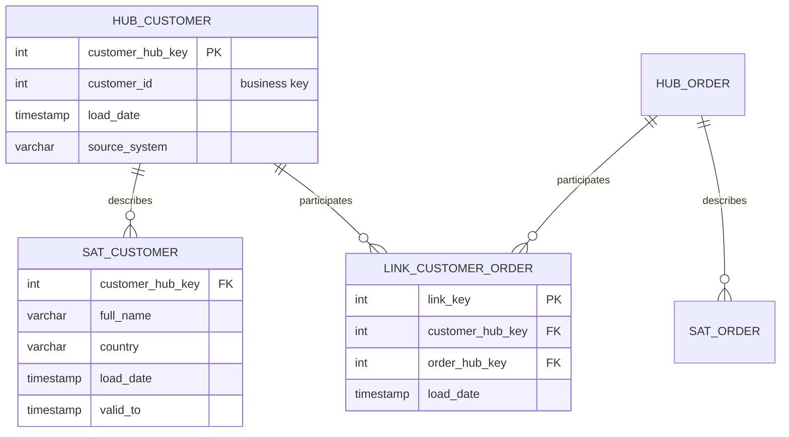
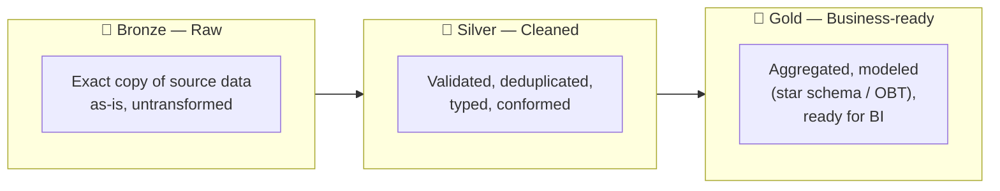
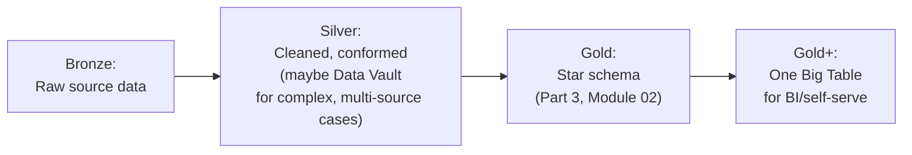

# 04. Modern Modeling Patterns

*Part of [Part 3 — Database Design & Data Modeling](../). Previous: [03. Warehouse vs. Lake vs. Lakehouse](../03-warehouse-lake-lakehouse/).*

Star schemas ([Module 02](../02-dimensional-modeling/)) have been the
standard for decades, but cloud-scale compute and cheap storage have enabled
a few newer patterns worth knowing. This module closes out Part 3 with three
you'll see constantly in modern data engineering job postings and real teams.

## One Big Table (OBT)

> **New term — One Big Table (OBT)**: a single, wide, fully denormalized
> table that pre-joins facts and *all* their dimension attributes together
> — no joins needed at query time at all.

```sql
-- Instead of fact_order_items joined to dim_customer, dim_product, dim_date...
CREATE TABLE obt_order_items AS
SELECT
    oi.order_item_id,
    o.order_id,
    o.order_date,
    o.order_status,
    c.customer_id,
    c.first_name || ' ' || c.last_name AS customer_name,
    c.country AS customer_country,
    p.product_id,
    p.product_name,
    p.category AS product_category,
    oi.quantity,
    oi.unit_price,
    (oi.quantity * oi.unit_price) AS line_total
FROM order_items oi
JOIN orders o ON oi.order_id = o.order_id
JOIN customers c ON o.customer_id = c.customer_id
JOIN products p ON oi.product_id = p.product_id;
```

**Why this has become popular**: modern cloud warehouses (BigQuery,
Snowflake) are extremely good at scanning wide, flat tables cheaply, storage
is inexpensive, and business analysts using self-serve BI tools often find a
single flat table far easier to work with than navigating a star schema's
joins. The cost is heavy duplication (`customer_name` repeated on every
order line) and larger storage footprint — a direct, deliberate trade
against the normalization principles from [Module 01](../01-normalization-and-keys/).

> 💡 **When to reach for OBT**: when query simplicity for end users (analysts
> in a BI tool, not engineers) matters more than storage efficiency, and
> your warehouse's pricing model doesn't punish you for the extra storage or
> for scanning wider tables. It's common as the final, business-facing
> "gold" layer (see Medallion architecture below), sitting on top of a
> proper star schema used internally.

## Data Vault (the essentials)

> **New term — Data Vault**: a modeling methodology designed for maximum
> auditability and flexibility when integrating data from many, frequently
> changing source systems — common in large enterprises (banking,
> insurance, healthcare) with strict compliance requirements.

Data Vault splits every entity into three specialized table types:

| Table type | Purpose |
|---|---|
| **Hub** | Stores just the unique business key + a surrogate key + load metadata (when/where it was first seen) |
| **Link** | Stores relationships *between* hubs (e.g., which customer placed which order) |
| **Satellite** | Stores all the descriptive attributes, versioned over time (like an automatic SCD Type 2 for every attribute) |



**Why go through all this?** Because hubs and links never change once
written (only satellites accumulate new versions), Data Vault gives you
extremely strong **auditability** — you can always answer "exactly what did
we know, and from which source system, at any point in history?" — and it's
easy to add a *new* source system feeding the same hub without redesigning
anything. The tradeoff is real complexity: far more tables, and you
typically still build a star schema (or OBT) *on top of* the Data Vault
layer for actual business reporting, since Data Vault itself isn't
optimized for easy querying.

> 💡 **When to reach for Data Vault**: large organizations integrating many
> independent, evolving source systems, with strict audit/compliance needs
> (see [Part 6 — Compliance & Governance](../../06-security/05-compliance-and-governance/)).
> For a single-team, single-source-system project like our NorthStar Retail
> capstone, it would be significant overkill — star schema or OBT is the
> right choice at that scale.

## The Medallion Architecture: bronze, silver, gold

This is the pattern you are most likely to encounter in a real modern data
team, and it directly ties together everything from Parts 3 and 4.

> **New term — Medallion architecture**: organizing data processing into
> three progressively refined layers, each building on the last.



| Layer | Contains | Example |
|---|---|---|
| **Bronze** | Raw data, exactly as received, with minimal or no transformation — the permanent, replayable source of truth | Raw JSON events from `web_events`, unmodified daily exports from the orders application |
| **Silver** | Cleaned, validated, deduplicated, type-cast, conformed data — still detailed, but trustworthy | A cleaned `orders` table with bad rows removed, dates properly typed, duplicates resolved |
| **Gold** | Business-level aggregates and dimensional models, ready for direct BI consumption | `fact_order_items` + dimension tables, or an OBT, matching a specific reporting need |

Why keep bronze at all, if you're just going to clean it into silver? Two
reasons that matter enormously in practice:

1. **Reprocessing.** If you discover a bug in your cleaning logic six months
   from now, you can re-run silver and gold from the untouched bronze data
   — you don't need to re-extract from the (possibly no-longer-available)
   original source system.
2. **Debugging and trust.** When a number in a dashboard looks wrong, you can
   trace it backward: gold → silver → bronze, comparing at each layer to
   find exactly where the discrepancy was introduced.

This bronze/silver/gold flow is also exactly how the JSON semi-structured
data question from [Part 2, Module 06](../../02-intermediate-advanced-sql/06-json-and-semistructured-data/)
gets resolved in practice: land raw JSON in bronze untouched, extract stable
fields into typed columns in silver, and build the fully modeled star schema
in gold.

## Choosing a pattern: it's not either/or

In real systems, these patterns **combine** rather than compete:



A typical modern stack: bronze/silver/gold as the overall architecture
(Medallion), a star schema as the gold layer's internal structure
(dimensional modeling), Data Vault only if you're integrating many complex
source systems in silver, and an OBT as a final, flattened view for
non-technical analysts on top of the star schema.

## ✅ Try it yourself

There's no new hands-on dataset needed here — apply the concept to what you
already have:

```sql
SET search_path TO northstar;

-- Simulate a "gold layer" OBT for NorthStar Retail
CREATE MATERIALIZED VIEW gold_order_items_obt AS
SELECT
    oi.order_item_id,
    o.order_id, o.order_date, o.order_status,
    c.customer_id, c.first_name || ' ' || c.last_name AS customer_name, c.country,
    p.product_id, p.product_name, p.category,
    e.full_name AS handled_by,
    oi.quantity, oi.unit_price,
    (oi.quantity * oi.unit_price) AS line_total
FROM order_items oi
JOIN orders o ON oi.order_id = o.order_id
JOIN customers c ON o.customer_id = c.customer_id
JOIN products p ON oi.product_id = p.product_id
LEFT JOIN employees e ON o.employee_id = e.employee_id;

SELECT * FROM gold_order_items_obt LIMIT 5;
```

### Exercises

1. In your own words, explain why bronze data should be kept even after
   it's been cleaned into silver — what specific problem does this solve
   that you couldn't solve if you deleted bronze data right away?
2. Would you model a company's core `products` catalog as a hub+satellite
   (Data Vault) if they have exactly one source system for products and a
   small team? Why or why not?
3. Sketch (in words or a quick diagram) what bronze, silver, and gold would
   look like for the `web_events` table from [Part 2, Module 06](../../02-intermediate-advanced-sql/06-json-and-semistructured-data/).

<details>
<summary>💡 Solutions</summary>

```text
1. Keeping bronze data preserves the ability to fully reprocess history if
   a bug is found in the cleaning/transformation logic later, and gives you
   an unambiguous point of comparison when debugging a number that looks
   wrong downstream — you can trace bronze -> silver -> gold to find exactly
   where a discrepancy was introduced, which is impossible if only the
   already-transformed data survives.

2. No — Data Vault's complexity earns its keep specifically when
   integrating MANY independent, evolving source systems with strict audit
   needs. A single source system and a small team gains little from hub/
   link/satellite complexity; a star schema (or even an OBT) directly is
   simpler to build, query, and maintain at that scale.

3. Bronze: raw web_events rows exactly as captured, JSONB payload untouched.
   Silver: one row per event with page_view/add_to_cart/search-specific
   fields extracted into real typed columns (e.g., product_id as INTEGER,
   not text pulled from JSON), duplicates removed, invalid events filtered.
   Gold: an aggregated fact table, e.g. fact_daily_customer_engagement,
   summarizing page views/searches/cart adds per customer per day, ready
   for a marketing dashboard.
```
</details>

## 🎉 Part 3 complete!

You can now design a normalized OLTP schema, remodel it for analytics with
a star schema, choose the right storage paradigm, and recognize the modern
patterns (OBT, Data Vault, Medallion) used across real data teams. Next:
[Part 4](../../04-data-engineering-with-sql/), where you'll actually build
the pipelines that move data through these layers.

## 🧠 Quick check

<details>
<summary>Q: What's the main tradeoff of using One Big Table (OBT) instead of a star schema?</summary>

OBT trades storage efficiency and write-side complexity (heavy duplication
of dimension attributes across every row) for maximum query simplicity —
no joins needed at all. It's a good fit for business-facing, BI-tool-driven
consumption, less so as the primary internal modeling layer.
</details>

<details>
<summary>Q: In the Medallion architecture, which layer should you never skip keeping, even after later layers are built?</summary>

Bronze — the raw, untransformed copy of source data. It's your only way to
safely reprocess everything downstream if transformation logic turns out to
have a bug, and it's essential for tracing exactly where a data quality
issue was introduced.
</details>

---
⬅ [Back to Part 3](../) | ➡ Next: [Part 4 — Data Engineering with SQL](../../04-data-engineering-with-sql/)
