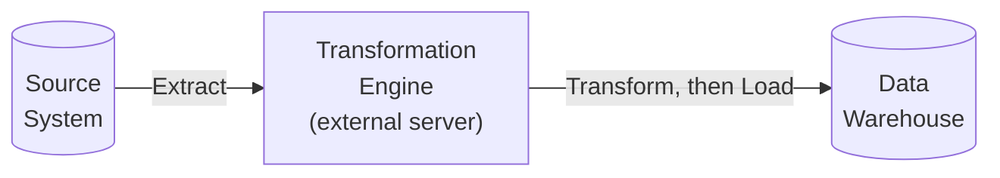
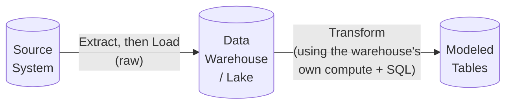

# 01. ETL vs. ELT

*Part of [Part 4 — Data Engineering with SQL](../). Previous: [Part 3 — Database Design & Data Modeling](../../03-database-design-and-modeling/).*

You now know how to model data ([Part 3](../../03-database-design-and-modeling/))
and query it expertly ([Parts 1–2](../../01-sql-foundations/)). This part is
about the missing piece: **how does data actually get from a source system
into your modeled tables in the first place?**

## The three-letter pipeline: Extract, Transform, Load

Every data pipeline, no matter how it's built, does some version of these three steps:

> **New term — Extract**: pulling raw data out of a source system (an
> application database, an API, a file export, an event stream).

> **New term — Transform**: cleaning, reshaping, validating, and combining
> that raw data into a useful structure — everything you learned in Parts 1–3.

> **New term — Load**: writing the (transformed, or not-yet-transformed)
> data into its destination — a data warehouse, lake, or lakehouse.

The entire ETL-vs-ELT question is simply: **in what order do you do these three things?**

## ETL: Transform before loading



In classic ETL, data is extracted, transformed on a **separate processing
system** (historically, dedicated ETL servers/software), and only the
already-clean, already-modeled result is loaded into the warehouse.

- **Strengths**: the warehouse never sees messy raw data; sensitive data can
  be filtered/masked *before* it ever reaches the warehouse (relevant to
  [Part 6 — Security](../../06-security/)); works well when the warehouse
  itself has limited compute for transformation.
- **Weaknesses**: requires separate transformation infrastructure; raw data
  is often not preserved (harder to reprocess if transformation logic had a
  bug — recall the Medallion "bronze" argument from
  [Part 3](../../03-database-design-and-modeling/04-modern-modeling-patterns/));
  changing the transformation logic often means re-extracting from the source.

## ELT: Load before transforming



In ELT, raw data is loaded into the warehouse or lake **first**,
untransformed, and all transformation happens *afterward*, using SQL running
directly inside the destination platform.

- **Strengths**: raw data is naturally preserved (this **is** the Medallion
  bronze layer in practice); transformation logic is just SQL, version-controllable
  and testable (this is exactly what tools like dbt, covered in
  [Module 03](../03-orchestration-basics/), are built around); modern cloud
  warehouses have enormous, elastically scalable compute, making
  "transform inside the warehouse" cheap and practical in a way it wasn't 20 years ago.
- **Weaknesses**: raw, possibly messy or sensitive data does land in the
  warehouse, even if temporarily — access control and masking
  ([Part 6](../../06-security/)) become more important as a result; can use
  more warehouse compute (and therefore cost — see
  [Part 5](../../05-performance-and-optimization/06-cloud-cost-optimization/))
  for the transformation step itself.

## Why the industry shifted from ETL to ELT

This shift happened for concrete, practical reasons, not fashion:

1. **Cloud warehouses got radically cheaper and more scalable at compute.**
   Historically, transformation had to happen on separate, expensive
   dedicated servers because warehouses couldn't handle heavy processing
   alongside serving queries. Modern warehouses (BigQuery, Snowflake,
   Redshift) are built to separate storage and compute and scale
   transformation workloads elastically and cheaply.
2. **Storage got radically cheaper.** Keeping a full copy of raw data
   (bronze layer) used to be wasteful; now it's a rounding error on cost
   and a huge win for reprocessability and debugging.
3. **SQL-based transformation tooling matured.** Tools like dbt (see
   [Module 03](../03-orchestration-basics/)) made "transformation logic as
   version-controlled SQL files, tested and documented like real software"
   practical and popular — and that only works well if the raw data is
   already sitting in the warehouse to run SQL against.

> 💡 **Modern default**: most new data platforms built today are ELT-based.
> This repo's [capstone project](../../08-real-world-projects/01-capstone-mini-warehouse/)
> follows the ELT pattern for exactly these reasons — you'll load raw
> NorthStar Retail data first, then transform it into a star schema entirely
> with SQL running against the loaded data.

## Where does "Extract" and "Load" actually happen, if not custom ETL servers?

In a modern ELT stack, extraction and loading are typically handled by:

- **Managed connectors** (tools like Fivetran, Airbyte, or a cloud
  platform's native data transfer service) that continuously sync data from
  common sources (SaaS APIs, application databases) into your
  warehouse/lake automatically.
- **Cloud-native ingestion services** (e.g., AWS DMS, Google Cloud
  Dataflow, Azure Data Factory's copy activities) for database replication
  and file-based loads.
- **Custom scripts** (often Python) for sources without an off-the-shelf
  connector — this is one of the few places outside SQL a data engineer
  regularly writes code, and is intentionally outside this repo's SQL-only
  scope (see [Part 9 — Further Resources](../../09-career-prep/04-further-resources/)
  for where to learn it next).

This repo focuses entirely on the **T** — transformation — because that's
the part done almost entirely in SQL, and it's where the modeling skills
from [Part 3](../../03-database-design-and-modeling/) get applied for real.

## ✅ Try it yourself

There's no new SQL syntax in this module — it's a conceptual foundation for
everything that follows. As a thought exercise, sketch out (on paper, or in
a comment) what an ELT pipeline for NorthStar Retail's `web_events` data
would look like end to end, using the Medallion terms from Part 3:

- **Extract**: how would raw clickstream events get from a website into cloud storage?
- **Load**: how would that raw data land in bronze?
- **Transform**: what would silver (cleaned events) and gold (a
  `fact_daily_engagement` table) look like?

### Exercises

1. A company needs to mask customer social security numbers *before* they
   ever reach a shared analytics warehouse, for compliance reasons. Does
   this push them toward ETL or ELT for that specific data? Why?
2. A team wants to keep a permanent, replayable copy of every raw event
   they've ever received, in case their transformation logic has bugs
   discovered months later. Does this push them toward ETL or ELT? Why?
3. Explain in your own words why cheaper cloud compute and storage were
   necessary preconditions for ELT to become popular — what would go wrong
   trying to run ELT-style heavy transformations on 1990s-era hardware and
   storage costs?

<details>
<summary>💡 Solutions</summary>

```text
1. ETL — masking sensitive data BEFORE it's loaded means the raw, unmasked
   values never touch the shared warehouse at all, which is a stronger
   compliance posture than loading raw data and masking/restricting access
   afterward (which relies entirely on downstream access controls working
   perfectly, with no margin for error).

2. ELT — this is precisely the argument for a Medallion "bronze" layer:
   loading raw data first and preserving it, transforming afterward inside
   the warehouse, guarantees a permanent, replayable raw copy exists no
   matter what happens to the transformation logic later.

3. Running heavy transformations directly on expensive, non-elastic
   compute would either be prohibitively costly or would compete with
   the compute needed to actually SERVE queries to end users — historically
   this is exactly why transformation was pushed OFF to separate, dedicated
   ETL servers. Cheap, elastically scalable cloud compute removed that
   constraint, making it practical to transform data using the same
   platform (and the same compute pool) that serves analytical queries.
```
</details>

## 🧠 Quick check

<details>
<summary>Q: What's the core difference between ETL and ELT?</summary>

The order of operations: ETL transforms data on separate infrastructure
before loading the already-clean result into the destination. ELT loads raw
data into the destination first, then transforms it there, using the
destination's own compute (almost always via SQL).
</details>

<details>
<summary>Q: Why did cheaper cloud storage specifically help enable ELT's popularity?</summary>

ELT requires storing a full copy of raw, untransformed data in the
warehouse/lake (the "bronze" layer), which used to be wasteful when storage
was expensive. As cloud storage costs dropped dramatically, keeping that
raw copy became cheap enough that its benefits (reprocessability,
debugging, auditability) clearly outweighed the storage cost.
</details>

---
⬅ [Back to Part 4](../) | ➡ Next: [02. SQL for Pipelines](../02-sql-for-pipelines/)
