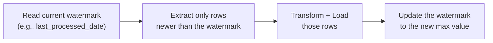

# 02. SQL for Pipelines

*Part of [Part 4 — Data Engineering with SQL](../). Previous: [01. ETL vs. ELT](../01-etl-vs-elt/).*

A query you run once, by hand, only has to be *correct*. A query that runs
automatically every hour, forever, unattended, also has to be **safe to
re-run** — this module is about that difference, which is the heart of what
makes SQL "data engineering" rather than "data analysis."

## Full refresh vs. incremental load

> **New term — full refresh**: reprocessing *all* the data every time a
> pipeline runs, from scratch.

```sql
SET search_path TO northstar;

-- Full refresh: rebuild the entire summary every single run
TRUNCATE TABLE monthly_revenue_summary_table;
INSERT INTO monthly_revenue_summary_table
SELECT
    DATE_TRUNC('month', o.order_date) AS month,
    SUM(oi.quantity * oi.unit_price)  AS revenue
FROM orders o
JOIN order_items oi ON o.order_id = oi.order_id
GROUP BY DATE_TRUNC('month', o.order_date);
```

Simple and always correct — but it re-does *all* the work every time, which
becomes slow and expensive as data grows into the millions or billions of rows.

> **New term — incremental load**: processing only the data that's **new or
> changed** since the last run, instead of everything.

```sql
-- Incremental: only process orders since the last known watermark
INSERT INTO monthly_revenue_summary_table
SELECT
    DATE_TRUNC('month', o.order_date) AS month,
    SUM(oi.quantity * oi.unit_price)  AS revenue
FROM orders o
JOIN order_items oi ON o.order_id = oi.order_id
WHERE o.order_date > (SELECT MAX(last_processed_date) FROM pipeline_watermark)
GROUP BY DATE_TRUNC('month', o.order_date);
```

> **New term — watermark**: a stored value (usually a timestamp or an
> incrementing ID) marking how far a pipeline has already processed —
> "everything up to here is done." Every incremental pipeline needs
> somewhere to persist its watermark between runs.



| | Full refresh | Incremental load |
|---|---|---|
| Simplicity | Very simple, hard to get wrong | More complex — must track state (the watermark) |
| Cost/speed at scale | Gets slower and more expensive as data grows | Stays fast regardless of total historical volume |
| Handles late-arriving/updated old data? | Yes, automatically (reprocesses everything) | Only if you specifically design for it (see below) |

> 💡 **Practical guidance**: start with full refresh for genuinely small
> tables (thousands to low millions of rows) — it's simpler and has no
> correctness edge cases. Move to incremental once full refresh becomes too
> slow or expensive, and be deliberate about it — incremental logic is where
> most real pipeline bugs live.

## Idempotency: the property that makes reruns safe

> **New term — idempotent**: an operation that produces the **same result**
> no matter how many times you run it. Running an idempotent pipeline twice
> in a row (say, because it failed partway and got automatically retried)
> causes no harm — no duplicated data, no corrupted totals.

This single property is arguably the most important practical skill in this
entire module. Consider this **non-idempotent** pipeline step:

```sql
-- ❌ NOT idempotent: running this twice doubles every count
INSERT INTO daily_order_counts (order_date, num_orders)
SELECT order_date, COUNT(*)
FROM orders
WHERE order_date = CURRENT_DATE
GROUP BY order_date;
```

Run this once: correct. A network blip causes your orchestrator to retry
it automatically (a completely normal, expected occurrence in real
pipelines): now `daily_order_counts` has **two** rows for today, or a
doubled count — silently wrong data, discovered maybe weeks later when
someone notices a dashboard spike that doesn't match reality.

**The fix**: make it idempotent using the `DELETE`-then-`INSERT` pattern, or
an upsert:

```sql
-- ✅ Idempotent version 1: delete the target date's data first, then reinsert
BEGIN;
DELETE FROM daily_order_counts WHERE order_date = CURRENT_DATE;
INSERT INTO daily_order_counts (order_date, num_orders)
SELECT order_date, COUNT(*)
FROM orders
WHERE order_date = CURRENT_DATE
GROUP BY order_date;
COMMIT;

-- ✅ Idempotent version 2: upsert (recall Part 2, Module 03)
INSERT INTO daily_order_counts (order_date, num_orders)
SELECT order_date, COUNT(*)
FROM orders
WHERE order_date = CURRENT_DATE
GROUP BY order_date
ON CONFLICT (order_date)
DO UPDATE SET num_orders = EXCLUDED.num_orders;
```

Both versions now produce the **exact same end state** whether run once or
ten times in a row — that's the goal.

## `MERGE`: the complete upsert-plus-delete tool

Recall `INSERT ... ON CONFLICT` from [Part 2, Module 03](../../02-intermediate-advanced-sql/03-data-modification-and-transactions/).
The ANSI-standard `MERGE` statement (supported in PostgreSQL 15+, SQL
Server, Snowflake, BigQuery, and Oracle) generalizes this to handle
**insert, update, and delete together**, driven by a join condition — the
standard tool for a full incremental sync from a source table:

```sql
MERGE INTO customers AS target
USING staging_customers AS source
ON target.customer_id = source.customer_id

WHEN MATCHED AND source.is_deleted THEN
    DELETE

WHEN MATCHED THEN
    UPDATE SET
        first_name = source.first_name,
        last_name  = source.last_name,
        email      = source.email,
        country    = source.country,
        is_active  = source.is_active

WHEN NOT MATCHED THEN
    INSERT (customer_id, first_name, last_name, email, country, signup_date, is_active)
    VALUES (source.customer_id, source.first_name, source.last_name, source.email,
            source.country, source.signup_date, source.is_active);
```

This one statement handles every case an incremental sync needs: new
customers get inserted, changed customers get updated, and customers marked
deleted at the source get removed — and running it twice with the same
`staging_customers` snapshot produces the same end state both times
(idempotent, by construction).

## Change Data Capture (CDC)

> **New term — Change Data Capture (CDC)**: a technique for detecting
> *exactly which rows changed* in a source system (and how — inserted,
> updated, or deleted) since the last check, typically by reading the source
> database's internal transaction log, rather than re-querying and comparing
> full table snapshots.

Why not just re-query the whole source table each time and compare? At
scale, that's extremely expensive and slow. CDC tools (like Debezium, or a
cloud data platform's native CDC connectors) tail the source database's
write-ahead log directly, streaming out a real-time feed of every insert,
update, and delete — often landing as rows in a staging table shaped like:

| operation | customer_id | first_name | ... | changed_at |
|---|---|---|---|---|
| INSERT | 201 | Nadia | ... | 2024-06-01 09:00 |
| UPDATE | 42 | Wei | ... | 2024-06-01 09:05 |
| DELETE | 88 | NULL | ... | 2024-06-01 09:10 |

Your transformation SQL then applies these operations (often via `MERGE`,
exactly as above) to keep your warehouse copy in sync with the source,
without ever needing to re-scan the entire source table.

## Handling late-arriving data

Real-world data doesn't always arrive in perfect order. An order placed
yesterday might not show up in your source extract until today, because of
a network delay, retry, or a source system's own processing lag.

A naive incremental pipeline that filters strictly on `WHERE order_date >
last_watermark` can silently **miss** that late order forever, since the
watermark has already moved past yesterday.

> 💡 **Common mitigation**: process a small overlapping **lookback window**
> instead of a razor-thin cutoff — e.g., always reprocess the last 3 days
> of data on every run, not just "since the watermark." Combined with an
> idempotent `MERGE`/upsert (which safely handles reprocessing the same rows
> without creating duplicates), this catches most late-arriving data without
> the cost of a full historical reprocess:

```sql
-- Reprocess a 3-day lookback window every run, safely, via idempotent upsert
INSERT INTO fact_daily_revenue (order_date, revenue)
SELECT o.order_date, SUM(oi.quantity * oi.unit_price)
FROM orders o
JOIN order_items oi ON o.order_id = oi.order_id
WHERE o.order_date >= CURRENT_DATE - INTERVAL '3 days'
GROUP BY o.order_date
ON CONFLICT (order_date) DO UPDATE SET revenue = EXCLUDED.revenue;
```

## ✅ Try it yourself

```sql
SET search_path TO northstar;

CREATE TABLE daily_revenue_summary (
    order_date DATE PRIMARY KEY,
    revenue NUMERIC(12,2),
    num_orders INTEGER
);

-- An idempotent incremental load you could safely schedule to run every day
INSERT INTO daily_revenue_summary (order_date, revenue, num_orders)
SELECT
    o.order_date,
    SUM(oi.quantity * oi.unit_price),
    COUNT(DISTINCT o.order_id)
FROM orders o
JOIN order_items oi ON o.order_id = oi.order_id
WHERE o.order_date >= CURRENT_DATE - INTERVAL '3 days'
GROUP BY o.order_date
ON CONFLICT (order_date)
DO UPDATE SET revenue = EXCLUDED.revenue, num_orders = EXCLUDED.num_orders;

-- Run it again right now — confirm the result doesn't change or duplicate:
SELECT * FROM daily_revenue_summary ORDER BY order_date DESC;
```

### Exercises

1. Take the "❌ NOT idempotent" example from this module and explain,
   precisely, what the `daily_order_counts` table would contain after
   running it three times in a row without the fix.
2. Write an idempotent incremental pipeline step that maintains a
   `customer_order_counts (customer_id, total_orders)` table, safely re-runnable at any time.
3. In your own words, explain why CDC is generally preferred over
   "re-query and diff the whole table" for large source tables, and what
   specifically it needs access to in the source system to work.

<details>
<summary>💡 Solutions</summary>

```text
1. After 3 runs, daily_order_counts would contain THREE rows for today's
   order_date, each with the identical num_orders value — not accumulated
   into one correct total, and not an error either, just silently
   triplicated data. Any downstream SUM() over this table would report
   3x the true order count for today.
```

```sql
-- 2.
INSERT INTO customer_order_counts (customer_id, total_orders)
SELECT customer_id, COUNT(*)
FROM orders
GROUP BY customer_id
ON CONFLICT (customer_id)
DO UPDATE SET total_orders = EXCLUDED.total_orders;
```

```text
3. Re-querying and diffing an entire large table on every pipeline run
   requires scanning EVERY row every time, which grows more expensive as
   the table grows, and can still miss deletes unless you compare full
   snapshots carefully. CDC instead reads the source database's own
   transaction/write-ahead log, so it only ever processes the ACTUAL
   changes that occurred, regardless of total table size, and correctly
   captures deletes as an explicit operation rather than something you have
   to infer by noticing a row's absence. It requires read access to that
   transaction log, which is why CDC tools are typically set up with
   elevated, carefully-scoped database permissions on the source system.
```
</details>

## 🧠 Quick check

<details>
<summary>Q: What does it mean for a pipeline step to be "idempotent," and why does it matter for automated pipelines?</summary>

An idempotent step produces the same end result no matter how many times
it's run. It matters because automated pipelines get retried — by design,
due to transient failures, network issues, or manual reruns — and a
non-idempotent step run twice can silently duplicate or corrupt data
without raising any error at all.
</details>

<details>
<summary>Q: Why might an incremental pipeline deliberately reprocess a few days of "already done" data on every run, instead of only the newest data since the last watermark?</summary>

To correctly capture late-arriving data — rows whose real-world event
happened before the current watermark but that didn't physically arrive in
the source extract until after it. An idempotent upsert/MERGE makes
reprocessing this overlapping window safe, since re-writing already-correct
rows causes no harm.
</details>

---
⬅ [Back to Part 4](../) | ➡ Next: [03. Orchestration Basics](../03-orchestration-basics/)
