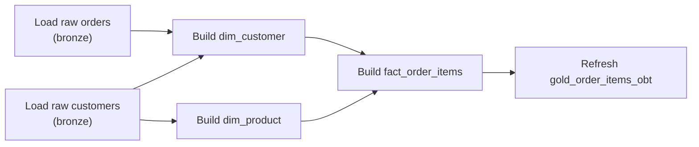
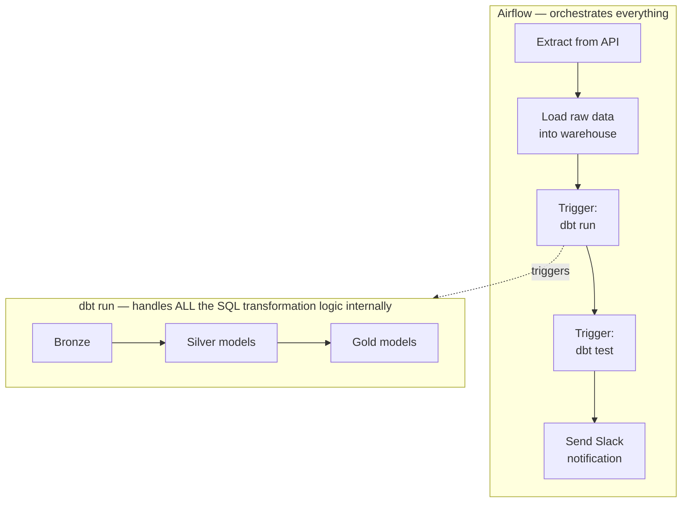

# 03. Orchestration Basics

*Part of [Part 4 — Data Engineering with SQL](../). Previous: [02. SQL for Pipelines](../02-sql-for-pipelines/).*

You now know how to write pipeline-safe SQL (incremental, idempotent). This
module answers the next question: **what actually runs that SQL, on a
schedule, in the right order, and tells you when something breaks?** You
won't install anything in this module — the goal is to recognize these
tools and concepts fluently, since you'll work alongside them (or directly
in them) on any real data team.

## The problem: real pipelines are graphs, not scripts

A realistic pipeline for our capstone project might need to run in this order:



Some steps can run in parallel (loading orders and customers don't depend on
each other); others must wait for their inputs to finish first
(`fact_order_items` needs both dimension tables built already). Running
these by hand, in the right order, every day, forever, doesn't scale — that's
exactly the job of an **orchestrator**.

> **New term — orchestration**: automatically running a set of
> interdependent tasks in the correct order, on a schedule, handling
> retries and failures, and giving you visibility into what ran and what didn't.

## DAGs: how orchestrators represent pipelines

> **New term — DAG (Directed Acyclic Graph)**: a diagram exactly like the
> one above — a set of tasks (nodes) connected by dependencies (directed
> arrows), with no cycles (task A can't depend on task B if B also depends,
> even indirectly, on A — that would create an impossible infinite loop).

Every major orchestration tool represents your pipeline as a DAG internally,
even if you don't draw it yourself — you declare *what depends on what*, and
the tool figures out execution order, parallelism, and retry behavior.

## Apache Airflow: the industry-standard general orchestrator

> **New term — Apache Airflow**: an open-source platform for defining,
> scheduling, and monitoring workflows (DAGs) as Python code.

A simplified Airflow DAG for the pipeline above looks roughly like this
(you're not expected to write Airflow code in this SQL-focused repo — this
is purely so you recognize it):

```python
from airflow import DAG
from airflow.operators.postgres_operator import PostgresOperator
from datetime import datetime

with DAG("northstar_gold_pipeline", schedule="@daily", start_date=datetime(2024, 1, 1)) as dag:
    load_orders = PostgresOperator(task_id="load_raw_orders", sql="load_orders.sql")
    load_customers = PostgresOperator(task_id="load_raw_customers", sql="load_customers.sql")
    build_dim_customer = PostgresOperator(task_id="build_dim_customer", sql="dim_customer.sql")
    build_dim_product = PostgresOperator(task_id="build_dim_product", sql="dim_product.sql")
    build_fact = PostgresOperator(task_id="build_fact_order_items", sql="fact_order_items.sql")

    load_customers >> build_dim_customer
    load_orders >> build_dim_product
    [build_dim_customer, build_dim_product] >> build_fact
```

The `>>` operator declares dependencies — "run the thing on the left before
the thing on the right." Airflow handles the rest: scheduling this to run
`@daily`, retrying failed tasks according to rules you set, alerting on
failure, and showing you a visual graph of what succeeded, failed, or is
still running.

**What Airflow is good at**: orchestrating *anything* — not just SQL. It can
trigger API calls, run Python scripts, kick off Spark jobs, and coordinate
across entirely different systems, with SQL execution being just one type
of task among many.

## dbt (data build tool): the SQL transformation specialist

> **New term — dbt**: a tool built specifically around the "T" in ELT —
> letting you write transformations as plain `SELECT` statements in `.sql`
> files, which dbt compiles and runs in dependency order, while adding
> testing, documentation, and version control on top.

This is the tool most directly built around everything you've learned in
this repo. A dbt "model" is just a `SELECT` statement in a file:

```sql
-- models/dim_customer.sql
SELECT
    customer_id,
    first_name || ' ' || last_name AS full_name,
    country,
    is_active
FROM {{ source('northstar', 'customers') }}
```

```sql
-- models/fact_order_items.sql
SELECT
    oi.order_item_id,
    o.order_id,
    o.order_date,
    {{ ref('dim_customer') }}.customer_id,
    oi.quantity,
    oi.unit_price,
    (oi.quantity * oi.unit_price) AS line_total
FROM {{ source('northstar', 'order_items') }} oi
JOIN {{ source('northstar', 'orders') }} o ON oi.order_id = o.order_id
JOIN {{ ref('dim_customer') }} ON o.customer_id = {{ ref('dim_customer') }}.customer_id
```

- **`{{ ref('dim_customer') }}`** references *another dbt model by name* —
  dbt automatically figures out that `fact_order_items` depends on
  `dim_customer` from this reference alone, and builds the dependency DAG
  **for you**, without you writing any explicit ordering logic like
  Airflow's `>>`.
- **`{{ source(...) }}`** references a raw source table (bronze layer),
  distinct from other dbt models, making the boundary between "raw input"
  and "transformed output" explicit.
- dbt compiles this templated SQL (this templating language is called
  **Jinja**) into plain SQL and runs it against your warehouse — dbt itself
  never touches your data directly except by generating and executing SQL.

### dbt tests: a first taste (fully covered in the next module)

```yaml
# models/schema.yml
models:
  - name: dim_customer
    columns:
      - name: customer_id
        tests:
          - unique
          - not_null
```

Running `dbt test` checks these assertions against your actual built
tables — a lightweight, built-in way to catch data quality problems, which
[Module 04](../04-data-quality-and-testing/) covers in full depth.

### dbt docs: automatic documentation and lineage

Because every model explicitly declares its dependencies via `ref()`/`source()`,
dbt can automatically generate a visual **lineage graph** — exactly like the
DAG diagram at the top of this module — showing how data flows from raw
sources through every transformation to your final tables, along with any
documentation you've written. This lineage graph becomes directly relevant
again in [Part 6 — Compliance & Governance](../../06-security/05-compliance-and-governance/),
where tracing exactly where a piece of data came from is a real compliance requirement.

## Airflow + dbt together: how they actually combine in practice

These tools aren't competitors — most real modern data stacks use both,
each for what it's best at:



Airflow handles the broader workflow — extraction, loading, calling
external systems, alerting — and treats "run all the SQL transformations"
as a single step that it delegates entirely to dbt, which handles the
internal dependency graph of *just* the SQL transformation layer.

## ✅ Try it yourself

There's no new SQL syntax in this module — but you can apply the *thinking*
directly. Using everything from Parts 1–4 so far, sketch (on paper or in a
text file) the dbt-style model files you'd need to go from
`northstar.orders`/`customers`/`products`/`order_items` all the way to the
`gold_order_items_obt` view from [Part 3, Module 04](../../03-database-design-and-modeling/04-modern-modeling-patterns/) —
name each model, and note which other models it would `ref()`.

### Exercises

1. In the Airflow example, why does `build_fact` depend on **both**
   `build_dim_customer` and `build_dim_product`, rather than just one of them?
2. Explain, in your own words, the difference between what Airflow's `>>`
   operator does and what dbt's `ref()` function does, given that they both
   express "this depends on that."
3. A team has a single, self-contained SQL transformation pipeline with no
   external systems to call and no need for Python/API steps at all. Would
   you recommend they still set up Airflow, or would dbt alone suffice? Why?

<details>
<summary>💡 Solutions</summary>

```text
1. fact_order_items needs data from BOTH dim_customer (to reference the
   right customer surrogate key) and dim_product (for the product surrogate
   key) to be built correctly — it can't be safely built if either input
   dimension is missing or stale, so the orchestrator must wait for both to
   finish before starting the fact table build.

2. Airflow's >> is an explicit, manually-declared dependency between TASKS
   in a DAG you write yourself — you decide and state the order directly.
   dbt's ref() is an implicit dependency, inferred automatically from the
   SQL itself: because fact_order_items.sql references {{ ref('dim_customer') }},
   dbt deduces the dependency without you writing any separate ordering
   statement — the dependency graph emerges from the SQL you'd be writing
   anyway.

3. dbt alone would likely suffice. If there's no need to orchestrate
   external systems, APIs, or non-SQL steps, dbt's own scheduling (dbt
   Cloud) or a simple cron job running `dbt run && dbt test` covers the
   full need without the added operational overhead of running and
   maintaining a full Airflow deployment. Airflow earns its complexity when
   you need to coordinate heterogeneous systems beyond just SQL.
```
</details>

## 🧠 Quick check

<details>
<summary>Q: What is a DAG, and why can't it contain cycles?</summary>

A DAG (Directed Acyclic Graph) represents tasks and their dependencies as
nodes and directed arrows. It can't contain cycles because a cycle would
mean a task depends (even indirectly) on itself completing first — a
logical impossibility that would mean the pipeline could never actually start.
</details>

<details>
<summary>Q: What's the key difference in what Airflow and dbt are each specialized for?</summary>

Airflow is a general-purpose orchestrator for coordinating any kind of task
across any systems (APIs, scripts, SQL, and more) on a schedule. dbt is
specialized specifically for the SQL transformation layer, letting you
write transformations as plain SQL `SELECT` statements with automatic
dependency resolution (via `ref()`), built-in testing, and automatic documentation/lineage.
</details>

---
⬅ [Back to Part 4](../) | ➡ Next: [04. Data Quality & Testing](../04-data-quality-and-testing/)
