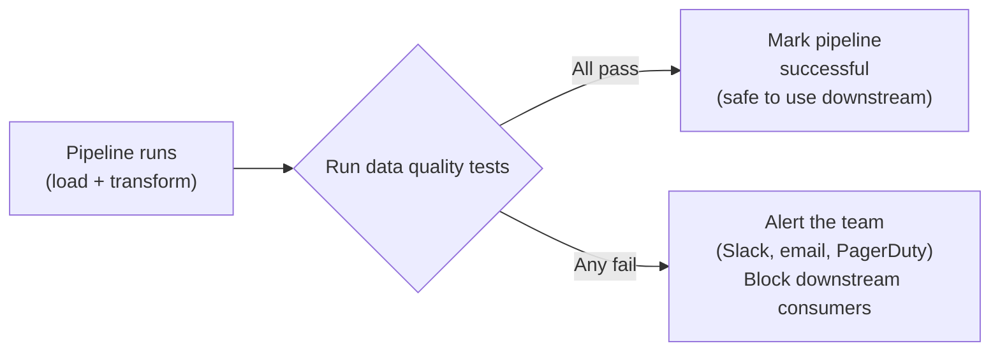

# 04. Data Quality & Testing

*Part of [Part 4 — Data Engineering with SQL](../). Previous: [03. Orchestration Basics](../03-orchestration-basics/).*

A pipeline that runs successfully every day but silently produces wrong
numbers is arguably worse than one that visibly crashes — at least a crash
gets noticed. This module closes out Part 4 with how data engineers catch
bad data automatically, before it reaches a dashboard or a decision-maker.

## Constraints: your first, free line of defense

You've been using this idea since [Part 1](../../01-sql-foundations/01-databases-101/)
without necessarily framing it as "testing" — but it is:

```sql
CREATE TABLE order_items (
    quantity   INTEGER NOT NULL CHECK (quantity > 0),
    unit_price NUMERIC(10,2) NOT NULL CHECK (unit_price >= 0)
);
```

`NOT NULL`, `CHECK`, `UNIQUE`, and foreign keys reject bad data **at write
time**, before it ever enters the table — the strongest, earliest form of
data quality enforcement there is. The limitation: they only catch what you
declared in advance, and they can't express questions across multiple rows
("today's row count shouldn't be 90% lower than yesterday's") or across
tables ("every `order_id` in `payments` should also exist in `orders`" —
though that specific one *is* just a foreign key, so add it if it's missing!).

## Writing your own SQL-based data quality checks

Since you already know how to write SQL, you already know how to write data
quality tests — a test is just a query designed to return **zero rows** when everything is fine.

```sql
SET search_path TO northstar;

-- Test: every order_id in payments should exist in orders
-- (If this returns any rows, something is badly wrong — likely a bug in the load process)
SELECT p.payment_id, p.order_id
FROM payments p
LEFT JOIN orders o ON p.order_id = o.order_id
WHERE o.order_id IS NULL;

-- Test: no product should have a negative profit margin (selling at a loss unintentionally)
SELECT product_id, product_name, unit_price, cost_price
FROM products
WHERE unit_price < cost_price;

-- Test: every customer's email should look like a valid email (a basic sanity check)
SELECT customer_id, email
FROM customers
WHERE email NOT LIKE '%_@_%._%';
```

This pattern — **a query that should return zero rows** — is the single
most useful data quality idea in this entire module. Wire any of these into
your orchestration tool ([Module 03](../03-orchestration-basics/)) to run
automatically after every pipeline run, and alert someone the moment a check
returns unexpected rows.

## The categories of data quality tests

| Category | Question it answers | Example |
|---|---|---|
| **Uniqueness** | Are there unexpected duplicates? | No two rows share the same `customer_id` |
| **Not null** | Is a required field ever missing? | Every order has an `order_date` |
| **Referential integrity** | Does every foreign key have a valid match? | Every `payments.order_id` exists in `orders` |
| **Accepted values** | Does a column only contain expected values? | `order_status` is always one of the 5 documented values |
| **Range / bounds** | Are values within a sane range? | `unit_price` is never negative; `signup_date` is never in the future |
| **Freshness** | Has new data arrived recently, as expected? | `MAX(order_date)` in the last load is within the last 24 hours |
| **Volume / anomaly** | Is today's data suspiciously different in size? | Today's row count isn't 90% lower than the 7-day average |

```sql
-- Freshness test: alert if the most recent order is more than a day old
-- (in a live system — our static sample data will always "fail" this, which is expected)
SELECT MAX(order_date) AS most_recent_order
FROM orders
HAVING MAX(order_date) < CURRENT_DATE - INTERVAL '1 day';

-- Volume anomaly test: today's order count vs. the recent daily average
WITH daily_counts AS (
    SELECT order_date, COUNT(*) AS num_orders
    FROM orders
    WHERE order_date >= CURRENT_DATE - INTERVAL '8 days'
    GROUP BY order_date
)
SELECT *
FROM daily_counts
WHERE order_date = CURRENT_DATE - INTERVAL '1 day'
  AND num_orders < 0.5 * (SELECT AVG(num_orders) FROM daily_counts WHERE order_date < CURRENT_DATE - INTERVAL '1 day');
```

## dbt-style generic tests: the same ideas, standardized

Recall dbt models from [Module 03](../03-orchestration-basics/). dbt ships
with built-in generic tests covering the most common cases above, applied
declaratively in YAML instead of hand-written SQL each time:

```yaml
# models/schema.yml
models:
  - name: dim_customer
    columns:
      - name: customer_id
        tests:
          - unique
          - not_null
      - name: country
        tests:
          - not_null

  - name: fact_order_items
    columns:
      - name: customer_id
        tests:
          - relationships:
              to: ref('dim_customer')
              field: customer_id
      - name: order_status
        tests:
          - accepted_values:
              values: ['placed', 'shipped', 'delivered', 'cancelled', 'returned']
```

Running `dbt test` compiles each of these into the exact same "should
return zero rows" SQL pattern you wrote by hand above, runs them all, and
reports pass/fail — the value is standardization and low effort for the
most common checks, while custom SQL (like the volume anomaly test) still
covers anything more specific to your business.

## Data contracts

> **New term — data contract**: an explicit, agreed-upon specification of
> what a dataset looks like (its schema, types, allowed values,
> update frequency, and ownership) — a formal agreement between the team
> producing data and the teams consuming it, so changes don't silently break
> downstream pipelines.

Why does this matter beyond just tests? Tests catch quality problems
*within* a dataset you already control. A data contract prevents a
different, sneakier problem: an **upstream** team (say, the engineering team
that owns the `orders` application database) silently renaming a column,
changing a data type, or removing a status value — breaking your pipeline
with zero warning, because they didn't know anyone downstream depended on
that exact shape.

A simple data contract for our `orders` source might state:
- `order_status` will only ever be one of the 5 documented values, and any
  new value will be announced at least 2 weeks in advance.
- `order_id` is a stable, never-reused integer.
- New columns may be added at any time (consumers should tolerate this);
  existing columns will not be removed or renamed without notice.

In practice, this is enforced partly by process (communication between
teams) and partly by the exact tests in this module — an `accepted_values`
test on `order_status` is, in effect, automatically enforcing part of the contract.

## Where to run these tests: the full picture



The critical design decision: tests should run **automatically, as part of
the pipeline**, not as a separate manual step someone might forget. This is
exactly why [Module 03's](../03-orchestration-basics/) Airflow-triggers-dbt
diagram included a dedicated `dbt test` step — data quality checks are a
first-class part of the pipeline, not an afterthought.

## ✅ Try it yourself

```sql
SET search_path TO northstar;

-- Run all of these — in a healthy dataset, every one should return zero rows
SELECT 'orphaned order_items' AS test_name, COUNT(*) AS failing_rows
FROM order_items oi LEFT JOIN orders o ON oi.order_id = o.order_id WHERE o.order_id IS NULL
UNION ALL
SELECT 'orphaned payments', COUNT(*)
FROM payments p LEFT JOIN orders o ON p.order_id = o.order_id WHERE o.order_id IS NULL
UNION ALL
SELECT 'negative quantities', COUNT(*)
FROM order_items WHERE quantity <= 0
UNION ALL
SELECT 'products sold at a loss', COUNT(*)
FROM products WHERE unit_price < cost_price
UNION ALL
SELECT 'duplicate customer emails', COUNT(*)
FROM (SELECT email FROM customers GROUP BY email HAVING COUNT(*) > 1) dupes;
```

### Exercises

1. Write a test (a query that should return zero rows) confirming every
   `orders.order_status` value is one of the 5 documented values — even
   though our schema already enforces this via `CHECK`, writing the test
   independently is good practice for tables that *don't* have such a constraint.
2. Write a freshness-style test: does every customer's `signup_date` fall
   on or before today (no signups from the future — a common data entry/
   timezone bug)?
3. Design (in words, no SQL needed) a simple data contract for the
   `web_events` table from [Part 2, Module 06](../../02-intermediate-advanced-sql/06-json-and-semistructured-data/) —
   what would you want to guarantee to anyone building a dashboard on top of it?

<details>
<summary>💡 Solutions</summary>

```sql
-- 1.
SELECT order_id, order_status
FROM orders
WHERE order_status NOT IN ('placed', 'shipped', 'delivered', 'cancelled', 'returned');

-- 2.
SELECT customer_id, signup_date
FROM customers
WHERE signup_date > CURRENT_DATE;
```

```text
3. A reasonable data contract for web_events might guarantee:
   - event_type will only ever be one of a documented, versioned list
     (adding a new type requires updating this contract, not a silent
     change).
   - Every event has a non-null customer_id, event_time, and payload.
   - The payload's shape for each event_type is documented and stable
     (e.g., "page_view always includes url, referrer, and device" — adding
     new keys is fine, removing or renaming existing ones is a breaking
     change requiring notice).
   - event_time will never be in the future and will always be within a
     reasonable freshness window (e.g., no more than 1 hour old for a
     near-real-time dashboard).
```
</details>

## 🎉 Part 4 complete!

You now understand the full ELT lifecycle: how data physically gets into
your platform, how to write pipeline-safe SQL that's incremental and
idempotent, how orchestration tools run and schedule that SQL, and how to
automatically verify the results are trustworthy. Next up:
[Part 5 — Performance & Optimization](../../05-performance-and-optimization/),
where you'll learn to make all of this fast and cost-efficient at scale.

## 🧠 Quick check

<details>
<summary>Q: What's the simplest way to think about what a SQL-based data quality test actually is?</summary>

A query designed to return zero rows when the data is healthy. If it
returns any rows, each one represents a specific violation of the rule
you're testing for — this framing works for uniqueness, referential
integrity, accepted values, ranges, and most other data quality checks.
</details>

<details>
<summary>Q: How is a "data contract" different from a database constraint or a dbt test?</summary>

A constraint or test enforces/verifies rules within a dataset you already
control. A data contract is a broader, often cross-team agreement about a
dataset's shape and guarantees — including things a database can't enforce
on its own, like advance notice of upstream changes — designed to prevent
an UPSTREAM team from silently breaking downstream consumers who depend on
that dataset's current shape.
</details>

---
⬅ [Back to Part 4](../) | ➡ Next: [Part 5 — Performance & Optimization](../../05-performance-and-optimization/)
