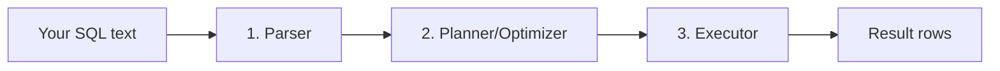

# 01. How Databases Execute Queries

*Part of [Part 5 — Performance & Optimization](../). Previous: [Part 4 — Data Engineering with SQL](../../04-data-engineering-with-sql/).*

Recall from [Part 0](../../00-orientation/) that SQL is **declarative** — you
say *what* you want, not *how* to get it. This module opens the black box:
what actually happens between you pressing "run" and rows coming back? You
can't tune what you don't understand, so this is the foundation for
everything else in Part 5.

## The four stages every query goes through



1. **Parser**: checks your SQL is syntactically valid and turns it into an
   internal representation (a "parse tree"). This is where you'd get a
   `syntax error` if you typo'd a keyword.
2. **Planner/Optimizer**: the most interesting stage. The database considers
   **multiple possible strategies** for executing your query (which index to
   use, if any; which order to join tables in; whether to sort before or
   after filtering) and picks the one it estimates will be cheapest.
3. **Executor**: actually carries out the chosen plan — reading data pages
   from disk or cache, applying filters, performing joins, sorting, and
   aggregating.
4. **Result**: rows are streamed back to you.

> **New term — query optimizer**: the component that chooses *how* to
> execute your declarative SQL, out of many possible equivalent strategies,
> based on cost estimates. This is the concrete mechanism behind "SQL is
> declarative" — the optimizer is doing the "how" so you don't have to.

## `EXPLAIN`: seeing the chosen plan

```sql
SET search_path TO northstar;

EXPLAIN
SELECT * FROM orders WHERE customer_id = 42;
```

Output looks something like:

```
Index Scan using idx_orders_customer_id on orders  (cost=0.29..8.31 rows=5 width=44)
  Index Cond: (customer_id = 42)
```

Read this from the **inside out** (the innermost/lowest operation runs
first) — here there's just one step: an **Index Scan**. The numbers mean:

- **`cost=0.29..8.31`**: the optimizer's *estimated* cost to start producing
  the first row (`0.29`) and to return all rows (`8.31`), in arbitrary
  internal cost units — not milliseconds, just a relative number used to
  compare plans against each other.
- **`rows=5`**: the optimizer's *estimate* of how many rows this step will
  produce — based on statistics about your data (see below), not an actual count yet.
- **`width=44`**: the estimated average size, in bytes, of each returned row.

## `EXPLAIN ANALYZE`: seeing what actually happened

`EXPLAIN` alone only shows the *plan* and *estimates* — it doesn't run the
query. `EXPLAIN ANALYZE` actually **executes** the query and shows you real,
measured numbers alongside the estimates:

```sql
EXPLAIN ANALYZE
SELECT * FROM orders WHERE customer_id = 42;
```

```
Index Scan using idx_orders_customer_id on orders
  (cost=0.29..8.31 rows=5 width=44)
  (actual time=0.021..0.028 rows=5 loops=1)
  Index Cond: (customer_id = 42)
Planning Time: 0.112 ms
Execution Time: 0.045 ms
```

The `actual` numbers are real measurements from actually running the query.
**Comparing estimated `rows` to actual `rows` is one of the single most
useful diagnostic habits you can build** — a big mismatch (the optimizer
estimated 5 rows but got 50,000) is a strong signal that the optimizer's
statistics are stale or wrong, which can cause it to choose a bad plan
entirely, as you'll see below.

> ⚠️ **Be careful with `EXPLAIN ANALYZE` on `INSERT`/`UPDATE`/`DELETE`** — it
> actually executes the statement, so it *will* modify your data. Wrap it in
> a transaction you `ROLLBACK` (recall [Part 2, Module 03](../../02-intermediate-advanced-sql/03-data-modification-and-transactions/))
> if you're just investigating a write query's plan.

## Seq Scan vs. Index Scan: the most important distinction

```sql
EXPLAIN ANALYZE SELECT * FROM products WHERE category = 'Electronics';
```

```
Seq Scan on products  (cost=0.00..1.50 rows=7 width=... )
  Filter: (category = 'Electronics'::text)
```

> **New term — sequential scan (Seq Scan)**: reading **every single row** in
> a table, in physical storage order, checking each one against your filter
> — like reading an entire book page by page looking for one word, instead
> of using the index at the back.

> **New term — index scan**: using an index (covered fully in
> [Module 02](../02-indexing-strategies/)) to jump directly to the matching
> rows, without reading the whole table.

A `Seq Scan` isn't automatically bad — for a **small** table (like our
40-row `products` table), scanning the whole thing is often genuinely
cheaper than the overhead of using an index. This is a real, deliberate
optimizer decision, not a failure — which is exactly why the next section matters.

## Why the optimizer sometimes "gets it wrong": statistics

The planner's cost estimates depend entirely on **statistics** — a stored
summary of your data's characteristics (row counts, the distribution of
distinct values in each column, and more) that PostgreSQL maintains via the
`ANALYZE` command (often run automatically, but not always immediately after big changes).

```sql
-- Manually refresh statistics for a table
ANALYZE products;

-- See what the optimizer currently believes about a table
SELECT relname, n_live_tup AS estimated_row_count
FROM pg_stat_user_tables
WHERE relname = 'products';
```

If statistics are stale (say, right after a huge bulk load that hasn't been
`ANALYZE`d yet), the optimizer's row estimates can be badly wrong, leading
it to choose a plan that would be fine for the *old* data volume but is
terrible for the *actual current* volume — for example, choosing a Seq Scan
because it still thinks a table has 100 rows when it now has 10 million.

> 💡 **Practical habit**: if a query's performance suddenly and mysteriously
> gets much worse after a large data load, `ANALYZE` the affected tables
> before doing anything else — stale statistics are one of the most common,
> and most quickly fixable, causes.

## Join strategies: a preview

The optimizer also chooses **how** to physically execute a `JOIN` — not
just which tables to scan. You'll see these three names constantly in
execution plans:

| Strategy | How it works | Best when |
|---|---|---|
| **Nested Loop** | For each row in table A, scan table B for matches | One side is small, or a good index exists on the join column |
| **Hash Join** | Build a hash table from the smaller table, then scan the larger table probing it | Larger tables, no useful index, equality joins |
| **Merge Join** | Sort both tables by the join key, then merge them like a zipper | Both inputs are already sorted (e.g., from an index) |

```sql
EXPLAIN ANALYZE
SELECT o.order_id, c.first_name
FROM orders o JOIN customers c ON o.customer_id = c.customer_id
WHERE o.order_id < 20;
```

You don't need to memorize how each algorithm works internally yet — just
recognize their names in a plan, and know that **the optimizer picked that
strategy because its cost model said it was cheapest for this specific query
and this specific data**, which is exactly why the same query can use a
different strategy on a different day, as your data grows.

## ✅ Try it yourself

```sql
SET search_path TO northstar;

-- Compare these two — same logical result, notice how the plan differs
EXPLAIN ANALYZE SELECT * FROM orders WHERE order_id = 5;
EXPLAIN ANALYZE SELECT * FROM orders WHERE order_status = 'delivered';
```

### Exercises

1. Run `EXPLAIN ANALYZE` on a query filtering `order_items` by `product_id`
   for a single product. Is it using the index created in
   [`datasets/postgres/00_schema.sql`](../../datasets/postgres/00_schema.sql)? How can you tell?
2. Run `EXPLAIN ANALYZE` on the 3-table join query from
   [Part 1, Module 05](../../01-sql-foundations/05-joins/) (`orders` JOIN
   `customers` JOIN `order_items` JOIN `products`). Identify at least one
   join strategy name in the output.
3. Explain, in your own words, why comparing the *estimated* row count to
   the *actual* row count in an `EXPLAIN ANALYZE` output is a useful
   diagnostic habit, using a concrete hypothetical example.

<details>
<summary>💡 Solutions</summary>

```sql
-- 1.
EXPLAIN ANALYZE SELECT * FROM order_items WHERE product_id = 7;
-- Look for "Index Scan using idx_order_items_product_id" in the output —
-- that confirms the index is being used. If you instead see "Seq Scan",
-- the optimizer decided scanning the whole table was cheaper for this
-- particular query/data size, which can genuinely happen on small tables.

-- 2.
EXPLAIN ANALYZE
SELECT o.order_id, c.first_name, p.product_name, oi.quantity
FROM orders o
JOIN customers c ON o.customer_id = c.customer_id
JOIN order_items oi ON o.order_id = oi.order_id
JOIN products p ON oi.product_id = p.product_id;
-- Look for "Hash Join", "Nested Loop", or "Merge Join" in the plan output.
```

```text
3. Suppose EXPLAIN ANALYZE shows "rows=5" estimated but "actual rows=48000"
   for a step. That mismatch means the optimizer thought this step would
   produce a small result and likely chose a plan optimized for a SMALL
   result (e.g., a Nested Loop join, which is efficient for small inputs
   but very slow for large ones). Because the ACTUAL result was much
   bigger, the chosen plan may be far from optimal — this specific
   estimate-vs-actual gap is one of the clearest signals that stale table
   statistics (fixed by running ANALYZE) are hurting query performance.
```
</details>

## 🧠 Quick check

<details>
<summary>Q: What's the practical difference between EXPLAIN and EXPLAIN ANALYZE?</summary>

`EXPLAIN` shows the chosen plan and the optimizer's *estimates* without
running the query. `EXPLAIN ANALYZE` actually executes the query and adds
*real, measured* timing and row-count numbers alongside those estimates —
which means it will actually modify data for `INSERT`/`UPDATE`/`DELETE`
statements, so use a rollback-able transaction when investigating those.
</details>

<details>
<summary>Q: Is a Seq Scan always a performance problem to fix?</summary>

No. For small tables, or queries that genuinely need to touch most of a
table's rows anyway, a sequential scan can be exactly as fast as (or faster
than) using an index — the overhead of navigating an index structure isn't
always worth it. Seeing a Seq Scan on a *huge* table for a highly selective
filter (one that should only match a handful of rows) is the situation
actually worth investigating.
</details>

---
⬅ [Back to Part 5](../) | ➡ Next: [02. Indexing Strategies](../02-indexing-strategies/)
