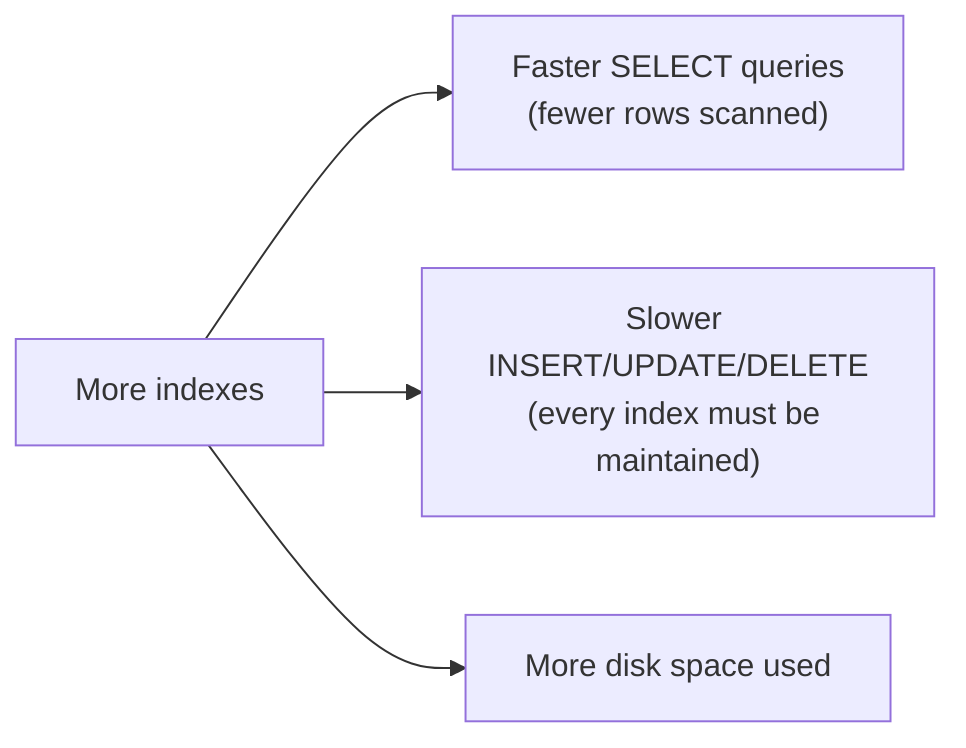

# 02. Indexing Strategies

*Part of [Part 5 — Performance & Optimization](../). Previous: [01. How Databases Execute Queries](../01-how-databases-execute-queries/).*

You've used indexes since [Part 1](../../01-sql-foundations/01-databases-101/)
without building them yourself — every foreign key in
[`datasets/postgres/00_schema.sql`](../../datasets/postgres/00_schema.sql)
has one. This module teaches you to choose, create, and reason about indexes
deliberately — arguably the single highest-leverage performance skill in all of SQL.

## What an index actually is

> **New term — index** (recap and expansion): a separate data structure,
> stored alongside a table, that maps column values to the physical
> locations of the rows containing them — letting the database jump directly
> to matching rows instead of scanning the whole table.

The textbook-index analogy from [Part 0](../../00-orientation/) is exactly
right: instead of reading every page of a book to find every mention of
"normalization," you check the alphabetized index at the back, which points
you directly to the right pages.

## The B-tree: the default, general-purpose index

> **New term — B-tree**: a balanced, tree-shaped data structure that keeps
> values sorted, allowing the database to find any value (or range of
> values) in a small, predictable number of steps, even across millions of rows.

```sql
SET search_path TO northstar;

CREATE INDEX idx_customers_country ON customers(country);
```

B-tree is PostgreSQL's default index type (and the default in nearly every
RDBMS) because it efficiently handles the most common query patterns:
equality (`=`), ranges (`<`, `>`, `BETWEEN`), and sorting (`ORDER BY`) — all
without needing to specify anything special.

## Creating and dropping indexes

```sql
CREATE INDEX idx_orders_order_date ON orders(order_date);

DROP INDEX idx_orders_order_date;

-- A unique index also enforces uniqueness as a side effect (this is
-- literally how UNIQUE and PRIMARY KEY constraints are implemented internally)
CREATE UNIQUE INDEX idx_customers_email ON customers(email);
```

## When an index actually helps: selectivity

> **New term — selectivity**: how well a column narrows down a search — a
> **highly selective** column has many distinct values (like `email`, unique
> per row), while a **low selectivity** column has few distinct values
> relative to the table size (like `is_active`, with only 2 possible values).

```sql
EXPLAIN ANALYZE SELECT * FROM customers WHERE email = 'emma.smith1@example.com';
-- Highly selective: an index narrows this down to ~1 row instantly. Great fit.

EXPLAIN ANALYZE SELECT * FROM customers WHERE is_active = true;
-- Low selectivity: if 90% of customers are active, an index barely helps —
-- the optimizer will likely (correctly!) choose a Seq Scan instead, because
-- "look up almost every row via an index, one at a time" is slower than
-- "just read the whole table sequentially."
```

> 💡 **Rule of thumb**: indexes pay off most on columns with high
> selectivity, used frequently in `WHERE`, `JOIN ... ON`, and `ORDER BY`
> clauses. An index on a low-selectivity column (a boolean flag, a status
> with only 5 values) is often close to useless — sometimes the optimizer
> won't even use it, exactly as [Module 01](../01-how-databases-execute-queries/) demonstrated.

## Composite (multi-column) indexes, and column order matters

```sql
CREATE INDEX idx_orders_customer_status ON orders(customer_id, order_status);
```

This index efficiently serves queries filtering on `customer_id` alone, or
on `customer_id` **AND** `order_status` together — but **not** on
`order_status` alone. Think of it like a phone book sorted by (last name,
first name): great for finding "Smith," and great for finding "Smith, Emma"
— useless for finding everyone named "Emma" regardless of last name, because
the phone book isn't sorted by first name at all.

```sql
-- Uses the composite index efficiently (leftmost column present):
EXPLAIN ANALYZE SELECT * FROM orders WHERE customer_id = 42 AND order_status = 'delivered';
EXPLAIN ANALYZE SELECT * FROM orders WHERE customer_id = 42;

-- Cannot use this composite index efficiently (leftmost column missing):
EXPLAIN ANALYZE SELECT * FROM orders WHERE order_status = 'delivered';
```

> ⚠️ **The leftmost-prefix rule**: a composite index on `(a, b, c)` can be
> used for lookups on `a`, on `(a, b)`, or on `(a, b, c)` — but generally
> *not* for `b` alone, `c` alone, or `(b, c)` without `a`. Always put the
> column you'll filter on *most consistently* (often the highest-selectivity
> one, or the one always present in your queries) leftmost.

## Covering indexes: avoiding a trip back to the table

> **New term — covering index**: an index that contains **every column** a
> query needs, so the database can answer the query directly from the index
> alone, without a separate lookup back to the actual table rows.

```sql
-- Add the columns your SELECT needs (not just what you filter on) with INCLUDE
CREATE INDEX idx_orders_covering ON orders(customer_id) INCLUDE (order_date, order_status);

EXPLAIN ANALYZE
SELECT order_date, order_status FROM orders WHERE customer_id = 42;
```

Look for `Index Only Scan` in the plan output (instead of `Index Scan`) —
that confirms the database satisfied the entire query from the index alone,
which is faster because it skips the extra step of fetching the full row
from the table ("heap") for each match.

## The real cost of indexes: writes get slower

Indexes are not free. **Every index on a table must also be updated on
every `INSERT`, `UPDATE`, and `DELETE`** that touches an indexed column —
more indexes mean more write overhead, plus extra storage space for the
index structures themselves.



This is a genuine, constant tradeoff in real systems: a table that's
written to constantly but read rarely wants **few** indexes; a table that's
read constantly (by dashboards, reports) but written to rarely can afford **many**.

## Finding unused or missing indexes

```sql
-- Indexes that exist but are rarely or never used — candidates for removal
SELECT indexrelname, idx_scan
FROM pg_stat_user_indexes
WHERE idx_scan < 10
ORDER BY idx_scan;

-- Tables with a lot of sequential scans relative to index scans —
-- candidates for a NEW index
SELECT relname, seq_scan, idx_scan
FROM pg_stat_user_tables
ORDER BY seq_scan DESC;
```

> 💡 **Best practice**: don't guess which indexes to add. Use `EXPLAIN
> ANALYZE` on your *actual, slow, real* queries (see
> [Module 04](../04-query-optimization-techniques/)) to find where a Seq
> Scan is hurting a large, frequently-run query — and periodically review
> `pg_stat_user_indexes` in a real production system to remove indexes
> nobody's using, recovering their write overhead and storage cost for free.

## Other index types (a quick map, not exhaustive)

| Index type | Best for |
|---|---|
| **B-tree** (default) | Equality, ranges, sorting — the vast majority of cases |
| **GIN** | Semi-structured/composite data — `JSONB` containment (`@>`), full-text search, arrays (you already used this in [Part 2, Module 06](../../02-intermediate-advanced-sql/06-json-and-semistructured-data/)) |
| **GiST** | Geometric/spatial data, some full-text search use cases |
| **Hash** | Pure equality lookups only (no ranges/sorting) — rarely chosen over B-tree in practice |
| **BRIN** | Very large tables with naturally sequential/correlated data (e.g., a `created_at` column in an append-only log table) — tiny index size, in exchange for coarser precision |

## ✅ Try it yourself

```sql
SET search_path TO northstar;

-- Before: check the plan
EXPLAIN ANALYZE SELECT * FROM orders WHERE order_date BETWEEN '2024-06-01' AND '2024-06-30';

-- Add an index and compare
CREATE INDEX idx_orders_order_date ON orders(order_date);
EXPLAIN ANALYZE SELECT * FROM orders WHERE order_date BETWEEN '2024-06-01' AND '2024-06-30';
```

### Exercises

1. Would you recommend an index on `products.is_discontinued`? Justify your
   answer using the selectivity concept from this module.
2. Design a composite index that would best serve this query pattern, used
   very frequently in a hypothetical reporting tool: `WHERE shipping_country
   = ? AND order_status = ? ORDER BY order_date`. Explain your column ordering choice.
3. A table is written to (via `INSERT`) thousands of times per second but
   only read a handful of times per day for a monthly report. Would you add
   5 indexes to make that monthly report faster? Why or why not?

<details>
<summary>💡 Solutions</summary>

```text
1. Generally no — is_discontinued is a boolean with only 2 possible values,
   very low selectivity. Unless the table is enormous AND the split between
   true/false is extremely lopsided (e.g., 99.9% false, 0.1% true, making a
   lookup for the rare value genuinely selective), an index here provides
   little benefit while still adding write overhead on every product update.
```

```sql
-- 2.
CREATE INDEX idx_orders_reporting ON orders(shipping_country, order_status, order_date);
-- shipping_country and order_status are the equality filters (leftmost-prefix
-- rule means both need to come before order_date to be usable together),
-- and order_date last both satisfies ORDER BY efficiently and matches how
-- it's used (as a sort, not an equality filter) in this query pattern.
```

```text
3. No — this table's write frequency (thousands of inserts/second) is
   overwhelmingly more important to protect than a report that runs once a
   month. Adding 5 indexes would meaningfully slow down every single insert
   (all 5 indexes must be updated on every write), for a benefit that's
   used extremely rarely. A better approach: keep this table minimally
   indexed, and instead build a separate, periodically-refreshed
   materialized view or summary table (Part 2, Module 04) for the monthly
   report, indexed however is convenient for THAT much smaller, much less
   frequently written table.
```
</details>

## 🧠 Quick check

<details>
<summary>Q: Why doesn't a composite index on (a, b) help a query that only filters on b?</summary>

Because a composite index is physically sorted by its columns in order —
first by `a`, then by `b` within each `a` value (the "leftmost-prefix
rule"). Without a value for `a`, the database has no way to narrow down
where in the sorted structure to look for a given `b` value, so it can't
use the index efficiently for that query.
</details>

<details>
<summary>Q: What's the tradeoff every additional index introduces?</summary>

Faster reads (for queries that can use it) at the cost of slower writes
(every `INSERT`/`UPDATE`/`DELETE` touching an indexed column must also
update the index) and additional disk space. This is why indexes should be
added deliberately, based on real, observed query patterns — not applied to
every column "just in case."
</details>

---
⬅ [Back to Part 5](../) | ➡ Next: [03. Partitioning & Clustering](../03-partitioning-and-clustering/)
