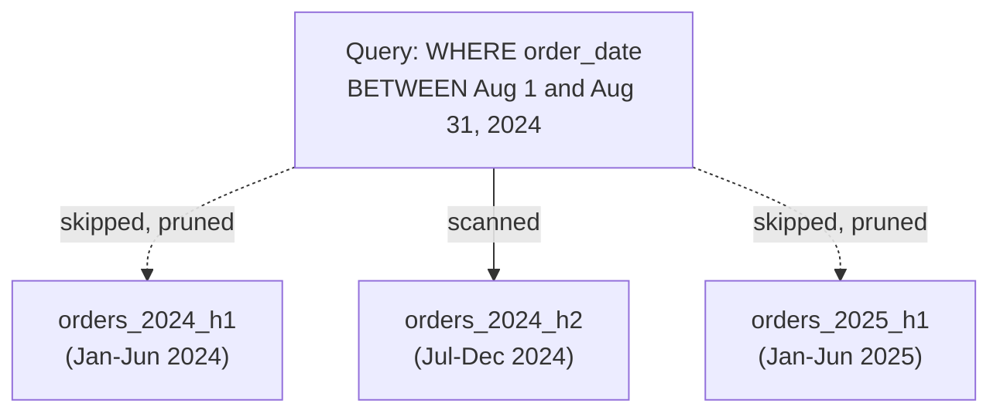
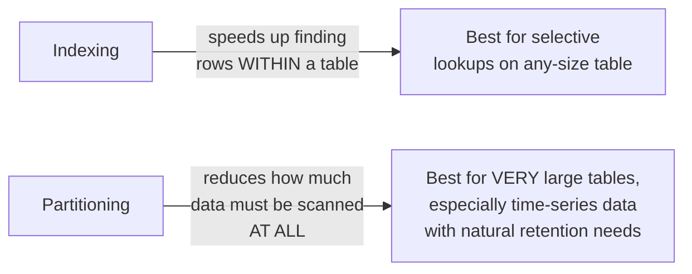

# 03. Partitioning & Clustering

*Part of [Part 5 — Performance & Optimization](../). Previous: [02. Indexing Strategies](../02-indexing-strategies/).*

Indexes ([Module 02](../02-indexing-strategies/)) speed up finding specific
rows within a table. This module addresses a different scaling problem: what
do you do when a **single table** grows to billions of rows, so large that
even routine maintenance (backups, deletes, index rebuilds) becomes painful?
The answer is to split the table itself into smaller physical pieces.

## Table partitioning: splitting one logical table into many physical pieces

> **New term — partitioning**: dividing a large table into smaller physical
> segments ("partitions"), based on the value of one or more columns —
> while still letting you query it as if it were one single table.

### Range partitioning: the most common pattern for time-series data

```sql
SET search_path TO northstar;

CREATE TABLE orders_partitioned (
    order_id         INTEGER NOT NULL,
    customer_id      INTEGER NOT NULL,
    employee_id      INTEGER,
    order_date       DATE NOT NULL,
    order_status     VARCHAR(20) NOT NULL,
    shipping_country VARCHAR(56) NOT NULL
) PARTITION BY RANGE (order_date);

CREATE TABLE orders_2024_h1 PARTITION OF orders_partitioned
    FOR VALUES FROM ('2024-01-01') TO ('2024-07-01');

CREATE TABLE orders_2024_h2 PARTITION OF orders_partitioned
    FOR VALUES FROM ('2024-07-01') TO ('2025-01-01');

CREATE TABLE orders_2025_h1 PARTITION OF orders_partitioned
    FOR VALUES FROM ('2025-01-01') TO ('2025-07-01');
```

You still query `orders_partitioned` exactly like a normal table — inserts
are automatically routed to the correct underlying partition based on
`order_date`, and PostgreSQL manages the rest:

```sql
INSERT INTO orders_partitioned (order_id, customer_id, order_date, order_status, shipping_country)
VALUES (100001, 1, '2024-08-15', 'placed', 'Canada');   -- automatically goes into orders_2024_h2
```

## Partition pruning: why this actually makes queries faster

> **New term — partition pruning**: the optimizer's ability to figure out,
> from your query's `WHERE` clause, which partitions **couldn't possibly**
> contain matching rows — and skip reading them entirely.

```sql
EXPLAIN ANALYZE
SELECT * FROM orders_partitioned WHERE order_date BETWEEN '2024-08-01' AND '2024-08-31';
```

The plan will show that only `orders_2024_h2` was scanned — `orders_2024_h1`
and `orders_2025_h1` are never even touched, because the optimizer can prove
from the partition boundaries that no matching rows could be in them. On a
table with, say, 5 years of daily partitions, a single-month query might
touch 1 partition instead of scanning years of irrelevant data — a
dramatic, often orders-of-magnitude speedup, with zero change to the query itself.



## Other partitioning strategies

| Strategy | Splits by | Good for |
|---|---|---|
| **Range** | A range of values (dates, numeric ranges) | Time-series data — by far the most common case |
| **List** | An explicit list of values | A known, fixed set of categories (e.g., partition by `shipping_country` if you always query one country at a time) |
| **Hash** | A hash of a column's value, spread evenly | Distributing writes evenly when there's no natural range/list to partition by |

## Why partitioning helps beyond just query speed

- **Faster maintenance**: dropping an entire old partition (`DROP TABLE
  orders_2022_h1;`) to implement a data retention policy is nearly
  instant — compare that to a `DELETE FROM orders WHERE order_date <
  '2022-07-01'`, which must find and remove matching rows one at a time
  from a giant table, and leaves behind bloat that needs cleanup.
- **Smaller indexes per partition**: each partition can have its own,
  smaller index, which is faster to scan and rebuild than one giant index
  spanning the entire table's history.
- **Parallelism**: some operations can process multiple partitions
  concurrently, since they're physically separate.

## Clustering: physically ordering a table's data on disk

> **New term — clustering** (table sense): physically reordering a table's
> rows on disk to match a particular column's order (or, in cloud
> warehouses, organizing data into groups by a chosen key) — making range
> queries on that column much faster, because matching rows sit close
> together instead of scattered throughout the table.

In PostgreSQL, `CLUSTER` physically reorders a table according to an
existing index, as a one-time operation (it doesn't stay clustered
automatically as new rows are added):

```sql
CLUSTER orders USING idx_orders_order_date;
```

> ⚠️ This is a genuinely different concept from cloud warehouse
> "clustering keys" (Snowflake) or "clustering columns" (BigQuery), which
> are maintained *automatically and continuously* by the platform, not a
> one-time manual command. We'll cover those platform-specific,
> continuously-maintained versions directly in
> [Part 7](../../07-cloud-data-platforms/) — the *concept* (organize data
> physically so related rows sit together, speeding up range/filter
> queries) is the same one you're learning here.

## Partitioning vs. indexing: not a replacement, a complement



A well-designed large table often uses **both**: partitioned by date for
pruning and easy retention management, *and* indexed within each partition
for fast lookups on other columns (like `customer_id`).

## When partitioning is (and isn't) worth the complexity

> 💡 **Practical guidance**: partitioning adds real operational complexity
> (managing partition creation as time moves forward, handling queries that
> span many partitions less efficiently). It typically starts paying off
> once a table reaches tens of millions of rows or more, especially when
> queries naturally filter on the partition key (like date ranges) and/or
> you need a clean way to expire old data. For our sample dataset's ~1,000
> orders, partitioning would be pure overhead with zero benefit — a good
> reminder that every technique in this repo has a scale at which it starts
> (and stops) making sense.

## ✅ Try it yourself

```sql
SET search_path TO northstar;

-- Confirm pruning behavior on the partitioned table created above
EXPLAIN ANALYZE SELECT COUNT(*) FROM orders_partitioned WHERE order_date = '2024-03-15';
-- Look for "Partitions removed by initial pruning" or note which
-- partition-named tables ("orders_2024_h1" etc.) actually appear in the plan.
```

### Exercises

1. Add a fourth partition, `orders_2025_h2`, covering July–December 2025,
   to the `orders_partitioned` table created in this module.
2. Explain why `DROP TABLE orders_2024_h1;` (assuming it were attached as a
   partition of `orders_partitioned`) is a much cheaper operation than
   `DELETE FROM orders_partitioned WHERE order_date < '2024-07-01';` on an
   equivalent non-partitioned table, even though both remove the same rows.
3. A company partitions their multi-billion-row `web_events` table by
   `event_date` (range) but their most common query is "show me all events
   for customer X across all time." Is date-range partitioning a good fit
   for this specific access pattern? Why or why not?

<details>
<summary>💡 Solutions</summary>

```sql
-- 1.
CREATE TABLE orders_2025_h2 PARTITION OF orders_partitioned
    FOR VALUES FROM ('2025-07-01') TO ('2026-01-01');
```

```text
2. DROP TABLE on a partition is a fast metadata-only operation — it simply
   detaches and removes an entire physical table object. DELETE with a
   WHERE clause must scan for matching rows (or use an index), remove them
   one at a time, update every index on the table as it goes, and leaves
   behind "dead" space that later needs a VACUUM to reclaim — vastly more
   work for the same logical outcome.

3. Not a great fit on its own — this query has no date filter at all, so
   EVERY partition would need to be scanned (no pruning benefit), and the
   query would need to gather and combine results across every single
   partition. A hash partition on customer_id (or a composite/different
   strategy entirely) would better match this specific access pattern,
   showing why partition strategy must be chosen based on how the data is
   ACTUALLY queried, not just what feels like a natural dimension to split by.
```
</details>

## 🧠 Quick check

<details>
<summary>Q: What is "partition pruning," and why does it make queries faster?</summary>

Partition pruning is the optimizer's ability to determine, from a query's
filter conditions, which partitions cannot possibly contain matching rows —
and skip scanning them entirely. It's faster because the database reads
dramatically less data overall, often just one small partition instead of
an entire massive table's history.
</details>

<details>
<summary>Q: Should you partition a table with only a few thousand rows?</summary>

No — partitioning adds real operational complexity (managing partition
boundaries over time, potential overhead for queries spanning multiple
partitions) that only pays off once a table is large enough that scanning
it wholesale, or maintaining it as one giant object, becomes genuinely
costly. For small tables, the overhead of partitioning outweighs any benefit.
</details>

---
⬅ [Back to Part 5](../) | ➡ Next: [04. Query Optimization Techniques](../04-query-optimization-techniques/)
