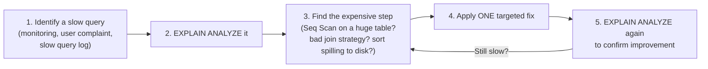

# 04. Query Optimization Techniques

*Part of [Part 5 — Performance & Optimization](../). Previous: [03. Partitioning & Clustering](../03-partitioning-and-clustering/).*

You now understand *how* the database executes queries, and *how* indexes
and partitioning help it. This module is the practical payoff: a concrete
checklist of query patterns to avoid, and what to write instead — the
patterns that come up again and again when tuning real, slow queries.

## The optimization workflow

Before touching a single query, follow this loop every time:



**Never guess.** Every technique below should be validated with `EXPLAIN
ANALYZE` (from [Module 01](../01-how-databases-execute-queries/)) on your
actual query and actual data — "this should theoretically be faster" is a
hypothesis to test, not a conclusion.

## 1. Avoid `SELECT *` in real application/pipeline code

```sql
-- ❌ Fetches every column, even ones you don't need
SELECT * FROM orders WHERE customer_id = 42;

-- ✅ Fetches only what's needed
SELECT order_id, order_date, order_status FROM orders WHERE customer_id = 42;
```

Beyond wasting network bandwidth and memory, this also enables **covering
indexes** ([Module 02](../02-indexing-strategies/)) — the optimizer can only
satisfy a query entirely from an index if it knows exactly which columns are needed.

## 2. Keep filtered columns "sargable"

> **New term — sargable** ("Search ARGument ABLE"): a condition written in a
> way that lets the database use an index directly, without first
> transforming every row's value.

```sql
-- ❌ NOT sargable: wrapping the indexed column in a function prevents
-- index use, because the database would need to compute EXTRACT() for
-- every single row before it could compare — defeating the whole point of an index.
EXPLAIN ANALYZE SELECT * FROM orders WHERE EXTRACT(YEAR FROM order_date) = 2024;

-- ✅ Sargable: rewritten as a plain range comparison on the raw column
EXPLAIN ANALYZE SELECT * FROM orders WHERE order_date >= '2024-01-01' AND order_date < '2025-01-01';
```

Compare the `EXPLAIN` output for both — the first often forces a `Seq Scan`
even with an index on `order_date` present, while the second can use an
`Index Scan`. The general rule: **keep the indexed column bare on one side
of the comparison**; do any necessary math/transformation to the *constant*
you're comparing against instead.

```sql
-- ❌ NOT sargable
WHERE unit_price * 1.1 > 100

-- ✅ Sargable — move the math to the constant side
WHERE unit_price > 100 / 1.1
```

## 3. Prefer `EXISTS` over `IN` for subqueries, `NOT EXISTS` over `NOT IN`

You saw the correctness reason in [Part 1, Module 06](../../01-sql-foundations/06-subqueries-and-ctes/)
(the `NULL` trap). There's also a performance angle: `EXISTS` can
short-circuit — stopping as soon as it finds **one** matching row — while
`IN` (in some databases/scenarios) may need to fully materialize the
subquery's entire result list first.

```sql
-- Often faster and always safer than NOT IN
SELECT c.customer_id
FROM customers c
WHERE NOT EXISTS (SELECT 1 FROM orders o WHERE o.customer_id = c.customer_id);
```

## 4. Filter as early as possible

```sql
-- ❌ Joins everything first, filters last
SELECT o.order_id, c.first_name
FROM orders o
JOIN customers c ON o.customer_id = c.customer_id
WHERE o.order_date >= '2024-06-01' AND c.country = 'Canada';

-- ✅ Same result, but pre-filtering in a CTE gives the optimizer an
-- obvious, explicit smaller set to join against
WITH recent_orders AS (
    SELECT * FROM orders WHERE order_date >= '2024-06-01'
),
canadian_customers AS (
    SELECT * FROM customers WHERE country = 'Canada'
)
SELECT ro.order_id, cc.first_name
FROM recent_orders ro
JOIN canadian_customers cc ON ro.customer_id = cc.customer_id;
```

> 💡 In practice, PostgreSQL's optimizer is usually smart enough to push
> `WHERE` conditions down into joins automatically, so both versions above
> often produce an *identical* final plan — always verify with `EXPLAIN` before
> assuming a rewrite helped. This rewrite becomes genuinely necessary (not just
> stylistic) more often in distributed query engines, covered in [Module 05](../05-distributed-query-engines/).

## 5. Avoid unnecessary `DISTINCT`

```sql
-- ❌ If you already know order_id is unique per row from a well-joined query, DISTINCT is pure wasted sorting/dedup work
SELECT DISTINCT o.order_id, o.order_date FROM orders o WHERE o.customer_id = 42;

-- ✅ order_id is already the primary key — no duplicates are possible here
SELECT o.order_id, o.order_date FROM orders o WHERE o.customer_id = 42;
```

`DISTINCT` is sometimes reached for as a reflexive fix for "my join produced
duplicate rows" — but that's usually a sign of an actual bug (recall
**grain** from [Part 1, Module 05](../../01-sql-foundations/05-joins/)), not
something to paper over. Fix the join's grain mismatch; don't mask it with `DISTINCT`.

## 6. Beware the "N+1 query" anti-pattern

> **New term — N+1 query problem**: running one query to get a list of N
> items, then running N *additional* separate queries (often in application
> code, in a loop) to fetch related data for each item one at a time —
> instead of one single query (or join) that gets everything at once.

```sql
-- ❌ Application code pseudocode — the anti-pattern:
-- orders = SELECT * FROM orders WHERE customer_id = 42
-- for each order in orders:
--     items = SELECT * FROM order_items WHERE order_id = order.id   <- runs N times!

-- ✅ One single query instead
SELECT o.order_id, oi.product_id, oi.quantity
FROM orders o
JOIN order_items oi ON o.order_id = oi.order_id
WHERE o.customer_id = 42;
```

This pattern is invisible in any single query's `EXPLAIN` output — each
individual query might even look perfectly fine and fast — but the
*aggregate* effect of running hundreds or thousands of tiny queries instead
of one well-joined query devastates performance. It's one of the most
common real-world performance bugs, especially in application code that
wasn't written with SQL joins in mind.

## 7. `LIMIT` with `ORDER BY` needs the right index to stay fast

```sql
-- Without an index on order_date, this must sort the ENTIRE table before
-- it can hand back just the top 10 rows
EXPLAIN ANALYZE SELECT * FROM orders ORDER BY order_date DESC LIMIT 10;
```

With an index on `order_date`, the database can walk the index in
already-sorted order and stop after 10 rows — without ever sorting the full
table. Watch for a `Sort` step in the plan when you expected an index to
avoid one entirely; that's a strong hint an index on the `ORDER BY` column would help.

## 8. Batch large writes instead of one row at a time

```sql
-- ❌ Slow: one round-trip and one transaction per row, for 10,000 rows
-- (application pseudocode, calling this once per row in a loop)
INSERT INTO customers (first_name, last_name, email, country, signup_date, is_active)
VALUES ('...', '...', '...', '...', '...', true);

-- ✅ Batch multiple rows into fewer statements
INSERT INTO customers (first_name, last_name, email, country, signup_date, is_active)
VALUES
    ('...', '...', '...', '...', '...', true),
    ('...', '...', '...', '...', '...', true),
    -- ... hundreds more rows in one statement
    ('...', '...', '...', '...', '...', true);
```

Each individual statement has fixed overhead (network round-trip, parsing,
planning) — batching amortizes that overhead across many rows at once,
often producing dramatic speedups for bulk loads, which is directly
relevant to the pipeline-loading work from [Part 4](../../04-data-engineering-with-sql/).

## Quick-reference checklist

| Symptom in `EXPLAIN ANALYZE` | Likely fix |
|---|---|
| `Seq Scan` on a huge table with a highly selective filter | Add an index ([Module 02](../02-indexing-strategies/)) |
| Function wrapped around a filtered column | Rewrite to keep the column bare (sargable) |
| Huge estimated-vs-actual row mismatch | Run `ANALYZE` to refresh statistics |
| `Sort` step before a `LIMIT` | Add an index matching the `ORDER BY` |
| Many small, similar queries in application logs | Look for an N+1 pattern; rewrite as one join |
| Query scans a huge date range every time | Consider partitioning ([Module 03](../03-partitioning-and-clustering/)) |

## ✅ Try it yourself

```sql
SET search_path TO northstar;

-- Compare these two logically-equivalent queries with EXPLAIN ANALYZE
EXPLAIN ANALYZE SELECT * FROM orders WHERE EXTRACT(YEAR FROM order_date) = 2024;
EXPLAIN ANALYZE SELECT * FROM orders WHERE order_date >= '2024-01-01' AND order_date < '2025-01-01';
```

### Exercises

1. Rewrite this non-sargable query to be sargable:
   `SELECT * FROM products WHERE LOWER(product_name) = 'aurora blender #1';`
   (hint: think about what index would even help here, and consider a
   functional index as one valid answer — research `CREATE INDEX ... ON
   table (LOWER(column))` if you want to keep the function).
2. Identify the N+1 problem in this pseudocode and rewrite it as a single SQL query:
   ```
   customers = SELECT customer_id FROM customers WHERE country = 'Canada'
   for each customer in customers:
       total = SELECT SUM(quantity * unit_price) FROM order_items oi
               JOIN orders o ON oi.order_id = o.order_id
               WHERE o.customer_id = customer.id
   ```
3. Explain why adding `DISTINCT` to "fix" a query returning unexpected
   duplicate rows can hide a real bug rather than solve it.

<details>
<summary>💡 Solutions</summary>

```sql
-- 1. Two valid approaches:
-- (a) Compare against a fixed literal value if the search term is already normalized:
SELECT * FROM products WHERE product_name = 'Aurora Blender #1';

-- (b) If you truly need case-insensitive search, create a functional index
-- that matches the expression, so it stays sargable with respect to THAT index:
CREATE INDEX idx_products_name_lower ON products (LOWER(product_name));
SELECT * FROM products WHERE LOWER(product_name) = 'aurora blender #1';

-- 2.
SELECT c.customer_id, SUM(oi.quantity * oi.unit_price) AS total
FROM customers c
JOIN orders o ON c.customer_id = o.customer_id
JOIN order_items oi ON o.order_id = oi.order_id
WHERE c.country = 'Canada'
GROUP BY c.customer_id;
```

```text
3. Unexpected duplicate rows from a join almost always mean the join's
   GRAIN doesn't match what you expected (Part 1, Module 05) — e.g.,
   joining to a table where you assumed one match per row, but there are
   actually several. Slapping DISTINCT on top hides the symptom (duplicate
   rows disappear from the output) without fixing the underlying join
   logic, and can silently produce WRONG aggregated numbers if you also
   SUM or COUNT anything in that same query, since the duplication may have
   already inflated an aggregate before DISTINCT even gets a chance to deduplicate.
```
</details>

## 🧠 Quick check

<details>
<summary>Q: What does it mean for a WHERE condition to be "sargable," and why does it matter?</summary>

A sargable condition compares an indexed column directly, without wrapping
it in a function or expression — letting the database use an index to find
matches. A non-sargable condition (like wrapping the column in a function)
forces the database to evaluate that function for every row before it can
compare, which usually defeats the purpose of having an index at all.
</details>

<details>
<summary>Q: Why is the N+1 query problem often invisible when looking at a single query's EXPLAIN output?</summary>

Because each of the individual N+1 queries can be perfectly fast and
efficient on its own — the problem is entirely about running far too MANY
separate round-trips instead of one well-joined query. `EXPLAIN` only shows
you the plan for one query at a time, so you have to look at the broader
pattern of application behavior (e.g., query logs showing the same query
shape repeated hundreds of times) to spot it.
</details>

---
⬅ [Back to Part 5](../) | ➡ Next: [05. Distributed Query Engines](../05-distributed-query-engines/)
