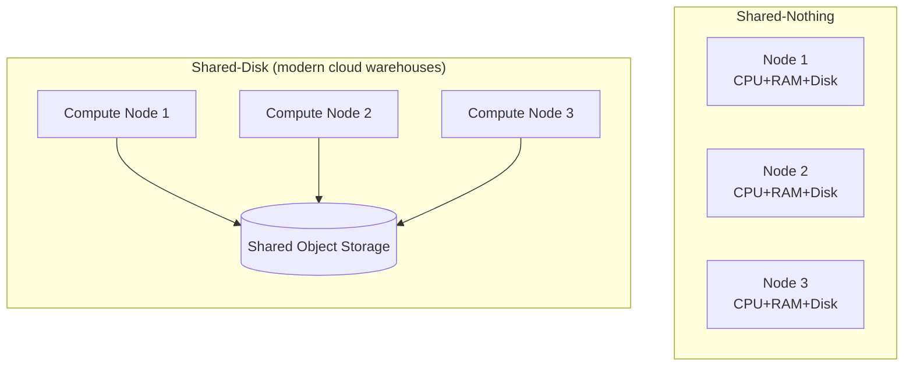
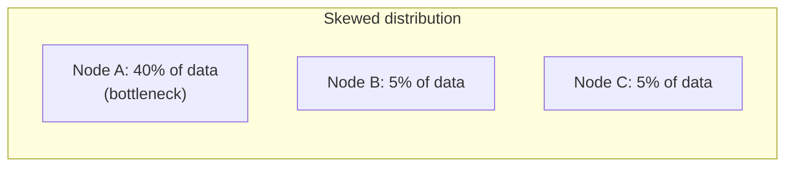
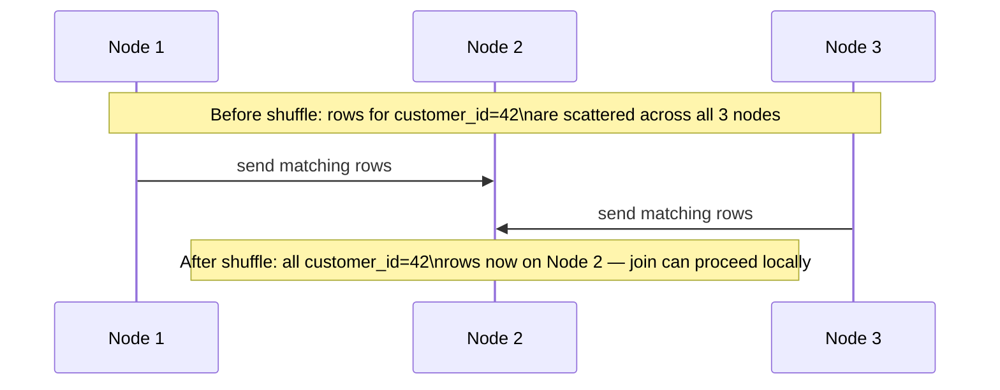
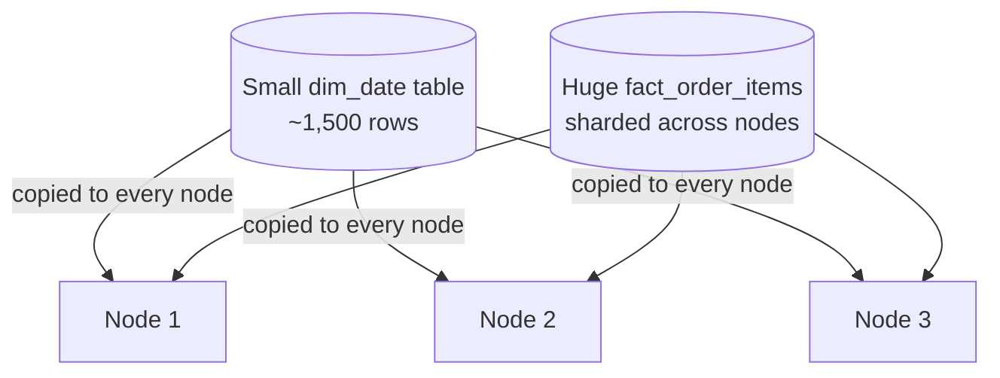

# 05. Distributed Query Engines

*Part of [Part 5 — Performance & Optimization](../). Previous: [04. Query Optimization Techniques](../04-query-optimization-techniques/).*

Everything so far in Part 5 has been about a **single-machine** database
like PostgreSQL. Cloud data warehouses (BigQuery, Snowflake, Redshift —
covered in depth in [Part 7](../../07-cloud-data-platforms/)) run your query
across **many machines at once**. This module explains how — the concepts
here directly explain behavior you'll observe once you start using those
platforms.

## Why spread a query across multiple machines at all?

A single machine has a hard ceiling: a fixed amount of CPU, memory, and disk
I/O bandwidth. Once a table grows into the billions of rows, or a query
needs to sort/join truly enormous amounts of data, no single machine —
however powerful — finishes in a reasonable time. The solution:
**parallelize the work across many machines**, each handling a slice of the data.

> **New term — MPP (Massively Parallel Processing)**: an architecture where
> many independent computers ("nodes") each process a portion of a query
> simultaneously, and their partial results are combined into the final answer.

## Shared-nothing vs. shared-disk architecture

> **New term — shared-nothing architecture**: each node has its **own**
> dedicated CPU, memory, and (often) storage — nodes communicate only by
> passing messages/data over the network, with no shared hardware bottleneck. This is how Redshift and traditional MPP systems are built.

> **New term — shared-disk architecture**: all nodes access the **same**
> underlying storage layer (often cloud object storage), but compute
> happens independently on each node. This is the model behind Snowflake and
> BigQuery, enabled by cheap, fast, effectively infinite cloud object storage.



The shared-disk model is why modern cloud warehouses can separate **storage
scaling** from **compute scaling** entirely — you can add more compute nodes
temporarily for a heavy workload without moving or duplicating any data,
since every node can already see the same underlying storage. This
separation of storage and compute is one of the defining architectural
ideas of the modern cloud data warehouse, and you'll see it named explicitly
across every platform in [Part 7](../../07-cloud-data-platforms/).

## Data distribution: how your data gets spread across nodes

For a query to run in parallel, the table's rows must first be spread
across nodes somehow. How this happens matters enormously for join performance:

> **New term — data skew**: an uneven distribution of data across nodes,
> where some nodes end up with far more data (or work) than others — the
> whole query can only go as fast as its **slowest** node, so skew directly
> hurts overall performance.

Imagine distributing `orders` across nodes by `shipping_country`. If 40% of
all orders ship to the United States, the node handling that slice does
dramatically more work than a node handling a country with 2% of orders —
that node becomes a bottleneck the entire query waits on, even if every
other node finished quickly.



**Mitigations**: choosing a higher-cardinality, more evenly-distributed
column to partition/distribute by (recall **selectivity** from
[Module 02](../02-indexing-strategies/) — the same idea applies here), or
letting the platform automatically re-distribute (redistribute/shuffle)
data as needed for a specific query, at some cost.

## Shuffle: redistributing data mid-query

> **New term — shuffle**: redistributing rows across nodes **during** query
> execution — typically needed when a `JOIN` or `GROUP BY` needs matching
> keys to end up on the same node, but the data wasn't already distributed
> that way.

Imagine joining `orders` (distributed by `order_id`) to `customers`
(distributed by `customer_id`) on `customer_id`. Since the two tables are
physically spread across nodes differently, rows that need to be joined
together might currently sit on *different* nodes entirely. A shuffle
moves data across the network so that matching join keys land together
on the same node before the actual join computation happens.



Shuffles involve real network transfer between nodes, which is often the
single most expensive part of a distributed query — this is exactly *why*
cloud warehouses charge attention to (and let you influence, via clustering
keys, covered in [Part 7](../../07-cloud-data-platforms/)) how data is
physically organized, to minimize how much shuffling a typical query needs.

## Broadcast joins: avoiding a shuffle for small tables

> **New term — broadcast join**: instead of shuffling both large tables,
> the optimizer sends a **full copy of the smaller table** to every node —
> since it's small enough that copying it everywhere is cheaper than
> shuffling the (much larger) other table.



This is exactly why the star schema pattern from
[Part 3, Module 02](../../03-database-design-and-modeling/02-dimensional-modeling/)
works so well on distributed engines: small dimension tables (`dim_date`,
`dim_product`) are cheap to broadcast to every node, while the (usually
much larger) fact table stays put — avoiding an expensive shuffle of the
large table entirely. The query optimizer generally makes this
broadcast-vs-shuffle decision automatically, based on estimated table sizes
(recall **statistics** from [Module 01](../01-how-databases-execute-queries/) —
the same underlying mechanism, applied to a distributed decision).

## Why this matters for how you write SQL

You generally don't control shuffle/broadcast decisions directly (the
optimizer decides), but understanding them explains real, observable
behavior you'll see in cloud warehouse query profiles:

- Joining two **huge** tables on a low-cardinality or skewed key can be
  dramatically slower than joining on a well-distributed, high-cardinality key.
- A star schema's small dimension + large fact pattern is a genuinely good
  fit for distributed engines, not just a design nicety — it directly
  minimizes expensive shuffles.
- **`GROUP BY`** requires collecting all rows for a given group onto one
  node — a `GROUP BY` on a low-cardinality column (few distinct values)
  concentrates the work onto very few nodes, which can create the exact
  same skew problem as an unevenly distributed join key.

## ✅ Try it yourself

There's no PostgreSQL syntax to practice here — PostgreSQL is a
single-machine database, so distributed execution doesn't directly apply.
Instead, this is where the concept-first approach pays off: everything in
this module directly prepares you to read and reason about the query
profiles you'll see in BigQuery, Snowflake, and Redshift in
[Part 7](../../07-cloud-data-platforms/), each of which surfaces shuffle and
skew information explicitly in their query execution UIs.

### Exercises

1. Explain, in your own words, why joining a small `dim_date` table to a
   huge `fact_order_items` table is a good candidate for a broadcast join
   rather than a shuffle of both tables.
2. A `GROUP BY country` query runs much slower than expected on a
   distributed engine, and you discover 60% of all rows have `country =
   'United States'`. What's happening, and what's the underlying concept from this module?
3. Explain the practical difference between shared-nothing and shared-disk
   architecture, specifically regarding how easy it is to scale compute
   independently of storage.

<details>
<summary>💡 Solutions</summary>

```text
1. dim_date is small (a few thousand rows at most), so copying it in full
   to every node is cheap — far cheaper than shuffling BOTH tables across
   the network to align join keys, especially since fact_order_items may be
   enormous. Broadcasting the small table lets each node perform the join
   entirely locally against its own shard of the large fact table.

2. This is data skew: because 60% of rows share the same GROUP BY key
   ('United States'), the node responsible for aggregating that group ends
   up doing far more work than nodes handling less common countries. The
   overall query can't finish faster than that one overloaded node — a
   direct real-world example of skew slowing down an otherwise
   well-distributed query.

3. In shared-nothing, each node owns its own storage, so adding more
   compute capacity generally means adding whole new nodes with their own
   storage attached — storage and compute scale together. In shared-disk,
   all nodes read from the same underlying storage layer, so you can add or
   remove compute nodes freely without touching or redistributing the
   underlying data at all — storage and compute scale independently, which
   is why modern cloud warehouses can let you resize compute on demand,
   sometimes in seconds, without any data movement.
```
</details>

## 🧠 Quick check

<details>
<summary>Q: What is a "shuffle" in a distributed query engine, and why is it often the most expensive part of a query?</summary>

A shuffle redistributes rows across nodes over the network so that rows
needing to be joined or grouped together end up on the same node. It's
often the most expensive step because it involves real network transfer of
potentially large amounts of data between machines, which is far slower
than each node just processing data it already has locally.
</details>

<details>
<summary>Q: Why does a star schema (small dimensions, large fact table) work particularly well on distributed query engines?</summary>

Small dimension tables can be cheaply broadcast (copied in full) to every
node, letting each node join its local shard of the large fact table
against a complete copy of the dimension — avoiding an expensive shuffle of
the large fact table entirely. This makes the star schema pattern a
performance advantage on distributed engines, not just a modeling convenience.
</details>

---
⬅ [Back to Part 5](../) | ➡ Next: [06. Cloud Cost Optimization](../06-cloud-cost-optimization/)
