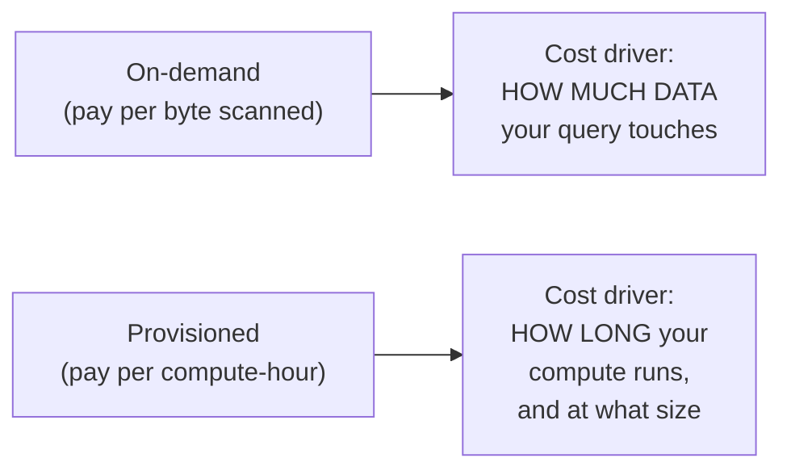

# 06. Cloud Cost Optimization

*Part of [Part 5 — Performance & Optimization](../). Previous: [05. Distributed Query Engines](../05-distributed-query-engines/).*

Every technique so far in Part 5 optimized for **speed**. On cloud
platforms, speed and **cost** are often the same lever — but not always, and
understanding the difference is a skill that directly saves real money, and
one interviewers specifically probe for. This module closes out Part 5.

## The two cloud pricing models you'll encounter

> **New term — on-demand (consumption-based) pricing**: you pay based on
> the amount of **data processed** by your queries — regardless of how long
> the query takes to run. Google BigQuery is the canonical example.

> **New term — provisioned (capacity-based) pricing**: you pay for compute
> resources (a "warehouse" or cluster) to be **running**, for as long as
> it's active — regardless of how much data any individual query happens to
> process. Snowflake's virtual warehouses and Redshift clusters are the canonical examples.



This distinction changes *which* optimizations save you money most
directly — we'll cover both, since you'll likely encounter platforms using
each model in [Part 7](../../07-cloud-data-platforms/).

## Optimizing for on-demand (bytes-scanned) pricing

If you're billed per byte scanned, the golden rule is simple: **scan less data.**

### Never `SELECT *` — this is now a cost decision, not just a style one

```sql
-- On a columnar, bytes-scanned-billed platform, this literally costs more
-- money than selecting only the 3 columns you actually need, because it
-- reads (and bills for) every column's data from storage.
SELECT * FROM orders WHERE order_date = '2024-06-15';

SELECT order_id, customer_id, order_status FROM orders WHERE order_date = '2024-06-15';
```

Recall columnar storage (Parquet) from
[Part 3, Module 03](../../03-database-design-and-modeling/03-warehouse-lake-lakehouse/):
a columnar engine only reads the columns your query actually references.
`SELECT *` forces it to read (and bill you for) every column, even ones
your query throws away — this is a direct, quantifiable, unnecessary cost
on a platform like BigQuery.

### Partition pruning directly reduces billed bytes

Recall [Module 03](../03-partitioning-and-clustering/): a partitioned table
lets the engine skip scanning irrelevant partitions entirely. On an
on-demand platform, this isn't just a speed win — a query that only needs to
scan 1 out of 24 monthly partitions is billed for roughly **1/24th** the
data of a query that scans the whole table:

```sql
-- Scans (and bills for) only the March 2024 partition, not the whole table's history
SELECT COUNT(*) FROM orders_partitioned
WHERE order_date >= '2024-03-01' AND order_date < '2024-04-01';
```

This is exactly why [Part 7's BigQuery module](../../07-cloud-data-platforms/02-google-bigquery/)
will emphasize partitioning and clustering as much for **cost** as for speed.

### Preview/estimate cost before running an expensive query

Every major on-demand platform provides a way to see how much data a query
*would* scan before you actually run it (in BigQuery, this is the "bytes
processed" estimate shown before execution, or an explicit dry-run mode).
**Build a habit of checking this before running large, ad-hoc queries** —
especially anything scanning a huge, un-partitioned table.

## Optimizing for provisioned (compute-hour) pricing

If you're billed for compute running over time, the golden rule shifts:
**minimize how long expensive compute runs, and don't over-provision "just in case."**

### Right-size your compute

Platforms like Snowflake let you choose a warehouse "size" (roughly, how
many nodes/how much CPU and memory) independently for each workload. A
warehouse that's too small makes queries slow (and, paradoxically, can cost
*more* overall if it runs for much longer as a result); a warehouse that's
too large wastes money sitting mostly idle for a workload that didn't need
that much power.

> 💡 **Practical guidance**: match warehouse size to the actual workload —
> small, frequent, simple queries (dashboards refreshing) don't need a huge
> warehouse; large, complex, infrequent transformations (nightly batch
> jobs) might benefit from a bigger one for a shorter time. Most platforms
> let you have *multiple* warehouses of different sizes for different workloads.

### Auto-suspend idle compute

The single most common, avoidable waste in provisioned pricing: leaving
compute **running** (and billing) when nobody's actually querying it.
Nearly every provisioned platform supports auto-suspend (automatically
pausing compute after some period of inactivity) and auto-resume
(instantly starting it back up the moment a new query arrives) — always
configure this rather than leaving compute running 24/7 "just in case."

### Caching: sometimes the fastest, cheapest query is the one you don't run

Most cloud warehouses automatically cache the exact result of a repeated,
identical query for some period — if the underlying data hasn't changed,
you get the cached result back essentially free and instantly, without
re-running the query (and without it counting against either bytes-scanned
or compute-hour costs). This is a strong argument for **materialized views**
(recall [Part 2, Module 04](../../02-intermediate-advanced-sql/04-views-and-materialized-views/))
for expensive, frequently-repeated aggregations: pay the compute cost
**once**, on a schedule, instead of on every single dashboard refresh.

## Techniques that help cost *and* speed together

Good news: most of what you learned earlier in Part 5 helps both dimensions
at once, since scanning less data and doing less work are, fundamentally,
the same underlying improvement:

| Technique | Helps on-demand cost | Helps provisioned cost | Helps speed |
|---|---|---|---|
| Avoid `SELECT *` | ✅ Directly | ✅ Less compute needed | ✅ |
| Partition pruning | ✅ Directly | ✅ Less compute needed | ✅ |
| Materialized views for repeated queries | ✅ Compute paid once | ✅ Compute paid once | ✅ |
| Sargable predicates / indexes (where supported) | ✅ | ✅ | ✅ |
| Right-sized compute / auto-suspend | N/A | ✅ Directly | Neutral (if sized correctly) |

## Monitoring: you can't control what you can't see

Every major platform provides a way to see historical cost/usage by query,
user, or team — a genuine data engineering responsibility is regularly
reviewing this to catch expensive, wasteful, or runaway queries before they
become a large unexpected bill. We'll show the platform-specific version of
this (BigQuery's `INFORMATION_SCHEMA.JOBS`, Snowflake's `QUERY_HISTORY`,
etc.) directly in [Part 7](../../07-cloud-data-platforms/).

## ✅ Try it yourself

There's no PostgreSQL-billing equivalent to practice directly (PostgreSQL
doesn't have consumption-based pricing), but you can practice the **mental
habit** right now: for every query you write from this point forward in
this repo, before running it, ask yourself:

1. Am I selecting only the columns I actually need?
2. If this table were partitioned, would my `WHERE` clause let the engine skip most of it?
3. If I'm going to run this exact query repeatedly, should it be a
   materialized view or scheduled table instead of an ad-hoc query each time?

### Exercises

1. A dashboard re-runs the same expensive daily-revenue aggregation query
   every time anyone loads the page — sometimes hundreds of times a day,
   with no changes to the underlying data between refreshes. What's the
   single highest-leverage optimization from this module for this scenario?
2. On an on-demand (bytes-scanned) platform, would you rather run one query
   scanning a wide, un-partitioned 10-year orders table, or a query
   scanning the same logical data but partitioned by year, filtered to just
   this year? Quantify roughly how much less data the second approach touches.
3. Explain why "leave the warehouse running all the time so queries are
   always instantly fast" is often the wrong default on a provisioned-pricing platform.

<details>
<summary>💡 Solutions</summary>

```text
1. Convert it to a materialized view (Part 2, Module 04), refreshed on a
   schedule (e.g., once per day, or whenever new data actually lands) using
   the orchestration patterns from Part 4. The expensive computation then
   runs ONCE per refresh instead of once per page load, and every dashboard
   view becomes a cheap read of pre-computed results.

2. The partitioned, filtered query — roughly 1/10th the data scanned (one
   year out of ten), assuming years are represented roughly evenly. On an
   on-demand platform, that's roughly a 90% cost reduction for this specific
   query, in addition to running much faster.

3. Provisioned compute bills for TIME RUNNING, not for actual query
   activity. Leaving it running around the clock means paying for idle time
   whenever nobody's actually querying — often the vast majority of a given
   day for many workloads (e.g., a warehouse used mainly during business
   hours). Auto-suspend during idle periods, combined with fast auto-resume,
   captures nearly all the "always fast" benefit without paying for time
   nobody's using the compute.
```
</details>

## 🎉 Part 5 complete!

You can now read an execution plan, choose the right indexes, partition
large tables, rewrite slow queries, reason about distributed query
execution, and optimize for cloud cost — a genuinely complete performance
toolkit. Next: [Part 6 — Security](../../06-security/), the other dedicated
deep-dive section of this repo.

## 🧠 Quick check

<details>
<summary>Q: What's the core difference between on-demand and provisioned cloud pricing, in terms of what actually drives your bill?</summary>

On-demand pricing bills based on how much DATA your queries process
(bytes scanned), regardless of how long they take. Provisioned pricing
bills based on how long compute resources are RUNNING, regardless of how
much data any individual query touches. This difference changes which
optimizations save the most money on a given platform.
</details>

<details>
<summary>Q: Why does a materialized view save money on BOTH pricing models?</summary>

It computes an expensive result once (on a schedule) instead of every time
someone queries it. On an on-demand platform, that means paying for the
bytes scanned once instead of on every repeated query. On a provisioned
platform, it means using compute once instead of repeatedly re-running the
same expensive computation for every dashboard refresh.
</details>

---
⬅ [Back to Part 5](../) | ➡ Next: [Part 6 — Security](../../06-security/)
