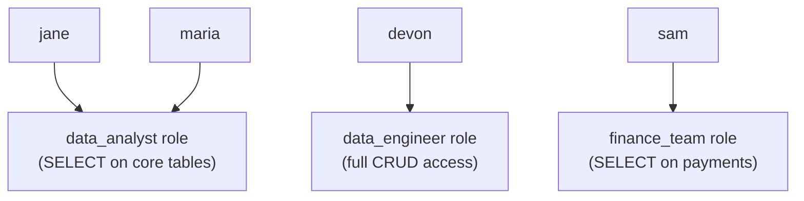

# 02. Authentication & Authorization

*Part of [Part 6 — Security](../). Previous: [01. SQL Injection & Prevention](../01-sql-injection-and-prevention/).*

"Least privilege" appeared as a defense-in-depth layer in the last module —
this module teaches you how to actually implement it: controlling exactly
*who* can connect to your database, and exactly *what* they're allowed to do
once they're in.

## Authentication vs. authorization: two different questions

> **New term — authentication**: verifying **who** someone is (are you
> really who you claim to be?) — typically via a password, key, or token.

> **New term — authorization**: determining **what** an authenticated user
> is allowed to do — which databases, tables, rows, or actions they can access.

These are genuinely separate concerns, and conflating them is a common
source of security mistakes: a system can authenticate someone perfectly
(confirming they are who they say) while still authorizing them
incorrectly (giving them access to far more than they need).

## Users and roles in PostgreSQL

```sql
-- Create a login role (a "user" you can connect as)
CREATE ROLE analyst_jane WITH LOGIN PASSWORD 'use-a-real-secret-manager-not-this';

-- Create a role that's just a permission GROUP, not meant to log in directly
CREATE ROLE read_only_analysts;
```

> **New term — role**: PostgreSQL's unified concept for both "a user" and
> "a group of permissions" — the same underlying object type. A role with
> `LOGIN` can connect to the database directly; a role without it functions
> purely as a reusable permission group that other roles can be added to.

## `GRANT` and `REVOKE`: the core authorization commands

```sql
SET search_path TO northstar;

-- Grant the group role read access to specific tables
GRANT SELECT ON customers, orders, order_items, products TO read_only_analysts;

-- Add an individual user to that group role, inheriting its permissions
GRANT read_only_analysts TO analyst_jane;

-- Remove a permission
REVOKE SELECT ON payments FROM read_only_analysts;
```

Once granted, `analyst_jane` can run `SELECT` queries against
`customers`, `orders`, `order_items`, and `products` — but attempting
anything against `payments`, or attempting `INSERT`/`UPDATE`/`DELETE`
anywhere, fails with a permissions error, because those actions were never granted.

```sql
-- As analyst_jane, this works:
SELECT * FROM customers LIMIT 5;

-- As analyst_jane, this fails: "permission denied for table orders"
DELETE FROM orders WHERE order_id = 1;
```

## The principle of least privilege

> **New term — least privilege**: granting a user or system only the
> **minimum** permissions genuinely necessary to do its job — nothing more,
> "just in case."

This sounds obvious stated plainly, but it's routinely violated in practice
because it's *easier* in the moment to grant broad access ("just give them
admin, it's simpler") than to figure out the minimal correct permission set.
The cost shows up later — in a breach's blast radius, in an accidental
`DELETE` by someone who never needed write access at all, or in a compliance
audit ([Module 05](../05-compliance-and-governance/)) that can't explain why
a marketing analyst can read payment card data.

```sql
-- ❌ Overly broad — grants far more than a read-only reporting analyst needs
GRANT ALL PRIVILEGES ON ALL TABLES IN SCHEMA northstar TO analyst_jane;

-- ✅ Least privilege — exactly what the role requires, nothing more
GRANT SELECT ON customers, orders, order_items, products TO read_only_analysts;
```

## Role-Based Access Control (RBAC)

> **New term — RBAC (Role-Based Access Control)**: organizing permissions
> around **roles that represent job functions**, then assigning users to
> those roles — rather than granting permissions to individuals one at a time.

```sql
CREATE ROLE data_analyst;
CREATE ROLE data_engineer;
CREATE ROLE finance_team;

GRANT SELECT ON customers, orders, order_items, products TO data_analyst;
GRANT SELECT, INSERT, UPDATE, DELETE ON ALL TABLES IN SCHEMA northstar TO data_engineer;
GRANT SELECT ON payments, orders TO finance_team;

-- Onboarding a new hire becomes a single, auditable statement:
GRANT data_analyst TO new_hire_maria;
```



The value of RBAC over granting permissions individually: when your access
policy changes (say, analysts should no longer see raw `payments` data),
you change it **once**, on the role — every user in that role is instantly
and consistently affected, with no risk of forgetting one person or one
table when applying the change by hand.

## Column-level and schema-level grants

Permissions don't have to be all-or-nothing at the table level:

```sql
-- Grant SELECT on only specific, non-sensitive columns
GRANT SELECT (customer_id, first_name, country, signup_date) ON customers TO marketing_team;
-- marketing_team can query those 4 columns but NOT email or any other column

-- Grant broadly across an entire schema at once
GRANT USAGE ON SCHEMA northstar TO read_only_analysts;
GRANT SELECT ON ALL TABLES IN SCHEMA northstar TO read_only_analysts;
```

We'll go further than column-level grants in
[Module 04 — Data Masking & Row/Column Security](../04-data-masking-and-row-column-security/),
which covers restricting *which rows* (not just which columns) a role can see.

## Service accounts: authorization for pipelines, not people

> **New term — service account**: a non-human identity used by an
> application, pipeline, or automated process to authenticate — as opposed
> to a personal account tied to an individual employee.

Every pipeline you built conceptually in [Part 4](../../04-data-engineering-with-sql/)
needs to connect to the database as *something*. Best practice: a dedicated
service account, scoped to exactly what that specific pipeline needs —
never a personal employee account, and never a shared "admin" account used
by multiple systems.

```sql
CREATE ROLE svc_orders_pipeline WITH LOGIN PASSWORD 'stored-in-a-secrets-manager';
GRANT SELECT, INSERT, UPDATE ON orders, order_items TO svc_orders_pipeline;
-- Deliberately no DELETE, no access to customers/payments — this pipeline
-- never needs either, so it never gets the ability, even if compromised.
```

This directly connects back to [Module 01's](../01-sql-injection-and-prevention/)
defense-in-depth idea: if this pipeline's credentials were ever
compromised (leaked, or exploited via an injection vulnerability), the
attacker inherits **exactly** this narrow set of permissions — not full
database access. [Module 06 — Secrets Management](../06-secrets-management/)
covers how to store credentials like this one safely.

## Auditing who has what access

```sql
-- See what a specific role can do
SELECT grantee, table_name, privilege_type
FROM information_schema.role_table_grants
WHERE grantee = 'analyst_jane';

-- See every role and whether it can log in / has superuser rights
SELECT rolname, rolcanlogin, rolsuper
FROM pg_roles;
```

> 💡 **Best practice**: periodically review actual granted permissions
> against what each role/person genuinely still needs — job responsibilities
> change, projects end, and unused-but-still-granted access is exactly the
> kind of thing that quietly accumulates into a security and compliance
> problem (directly relevant to [Module 05](../05-compliance-and-governance/)).

## ✅ Try it yourself

```sql
SET search_path TO northstar;

CREATE ROLE demo_readonly;
GRANT SELECT ON customers, products TO demo_readonly;

CREATE ROLE demo_analyst WITH LOGIN PASSWORD 'demo_password_change_me';
GRANT demo_readonly TO demo_analyst;

-- Confirm the grant took effect
SELECT grantee, table_name, privilege_type
FROM information_schema.role_table_grants
WHERE grantee = 'demo_readonly';
```

### Exercises

1. Create a role `demo_pipeline` suitable for a service account that only
   ever needs to `INSERT` new rows into `web_events` — nothing else.
2. Explain why granting `demo_analyst` full `ALL PRIVILEGES` on the entire
   `northstar` schema "to save time" violates least privilege, even if that
   analyst is a trusted, senior employee.
3. A company currently grants database permissions to each new hire
   individually, table by table. What specific problems does this create as
   the company grows, and how would introducing RBAC roles fix them?

<details>
<summary>💡 Solutions</summary>

```sql
-- 1.
CREATE ROLE demo_pipeline WITH LOGIN PASSWORD 'stored-in-a-secrets-manager';
GRANT INSERT ON web_events TO demo_pipeline;
-- No SELECT, UPDATE, or DELETE, and no access to any other table —
-- exactly, and only, what this pipeline needs to function.

-- 3. (RBAC creation example, matching the explanation below)
CREATE ROLE new_hire_role;
GRANT SELECT ON customers, orders, order_items, products TO new_hire_role;
```

```text
2. Least privilege isn't about trust in the PERSON — it's about limiting
   the blast radius of mistakes and compromised credentials, which can
   happen to anyone regardless of seniority or trustworthiness (a phished
   password, a leaked credential, an accidental typo in a DELETE
   statement). Even a fully trusted senior analyst doing read-only
   reporting gains nothing from write/delete access, while that unused
   excess access is pure, unnecessary risk sitting there waiting for a
   mistake or a compromised account to exploit it.

3. Individual, table-by-table grants don't scale: onboarding is slow and
   error-prone (easy to forget a table), offboarding is risky (easy to miss
   revoking something), and there's no single place to see or reason about
   "what can a typical analyst do?" — every person's permissions could
   subtly diverge over time through accumulated one-off grants. RBAC fixes
   this by defining permissions once per ROLE (representing a job
   function), then assigning/removing people from that role in one
   statement — a policy change to the role instantly and consistently
   affects everyone in it, and permissions stay auditable and comparable
   across people doing the same job.
```
</details>

## 🧠 Quick check

<details>
<summary>Q: What's the difference between authentication and authorization?</summary>

Authentication verifies WHO someone is (identity — usually via
credentials). Authorization determines WHAT that authenticated identity is
allowed to do (permissions). A system can authenticate someone correctly
while still having incorrect or overly broad authorization for them.
</details>

<details>
<summary>Q: Why is RBAC generally preferred over granting permissions to individual users directly?</summary>

RBAC lets you define and change a permission policy once, on a role
representing a job function, and have it instantly and consistently apply
to everyone assigned that role — rather than manually managing (and
risking inconsistency or mistakes across) individual grants for every
single user separately.
</details>

---
⬅ [Back to Part 6](../) | ➡ Next: [03. Encryption](../03-encryption/)
