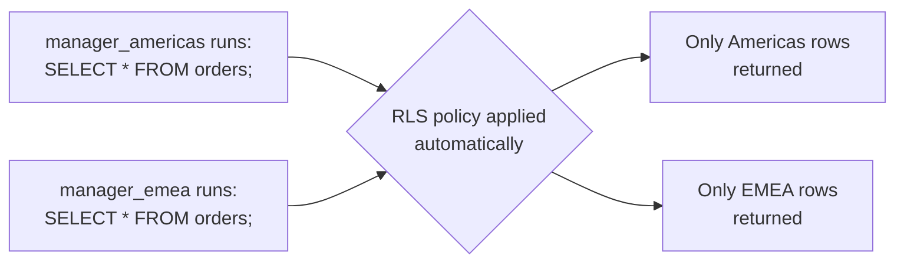
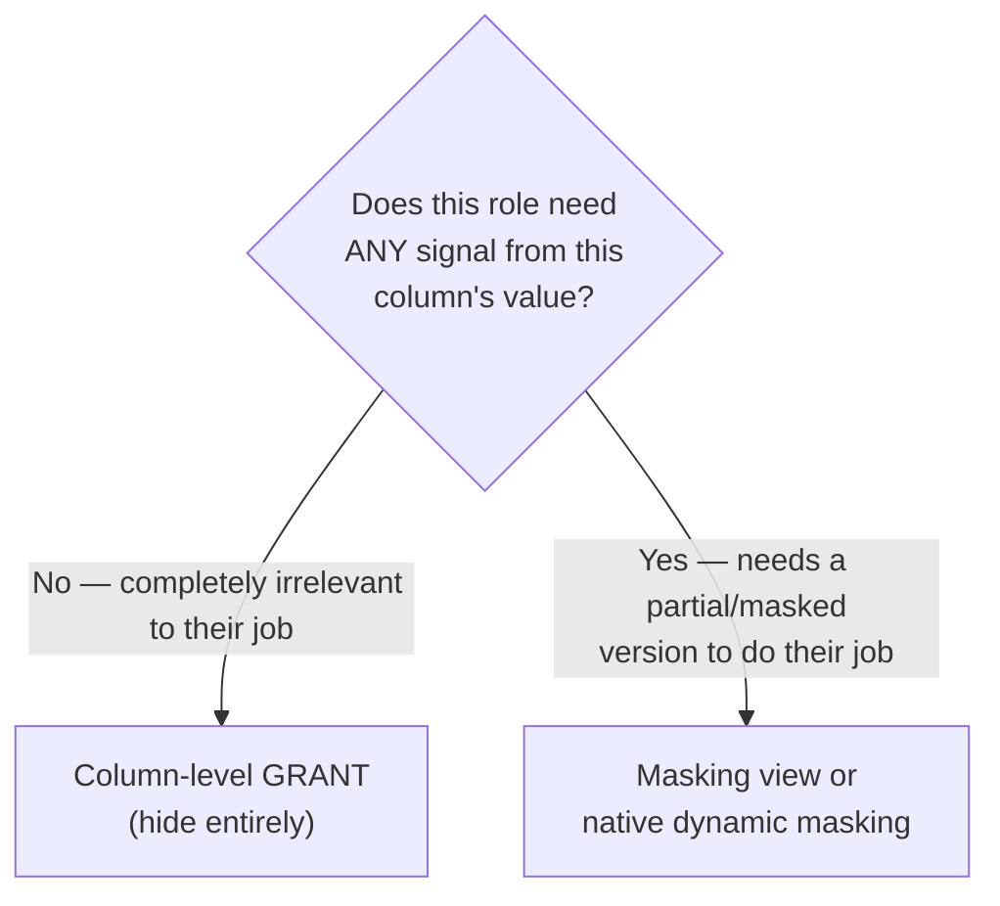

# 04. Data Masking & Row/Column Security

*Part of [Part 6 — Security](../). Previous: [03. Encryption](../03-encryption/).*

[Module 02](../02-authentication-and-authorization/) controlled access at
the **table** level (can this role query `customers` at all?). This module
goes finer-grained: restricting *which specific rows* and *which specific
values* a role sees, even within a table they're otherwise allowed to query.

## The problem this solves

Imagine `orders` needs to be queried by regional sales managers — but each
manager should only see orders from **their own region**, never other
regions' data. Table-level `GRANT`/`REVOKE` from
[Module 02](../02-authentication-and-authorization/) can't express this at
all — it's all-or-nothing per table. You need something that filters *rows*
based on *who's asking*.

## Row-Level Security (RLS)

> **New term — Row-Level Security (RLS)**: a database feature that
> automatically filters which rows a query can see (or modify), based on
> **who is running the query** — enforced by the database itself, so it
> applies no matter what SQL the user writes, even ad-hoc queries you never
> anticipated.

```sql
SET search_path TO northstar;

-- Add a column representing which region an order belongs to (simplified
-- for this example — in NorthStar Retail you'd typically derive this from
-- shipping_country or a dedicated region mapping table)
ALTER TABLE orders ADD COLUMN sales_region VARCHAR(20);

-- Enable row-level security on the table (it does nothing until you add a policy)
ALTER TABLE orders ENABLE ROW LEVEL SECURITY;

-- A policy: each role can only see rows matching their assigned region,
-- looked up via a mapping table you control
CREATE TABLE role_region_mapping (role_name TEXT PRIMARY KEY, sales_region VARCHAR(20));
INSERT INTO role_region_mapping VALUES ('manager_americas', 'Americas'), ('manager_emea', 'EMEA');

CREATE POLICY region_filter ON orders
    USING (
        sales_region = (SELECT sales_region FROM role_region_mapping WHERE role_name = current_user)
    );
```

Once this policy is active, `manager_americas` running a completely
unfiltered `SELECT * FROM orders;` **automatically** only sees Americas
rows — the filtering is invisible and unavoidable from the querying role's
perspective, applied by the database itself underneath any query they write.



### Why RLS is stronger than "just remembering to add a WHERE clause"

You could imagine achieving the same *result* by telling every analyst
"always add `WHERE sales_region = 'your region'` to your queries" — but that
relies entirely on every person, every time, remembering to add it
correctly, with zero enforcement. **RLS makes the restriction structural**:
it's enforced by the database itself, on every query, regardless of what
the user writes — including ad-hoc, exploratory queries nobody reviewed in
advance. This is a recurring theme across this entire security part: prefer
controls the database *enforces automatically* over controls that rely on
every person remembering to do the right thing.

## Column-level security: two approaches

You saw column-level `GRANT` in [Module 02](../02-authentication-and-authorization/)
— restricting which columns a role can query at all. There's a second,
complementary approach worth knowing:

### Approach 1: column-level `GRANT` (hard restriction)

```sql
GRANT SELECT (customer_id, first_name, country) ON customers TO marketing_team;
-- marketing_team's queries FAIL entirely if they reference "email" at all
```

### Approach 2: masking views (soft restriction — show something, not nothing)

Sometimes you don't want to hide a column entirely — you want to show a
**masked, partial version** of it, so the data remains useful for its
intended purpose without exposing the sensitive full value:

```sql
CREATE VIEW customers_masked AS
SELECT
    customer_id,
    first_name,
    last_name,
    LEFT(email, 2) || '***@' || SPLIT_PART(email, '@', 2) AS email_masked,
    country,
    signup_date
FROM customers;

-- e.g. 'emma.smith1@example.com' becomes 'em***@example.com'
GRANT SELECT ON customers_masked TO support_team;
-- support_team never gets direct access to the real "customers" table at all —
-- only to this view, which structurally can never reveal the full email
```

> **New term — dynamic data masking**: automatically masking (partially
> hiding) sensitive column values based on who's querying — some platforms
> (Snowflake, SQL Server, BigQuery — see [Part 7](../../07-cloud-data-platforms/))
> support this as a native, built-in feature applied directly to the real
> table (the masking rule is attached to the column itself and evaluated
> per-query, based on the querying role), rather than requiring you to
> build and maintain a separate masking view by hand as shown above.
> PostgreSQL doesn't have built-in dynamic masking as of this writing — the
> view-based approach above is the standard way to achieve the same effect.

## Choosing between hard restriction and masking



Example: a customer support agent verifying identity plausibly needs to
confirm "does the last 4 digits of this phone number match what the
customer just told me?" — a fully hidden phone number can't support that;
a masked one (`***-***-4567`) can. A marketing analyst building an email
campaign summary has no legitimate need to see *any* part of a specific
individual's raw email — full column-level restriction is the better fit there.

## Combining RLS and masking: defense in depth for data itself

These techniques compose naturally — you can restrict *which rows* a role
sees (RLS) **and** mask *which columns/values* they see within those rows,
at the same time:

```sql
CREATE VIEW regional_orders_masked AS
SELECT
    o.order_id,
    o.order_date,
    o.sales_region,
    LEFT(c.first_name, 1) || '.' AS customer_initial,
    o.order_status
FROM orders o
JOIN customers c ON o.customer_id = c.customer_id;
-- Combined with RLS on the underlying orders table, a role querying THIS
-- view still only sees their own region's rows, AND never sees full
-- customer names within those rows.
```

## ✅ Try it yourself

```sql
SET search_path TO northstar;

-- Build a masked view exposing only non-sensitive customer info
CREATE VIEW customers_public_safe AS
SELECT
    customer_id,
    first_name,
    country,
    signup_date,
    is_active
FROM customers;
-- Notice: last_name and email are deliberately excluded entirely here,
-- rather than masked — a legitimate design choice when no partial version
-- of a field is useful to the intended audience.

SELECT * FROM customers_public_safe LIMIT 5;
```

### Exercises

1. Design (write the SQL for) a masking view over `payments` that shows
   `payment_id`, `order_id`, `payment_date`, and `payment_status`, but masks
   `amount` by rounding it to the nearest $100 instead of showing the exact figure.
2. Would you implement "customer support agents can see the last 4 digits
   of a phone number" using column-level `GRANT` alone, or does it require
   a masking view/native dynamic masking? Explain why.
3. Explain, in your own words, why RLS is considered more robust than a
   team policy of "always remember to add `WHERE region = ...`" to every query.

<details>
<summary>💡 Solutions</summary>

```sql
-- 1.
CREATE VIEW payments_masked AS
SELECT
    payment_id,
    order_id,
    payment_date,
    payment_status,
    ROUND(amount, -2) AS amount_rounded_to_100
FROM payments;
```

```text
2. It requires masking (a view, or native dynamic masking) — column-level
   GRANT is all-or-nothing per column: it can only let a role see the FULL
   phone number or NONE of it. Showing a deliberately partial version
   (last 4 digits only) requires a transformation applied to the value
   itself, which only masking approaches provide.

3. A team policy relying on humans remembering to add a WHERE clause has
   no enforcement mechanism at all — a single forgotten clause, in a single
   ad-hoc query by a single analyst on a single occasion, immediately and
   silently exposes data that should have been restricted, with no error,
   no warning, and often no way to even detect after the fact that it
   happened. RLS moves this enforcement INTO the database itself, applying
   automatically to every query regardless of who wrote it or whether they
   remembered anything — removing the human-reliability failure point entirely.
```
</details>

## 🧠 Quick check

<details>
<summary>Q: What's the core difference between what Row-Level Security and column-level GRANT each restrict?</summary>

RLS restricts WHICH ROWS a role can see or modify within a table (e.g.,
only orders from their assigned region), evaluated per query based on who's
running it. Column-level GRANT restricts WHICH COLUMNS a role can reference
at all, applying uniformly across every row.
</details>

<details>
<summary>Q: Why might a masking view be preferable to fully hiding a sensitive column via GRANT?</summary>

When the role genuinely needs some partial signal from that column to do
their job (e.g., verifying a customer's identity via the last 4 digits of
a phone number) but shouldn't see the full, exact value — full hiding
would prevent them from doing their legitimate job, while showing the raw
value would over-expose sensitive data. A masking view (or native dynamic
masking) provides a useful middle ground.
</details>

---
⬅ [Back to Part 6](../) | ➡ Next: [05. Compliance & Governance](../05-compliance-and-governance/)
