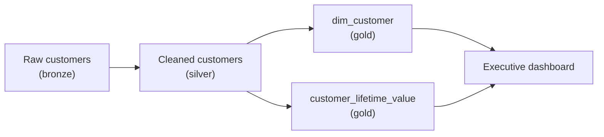

# 05. Compliance & Governance

*Part of [Part 6 — Security](../). Previous: [04. Data Masking & Row/Column Security](../04-data-masking-and-row-column-security/).*

Everything so far in Part 6 covered *technical* controls. This module covers
the *legal and organizational* context those controls exist to satisfy —
essential knowledge for any data engineer, since the practical rules you
work under (what you can store, for how long, who can see it) are often
driven directly by regulations like the ones below.

## PII: the concept everything else in this module orbits

> **New term — PII (Personally Identifiable Information)**: any data that
> could identify a specific individual, either on its own (a full name, an
> email, a national ID number) or combined with other data (a birth date
> plus a zip code plus a gender, which together can uniquely identify most people).

In our NorthStar Retail dataset, `customers.first_name`, `last_name`,
`email`, and arguably `country` (in combination with other fields) are PII.
`products.category` and `unit_price` are not — they describe products, not people.

> 💡 **The first step of any compliance effort is data classification**:
> systematically identifying *which columns, across every table you own,*
> contain PII (or other regulated categories — see below) — you cannot
> protect, or even *know if you're required to protect*, data you haven't
> identified as sensitive.

```sql
-- A simple, practical classification approach: a metadata table describing
-- your own schema's sensitivity, that you maintain deliberately
CREATE TABLE data_classification (
    table_name  TEXT NOT NULL,
    column_name TEXT NOT NULL,
    classification TEXT NOT NULL CHECK (classification IN ('public', 'internal', 'pii', 'sensitive_pii')),
    PRIMARY KEY (table_name, column_name)
);

INSERT INTO data_classification VALUES
    ('customers', 'first_name', 'pii'),
    ('customers', 'last_name', 'pii'),
    ('customers', 'email', 'pii'),
    ('customers', 'country', 'internal'),
    ('products', 'unit_price', 'public'),
    ('payments', 'payment_method', 'internal');
```

Maintaining a table like this (or using a dedicated data catalog tool)
turns "do we have PII, and where?" from a scramble during an audit into a
query you can run any time.

## Major regulatory frameworks (a practical, non-legal overview)

> ⚠️ This is educational technical context, **not legal advice** — real
> compliance decisions should involve your organization's legal/privacy
> team. The goal here is that you recognize these terms and their practical
> implications for how you design and build data systems.

### GDPR (General Data Protection Regulation) — European Union

The most influential privacy regulation globally, applying to any
organization processing EU residents' personal data, regardless of where
the company itself is based. Key concepts with direct data engineering implications:

- **Right to erasure ("right to be forgotten")**: an individual can request
  their personal data be deleted. This has a real, concrete SQL
  implication: can your schema actually support "delete everything about
  customer X," given foreign key relationships (recall
  [Part 1, Module 05](../../01-sql-foundations/05-joins/))? Does deleting a
  customer break historical `orders` records that legitimately need to be
  retained for financial/legal reasons? This tension — the right to
  erasure vs. legitimate retention needs — is a genuinely hard, common
  real-world data modeling problem.
- **Right to access/portability**: an individual can request a copy of all
  data held about them — you need to be able to answer "show me everything
  we know about customer X" across every table that references them, which
  is much easier if your schema and documentation are already well
  understood (exactly what [Part 3](../../03-database-design-and-modeling/)
  and this module's data classification table support).
- **Data minimization**: only collect and retain personal data you
  genuinely need, for only as long as you need it — directly relevant to
  designing retention policies (see below).

### CCPA/CPRA (California Consumer Privacy Act) — California, USA

Similar in spirit to GDPR (right to know what's collected, right to
deletion, right to opt out of data "sale") but with different specific
mechanics and a narrower geographic scope. Many companies design one
compliant system that satisfies the *stricter* of GDPR/CCPA requirements,
rather than maintaining separate systems per regulation.

### PCI-DSS (Payment Card Industry Data Security Standard)

Not a government law but an industry-mandated standard for any
organization storing, processing, or transmitting credit card data.
Directly connects to [Module 03's](../03-encryption/) discussion of
tokenization — many companies deliberately architect their systems to
**never store real card numbers at all** specifically to minimize their
PCI-DSS compliance scope (a system that never touches real card data has
far fewer PCI-DSS requirements to satisfy).

### HIPAA (Health Insurance Portability and Accountability Act) — USA healthcare

Governs protected health information (PHI) specifically. If you ever work
with healthcare data, PHI requires its own dedicated, careful classification
and handling — the general principles in this module (classification,
least privilege, encryption, auditing) all apply, but HIPAA has its own
specific, detailed technical requirements beyond this module's general scope.

## Data retention policies

> **New term — data retention policy**: a defined rule for how long
> different categories of data are kept before being deleted or archived —
> balancing legitimate business/legal needs to retain data against
> minimization principles and storage cost.

```sql
-- Example: automatically identify (and, after review, delete) customer
-- accounts inactive for more than the policy's retention period
SELECT customer_id, first_name, last_name, signup_date
FROM customers
WHERE is_active = false
  AND customer_id NOT IN (
      SELECT DISTINCT customer_id FROM orders WHERE order_date > CURRENT_DATE - INTERVAL '7 years'
  );
-- (7 years used here only as an illustrative example — actual retention
-- periods depend on your specific legal/business requirements, often
-- driven by tax/financial record-keeping laws as much as privacy ones.)
```

Recall the Medallion architecture's **bronze layer** from
[Part 3, Module 04](../../03-database-design-and-modeling/04-modern-modeling-patterns/) —
retention policies apply there too, and arguably need *more* careful
thought, since bronze is specifically designed to be a permanent, complete
historical record. A company can't claim to honor "right to erasure"
requests if raw, unmasked personal data quietly lives forever in an
untouched bronze layer nobody thought to include in the deletion process.

## Auditing: proving what happened, not just preventing it

> **New term — audit log**: a recorded, tamper-resistant history of who
> accessed or changed what data, and when — essential both for detecting
> misuse and for demonstrating compliance to an auditor or regulator.

Recall the audit trigger pattern from
[Part 2, Module 05](../../02-intermediate-advanced-sql/05-stored-procedures-functions-triggers/) —
that's a genuine, practical audit logging mechanism:

```sql
-- Recall this pattern — it directly serves compliance/audit needs, not just debugging
CREATE TABLE product_price_history (
    history_id   SERIAL PRIMARY KEY,
    product_id   INTEGER NOT NULL,
    old_price    NUMERIC(10,2),
    new_price    NUMERIC(10,2),
    changed_at   TIMESTAMP NOT NULL DEFAULT NOW(),
    changed_by   TEXT NOT NULL DEFAULT CURRENT_USER   -- WHO made the change
);
```

Beyond application-level audit tables, PostgreSQL and every cloud platform
in [Part 7](../../07-cloud-data-platforms/) provide database-level query
logging (recording every query executed, by whom, and when) — a real
compliance/security requirement is ensuring this logging is actually
enabled, retained for an appropriate period, and periodically reviewed —
not merely theoretically available.

## Data lineage: tracing data back to its source

> **New term — data lineage**: a complete record of where a piece of data
> came from, and every transformation it passed through to reach its
> current form — answering "where did this number in the dashboard
> ultimately originate, and what happened to it along the way?"

Recall [Part 4, Module 03](../../04-data-engineering-with-sql/03-orchestration-basics/):
dbt automatically generates a lineage graph from `ref()`/`source()`
relationships between models. This isn't just a debugging convenience — it's
a genuine, often *required* compliance capability: if a regulator or
customer asks "prove to me that customer X's deleted personal data has been
fully removed, everywhere," lineage is how you can confidently answer "here
is every single downstream table/model that was ever derived from the raw
customer data, and here's confirmation each one has been handled."



Without lineage, answering "does this dashboard number depend on customer
X's data anywhere?" requires manually inspecting every query and table by
hand — with lineage, it's a traceable, visual (and often queryable) graph.

## ✅ Try it yourself

There's no destructive SQL to run here, but you can practice the *thinking*
directly on our sample data:

```sql
SET search_path TO northstar;

-- "Right to access" simulation: gather everything we know about one customer
SELECT c.*, o.order_id, o.order_date, p.payment_id, p.amount
FROM customers c
LEFT JOIN orders o ON c.customer_id = o.customer_id
LEFT JOIN payments p ON o.order_id = p.order_id
WHERE c.customer_id = 1;
```

### Exercises

1. Using the `data_classification` table structure from this module, add
   rows classifying every column of `payments` and `web_events`.
2. A customer requests full deletion of their data under GDPR's right to
   erasure. Their `customer_id` appears in `customers`, `orders`, and
   `payments` — but financial regulations require order/payment records be
   retained for 7 years for tax purposes. Describe (in words) a practical
   compromise approach that respects both requirements.
3. Explain why a company that never stores real credit card numbers at all
   (using tokenization, from [Module 03](../03-encryption/)) has a smaller
   PCI-DSS compliance burden than one that stores encrypted card numbers directly.

<details>
<summary>💡 Solutions</summary>

```sql
-- 1.
INSERT INTO data_classification VALUES
    ('payments', 'payment_id', 'internal'),
    ('payments', 'order_id', 'internal'),
    ('payments', 'amount', 'internal'),
    ('payments', 'payment_method', 'internal'),
    ('web_events', 'customer_id', 'pii'),
    ('web_events', 'payload', 'internal');
```

```text
2. A common practical approach is PSEUDONYMIZATION rather than full
   deletion for records that must legally be retained: replace directly
   identifying fields (name, email) in the customer's historical
   orders/payments with a non-identifying placeholder or a one-way
   reference, while keeping the financial facts themselves (amounts,
   dates, statuses) intact for the required retention period. This
   satisfies "we no longer hold personal data that identifies this
   individual" while preserving the specific financial records regulations
   require — an approach worth confirming against your organization's
   actual legal guidance, since the right balance can vary by jurisdiction
   and specific regulation.

3. PCI-DSS compliance requirements scale with how much cardholder data your
   own systems actually touch/store — a system that never stores real card
   numbers (using tokenization, where the real numbers exist only inside a
   specialized, already-PCI-compliant payment processor's vault)
   dramatically reduces its own "scope" under the standard, since there's
   simply no real cardholder data present in your systems to protect,
   audit, or potentially leak in a breach. Storing even encrypted card
   numbers directly still brings your systems into a broader compliance
   scope, since you're still directly responsible for that data's protection.
```
</details>

## 🧠 Quick check

<details>
<summary>Q: Why is data classification described as "the first step" of compliance work?</summary>

You can't apply the right protections, retention policies, or access
controls to data you haven't identified as sensitive in the first place.
Systematically classifying every column across your tables (public,
internal, PII, etc.) is the foundation every other compliance control in
this module builds on.
</details>

<details>
<summary>Q: How does data lineage help answer a "right to erasure" request in practice?</summary>

Lineage traces every downstream table or model that was ever derived from
a given source of personal data, letting you confidently identify EVERY
place that data (or data derived from it) might still exist — without
lineage, you'd have to manually inspect every pipeline and table by hand to
be confident you found everywhere it could have propagated to.
</details>

---
⬅ [Back to Part 6](../) | ➡ Next: [06. Secrets Management](../06-secrets-management/)
