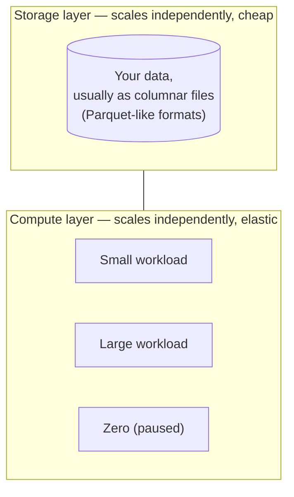
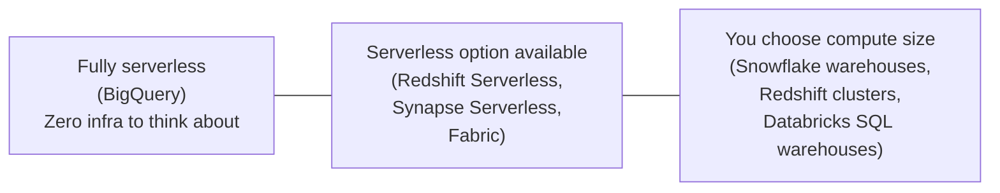

# 01. Cloud Warehousing Overview

*Part of [Part 7 — Cloud Data Platforms](../). Previous: [Part 6 — Security](../../06-security/).*

Before diving into each platform individually, this module gives you the
map — a comparison you can refer back to throughout the rest of Part 7, and
in real job-hunting or architecture-decision situations.

## The one idea that unlocks all of them: separation of storage and compute

Recall this from [Part 5, Module 05](../../05-performance-and-optimization/05-distributed-query-engines/):
modern cloud warehouses use a **shared-disk** architecture, where storage
and compute scale independently. This single architectural choice explains
almost everything distinctive about how these platforms are priced, scaled,
and operated — keep it in mind as the throughline for this entire part.



## The five platforms this part covers

| Platform | Provider | Storage/compute model | Primary pricing model |
|---|---|---|---|
| [BigQuery](../02-google-bigquery/) | Google Cloud | Fully serverless — no compute to manage at all | On-demand (per byte scanned) or flat-rate (capacity) |
| [Snowflake](../03-snowflake/) | Independent (multi-cloud) | Virtual warehouses (compute) separate from storage | Provisioned (per compute-second, "credits") |
| [Redshift](../04-aws-redshift/) | Amazon Web Services | Clusters (provisioned) or Redshift Serverless | Provisioned (per node-hour) or serverless (per capacity used) |
| [Synapse / Fabric](../05-azure-synapse-and-fabric/) | Microsoft Azure | Dedicated pools (provisioned) or serverless SQL pools | Both provisioned and on-demand options exist |
| [Databricks SQL](../06-databricks-sql/) | Independent (multi-cloud) | SQL warehouses on top of a lakehouse (Delta Lake) | Provisioned (per compute-second, "DBUs") |

Recall the two pricing models from
[Part 5, Module 06](../../05-performance-and-optimization/06-cloud-cost-optimization/):
**on-demand** (pay per byte scanned) vs. **provisioned** (pay per compute
time). BigQuery is the purest example of on-demand; Snowflake, Redshift
(in cluster mode), and Databricks lean provisioned; several platforms now
offer both models, letting you choose per workload.

## SQL dialect differences: real, but shallower than they first appear

Every platform in this part supports standard ANSI SQL for the vast
majority of what you learned in Parts 1–4 — `SELECT`, `JOIN`, `GROUP BY`,
window functions, CTEs all work essentially identically everywhere. The
differences that *do* exist cluster around a few specific areas, which each
platform's module will call out explicitly:

- **Date/time function names** (recall the portability note from
  [Part 1, Module 08](../../01-sql-foundations/08-string-date-numeric-functions/))
- **Semi-structured data syntax** (each platform has its own JSON/nested
  data functions, building on the concepts from
  [Part 2, Module 06](../../02-intermediate-advanced-sql/06-json-and-semistructured-data/))
- **DDL for partitioning/clustering** (each platform names and configures
  this differently, though the underlying concept from
  [Part 5, Module 03](../../05-performance-and-optimization/03-partitioning-and-clustering/) is shared)
- **Platform-specific system tables** for cost/usage monitoring (each has
  its own equivalent of `information_schema`, extended with usage/billing data)

> 💡 **The right mental model**: think of yourself as fluent in "SQL," with
> each platform being closer to a strong regional accent than a different
> language. Everything you've learned through Part 6 transfers directly;
> what's left to learn per-platform is a relatively small, learnable set of
> platform-specific vocabulary and configuration — not a restart.

## Serverless vs. cluster/warehouse-based: a spectrum, not a binary



"Serverless" here doesn't mean "no servers exist" (they always do,
somewhere) — it means **you never provision, size, or manage them
yourself**; the platform handles it entirely behind the scenes, and you
simply pay for usage. Non-serverless (or optionally-serverless) platforms
give you more direct control over compute size and cost predictability, at
the cost of needing to actually think about and manage that sizing decision
yourself (recall [Part 5, Module 06's](../../05-performance-and-optimization/06-cloud-cost-optimization/)
"right-size your compute" guidance).

## Getting hands-on: free tiers, as of this writing

Each platform's module includes setup guidance, but here's the landscape at a glance:

- **BigQuery**: Google Cloud's free tier includes a genuinely usable amount
  of free query processing every month, ongoing (not just a trial).
- **Snowflake**: time-limited free trial credits for new accounts.
- **Redshift**: AWS Free Tier includes limited Redshift Serverless usage for new accounts.
- **Synapse/Fabric**: Azure free trial credits, plus Fabric's own trial capacity.
- **Databricks**: a free "Community Edition" with reduced capacity, plus
  trial credits on the full platform.

> ⚠️ **Always double-check current free-tier terms directly on the
> provider's site before starting** — cloud free-tier offers change
> frequently, and you're responsible for any charges beyond what's covered
> if you exceed a trial's limits. Set up billing alerts as a safety net
> regardless of which platform you try.

## ✅ Try it yourself

There's no SQL for this overview module — treat it as your reference map.
Before moving to the next module, revisit the comparison table above and
try to explain, in your own words, why BigQuery's pricing model (bytes
scanned) makes partition pruning a *direct* cost lever in a way that's less
immediately true on a fixed-size Snowflake warehouse running for a fixed
block of time.

### Exercises

1. A team wants to avoid ever thinking about compute sizing or cluster
   management at all, and is comfortable with variable, usage-based
   billing. Which platforms from the comparison table best fit that preference?
2. A team wants predictable, fixed monthly costs and is willing to manage
   compute sizing themselves to get there. Which platforms/pricing models fit better?
3. Explain why "SQL dialect differences" are described in this module as
   "real, but shallower than they first appear" — what specifically carries
   over unchanged, and what specifically tends to differ?

<details>
<summary>💡 Solutions</summary>

```text
1. BigQuery (fully serverless by default) is the clearest fit. Redshift
   Serverless, Synapse Serverless SQL pools, and Fabric's consumption model
   also fit this preference if a team prefers to stay within a
   provider they're already using elsewhere (AWS or Azure, respectively).

2. Snowflake, Redshift (provisioned clusters), and Databricks SQL warehouses
   all let a team choose a fixed compute size and run it continuously (or
   on a predictable schedule), trading the flexibility of pure
   pay-per-use for more predictable, budgetable costs — at the cost of
   needing to actively manage and right-size that compute themselves.

3. Everything from Parts 1-4 (SELECT, JOIN, GROUP BY, window functions,
   CTEs, subqueries) works essentially identically across all these
   platforms, because they all implement the same ANSI SQL core. What
   differs is a smaller, specific set of areas: date/time function names,
   semi-structured (JSON/nested) data syntax, partitioning/clustering DDL,
   and platform-specific system tables for cost and metadata — genuine
   differences, but a small vocabulary to learn on top of a much larger
   shared foundation, not a fundamentally different language.
```
</details>

## 🧠 Quick check

<details>
<summary>Q: What single architectural idea explains most of what's distinctive about how these platforms are priced and operated?</summary>

Separation of storage and compute (a shared-disk architecture, recapped
from Part 5, Module 05) — it's what allows fully serverless, usage-based
pricing to exist at all, and what lets provisioned platforms let you resize
or pause compute without touching or moving any actual data.
</details>

<details>
<summary>Q: Does "serverless" mean there are no servers involved?</summary>

No — servers always exist somewhere. "Serverless" means the platform
handles provisioning, sizing, and scaling compute entirely on your behalf,
so you never directly manage server/cluster infrastructure yourself — you
just submit queries and pay for what you use.
</details>

---
⬅ [Back to Part 7](../) | ➡ Next: [02. Google BigQuery](../02-google-bigquery/)
