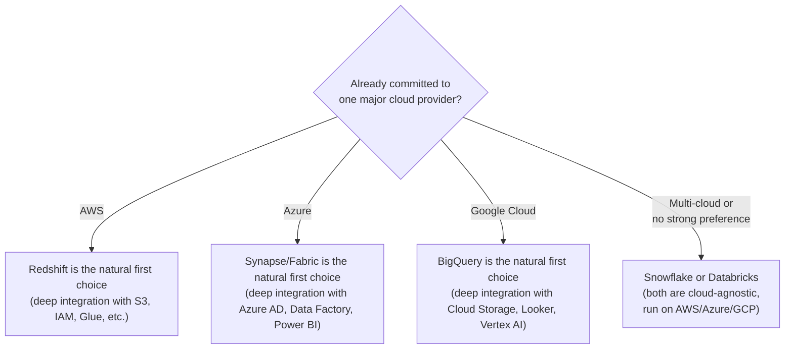

# 07. Choosing the Right Platform

*Part of [Part 7 — Cloud Data Platforms](../). Previous: [06. Databricks SQL](../06-databricks-sql/).*

This closing module of Part 7 is deliberately not hands-on SQL — it's a
decision-making framework, and a genuinely common interview and real-job
question: "which platform would you recommend, and why?" A good answer
demonstrates you understand the tradeoffs, not just the syntax.

## There is rarely a single "best" platform — only a best fit

Every platform in this part can solve the vast majority of data
engineering problems adequately. The real skill is matching a platform's
specific strengths to a specific organization's specific constraints —
existing cloud investment, team skills, workload shape, and budget model.

## Decision factor 1: existing cloud ecosystem

The single strongest practical signal, in real organizations: **which cloud
provider does the company already use for everything else?**



Integration cost is real and often underestimated: authentication, network
security, billing consolidation, and existing team tooling all get
meaningfully easier when you stay within an organization's established
cloud provider, even if a competing platform might be marginally "better"
on some abstract technical dimension.

## Decision factor 2: workload shape

Recall the pricing models from
[Part 5, Module 06](../../05-performance-and-optimization/06-cloud-cost-optimization/)
and [Module 01](../01-cloud-warehousing-overview/):

| Workload pattern | Better-suited pricing model | Platforms that fit well |
|---|---|---|
| Bursty, unpredictable, hard to forecast | On-demand (pay per byte/TB scanned) | BigQuery, Synapse/Databricks/Redshift serverless options |
| Steady, predictable, high-volume, continuous | Provisioned (fixed compute, resized deliberately) | Snowflake, Redshift/Synapse dedicated pools, Databricks SQL warehouses |
| Heavy mixed SQL + data science/ML on the same data | Lakehouse-native | Databricks, Fabric |

## Decision factor 3: team skills and existing tooling

- A team already fluent in **T-SQL** (from SQL Server experience) will ramp
  up on Synapse/Fabric faster than an unfamiliar dialect.
- A team already doing significant **Python/Spark** data science work
  benefits disproportionately from Databricks' unified SQL-and-code environment.
- A team with **no strong existing preference** benefits most from
  BigQuery's zero-infrastructure-to-learn serverless model, or Snowflake's
  widely-documented, heavily-adopted approach — both have particularly
  large communities and learning resources.

## Decision factor 4: semi-structured/nested data needs

Recall [Part 2, Module 06](../../02-intermediate-advanced-sql/06-json-and-semistructured-data/)
and each platform's specific approach ([Module 02](../02-google-bigquery/)'s
native `STRUCT`/`ARRAY`, [Module 03](../03-snowflake/)'s `VARIANT`). If a
huge proportion of your source data is deeply nested (event streams,
complex API responses), BigQuery's native nested/repeated columns offer a
particularly natural fit without flattening data first.

## Decision factor 5: governance and compliance requirements

Recall [Part 6](../../06-security/) in full. Organizations with strict,
centralized governance needs across *many* different data assets (not just
SQL tables — files, ML models, dashboards) benefit from platforms with
unified governance layers, like Databricks' Unity Catalog
([Module 06](../06-databricks-sql/)) — a single system enforcing access
control and generating lineage across everything, rather than needing to
stitch together governance separately per tool.

## A worked example: applying the framework

**Scenario**: A mid-sized e-commerce company (much like our fictional
NorthStar Retail) already runs its application infrastructure on AWS, has
a small data team comfortable with standard SQL, mostly structured
transactional data (orders, customers, payments — exactly our sample
schema), and needs predictable monthly costs for board/budget planning.

**Reasoning through the framework**:
1. Existing ecosystem → AWS → **Redshift** is the natural starting point.
2. Workload shape → predictable, steady BI/reporting workload → favors
   Redshift's provisioned option (or Redshift Serverless if usage is
   genuinely variable) for **cost predictability**.
3. Team skills → standard SQL, no special Python/Spark or T-SQL needs →
   no reason to look outside the natural AWS choice.
4. Semi-structured data needs → minimal (mostly structured, relational
   data, matching our exact sample schema) → doesn't push toward BigQuery's
   nested-data strengths.
5. Governance needs → standard, not spanning ML/files/dashboards uniformly
   → doesn't specifically require Databricks' unified catalog.

**Recommendation**: Redshift (or Redshift Serverless), with a clear,
specific justification tied to their actual constraints — exactly the kind
of reasoning an interviewer or a real stakeholder wants to see, rather than
"Redshift is popular" or "I've heard good things about Snowflake."

## When to deliberately choose against the "obvious" ecosystem fit

Sometimes the framework points *away* from the default cloud-ecosystem
choice, and that's a legitimate, defensible call too:

- A company on Azure doing **heavy** data science/ML work might still
  choose Databricks over Synapse, because the lakehouse-native, unified
  SQL-and-code workflow outweighs the marginal integration friction of a
  slightly less "native" platform — Databricks runs on Azure too, so the
  integration cost is smaller than choosing a platform on a different cloud entirely.
- A company on AWS with almost entirely nested/semi-structured event data
  might still evaluate BigQuery (which requires operating cross-cloud)
  specifically for its native nested data modeling strengths, if that
  outweighs the added operational complexity of a secondary cloud relationship.

The point isn't that any single factor always wins — it's that you should
be able to **name the tradeoff explicitly** and justify a choice against
competing factors, rather than defaulting unreflectively to either "always
pick the popular one" or "always pick the ecosystem match."

## ✅ Try it yourself

There's no SQL here — practice the reasoning itself. For each scenario
below, work through the five decision factors and form a recommendation
with an explicit justification, the way the worked example above did.

### Exercises

1. A healthcare startup, brand new, choosing their cloud provider and data
   platform simultaneously, with strict HIPAA compliance requirements
   ([Part 6, Module 05](../../06-security/05-compliance-and-governance/)),
   a small team with general SQL skills but no dialect preference, and
   entirely structured patient/billing data. What would you recommend, and why?
2. An established company already fully invested in Google Cloud, whose
   core need is real-time analytics over massive volumes of nested JSON
   event data from a mobile app, with a highly variable, spiky query load
   (busy during app usage peaks, quiet overnight). What would you
   recommend, and why?
3. A data science-heavy team building ML models directly on raw sensor
   data, who also need a small number of SQL-based dashboards for
   business stakeholders — currently on no particular cloud. What would
   you recommend, and why?

<details>
<summary>💡 Solutions (there's no single "correct" answer — evaluate your reasoning against this one)</summary>

```text
1. Since they're choosing the cloud provider AND platform together, with
   no existing ecosystem constraint, the decision comes down to team skills
   (no dialect preference — any platform works) and compliance needs.
   Any of the major platforms can meet HIPAA requirements with proper
   configuration, so this becomes more a question of overall
   simplicity for a small team: BigQuery's fully serverless model (Module
   02) removes an entire category of operational complexity (no compute
   sizing/management at all) that a small startup team benefits from,
   letting them focus engineering effort on their actual product rather
   than platform administration.

2. This scenario strongly matches BigQuery's specific strengths: existing
   GCP investment (ecosystem fit), native nested/repeated column support
   for JSON event data (Module 02) avoiding costly flattening, and fully
   serverless on-demand pricing that naturally handles a highly variable,
   spiky load without needing to manually size or pre-provision compute
   for peak capacity that sits idle overnight.

3. This matches Databricks well: heavy ML work on raw data benefits
   directly from Spark's full programming language support alongside SQL
   on the same underlying Delta Lake tables (Module 06), and the "small
   number of SQL dashboards" need is well served by Databricks SQL without
   requiring a completely separate warehouse platform — one platform
   serving both the heavy ML workload and the lighter BI need from a single
   copy of data.
```
</details>

## 🎉 Part 7 complete!

You can now map every concept from Parts 1–6 onto BigQuery, Snowflake,
Redshift, Synapse/Fabric, and Databricks SQL — and reason explicitly about
which platform fits a given situation, rather than just knowing one
platform's syntax. Next: [Part 8 — Real-World Projects](../../08-real-world-projects/),
where you'll build a complete, end-to-end pipeline yourself.

## 🧠 Quick check

<details>
<summary>Q: Why is "existing cloud ecosystem" often the strongest practical factor in a real platform decision, even when a competing platform might be technically superior on some dimension?</summary>

Integration cost is real and often underestimated — authentication,
networking, billing, and existing team tooling all become meaningfully
simpler and cheaper when a new platform sits within an organization's
already-established cloud provider, frequently outweighing a marginal
technical advantage from a platform requiring a separate, additional cloud relationship.
</details>

<details>
<summary>Q: What does it mean to say there's "no single best platform, only a best fit"?</summary>

Every major platform in this part can adequately handle the vast majority
of real data engineering workloads — the meaningful differences are around
which platform's specific strengths (pricing model, semi-structured data
handling, governance approach, ecosystem integration) best match a given
organization's actual, specific constraints, not a universal ranking where
one platform wins in every situation.
</details>

---
⬅ [Back to Part 7](../) | ➡ Next: [Part 8 — Real-World Projects](../../08-real-world-projects/)
