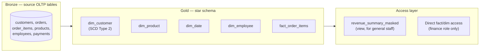

# 01. Capstone: Build a Mini Data Warehouse

*Part of [Part 8 — Real-World Projects](../). Previous: [Part 7 — Cloud Data Platforms](../../07-cloud-data-platforms/).*

This is the project. Every concept from Parts 1–7 comes together here: you
will take NorthStar Retail's raw OLTP data and build a complete,
production-style analytical pipeline — a star schema with a properly
versioned SCD Type 2 dimension, an idempotent incremental fact load, data
quality tests, performance tuning, and access control on top. When you
finish, you'll have a genuine, explainable, portfolio-worthy project.

> 💡 **Recommended approach**: don't just read and copy-paste. Type each
> step out yourself, run it against your own `northstar` database, inspect
> the results, and only move to the next step once you understand *why* it
> works — this is the single best way to consolidate everything you've
> learned in this repo.

## Project requirements

We're building analytics infrastructure for NorthStar Retail's leadership
team, who need to answer questions like:

- "What's our monthly revenue trend, by product category?"
- "Who are our highest-value customers, and how has that changed as
  customers moved between countries?" (this specific requirement is *why*
  we need SCD Type 2 — see below)
- "Which sales employees are driving the most revenue?"
- The pipeline must be safe to **re-run** every day without creating
  duplicate or corrupted data (idempotency, from [Part 4](../../04-data-engineering-with-sql/02-sql-for-pipelines/)).
- Only the finance team should see raw payment amounts; everyone else
  should see revenue only in aggregate.

## Architecture



We're skipping an explicit silver layer for this project's scope (our
source data is already reasonably clean, thanks to the constraints in
[`datasets/postgres/00_schema.sql`](../../datasets/postgres/00_schema.sql))
— in a real project with messier sources, you'd add one, exactly as
described in [Part 3, Module 04](../../03-database-design-and-modeling/04-modern-modeling-patterns/).

## Step 1 — Create the warehouse schema

```sql
CREATE SCHEMA IF NOT EXISTS warehouse;
SET search_path TO warehouse, northstar;
```

## Step 2 — Build `dim_date`

Recall [Part 3, Module 02](../../03-database-design-and-modeling/02-dimensional-modeling/) —
build this once, up front, covering a wide date range:

```sql
CREATE TABLE warehouse.dim_date (
    date_key     INTEGER PRIMARY KEY,
    full_date    DATE NOT NULL,
    year         INTEGER NOT NULL,
    quarter      INTEGER NOT NULL,
    month        INTEGER NOT NULL,
    month_name   VARCHAR(10) NOT NULL,
    day_of_month INTEGER NOT NULL,
    day_name     VARCHAR(10) NOT NULL,
    is_weekend   BOOLEAN NOT NULL
);

INSERT INTO warehouse.dim_date
SELECT
    TO_CHAR(d, 'YYYYMMDD')::INTEGER,
    d,
    EXTRACT(YEAR FROM d)::INTEGER,
    EXTRACT(QUARTER FROM d)::INTEGER,
    EXTRACT(MONTH FROM d)::INTEGER,
    TRIM(TO_CHAR(d, 'Month')),
    EXTRACT(DAY FROM d)::INTEGER,
    TRIM(TO_CHAR(d, 'Day')),
    EXTRACT(DOW FROM d) IN (0, 6)
FROM generate_series('2023-01-01'::DATE, '2026-12-31'::DATE, '1 day') AS d;
```

## Step 3 — Build `dim_product` and `dim_employee` (simple, no history needed)

These change rarely enough in our scenario that we'll treat them as **SCD
Type 1** (recall [Part 3, Module 02](../../03-database-design-and-modeling/02-dimensional-modeling/)) —
overwrite on change, no history kept — a deliberate, documented choice, not an oversight:

```sql
CREATE TABLE warehouse.dim_product (
    product_key     INTEGER PRIMARY KEY,   -- same as northstar.products.product_id (SCD1: 1:1, no versioning)
    product_name    VARCHAR(100),
    category        VARCHAR(50),
    unit_price      NUMERIC(10,2),
    is_discontinued BOOLEAN
);

CREATE TABLE warehouse.dim_employee (
    employee_key  INTEGER PRIMARY KEY,
    full_name     VARCHAR(100),
    department    VARCHAR(50),
    manager_name  VARCHAR(100)             -- flattened/denormalized, per Part 3 Module 02
);

-- Idempotent load for both — safe to re-run any time (Part 4, Module 02)
INSERT INTO warehouse.dim_product (product_key, product_name, category, unit_price, is_discontinued)
SELECT product_id, product_name, category, unit_price, is_discontinued
FROM northstar.products
ON CONFLICT (product_key) DO UPDATE SET
    product_name = EXCLUDED.product_name,
    category = EXCLUDED.category,
    unit_price = EXCLUDED.unit_price,
    is_discontinued = EXCLUDED.is_discontinued;

INSERT INTO warehouse.dim_employee (employee_key, full_name, department, manager_name)
SELECT e.employee_id, e.full_name, e.department, m.full_name
FROM northstar.employees e
LEFT JOIN northstar.employees m ON e.manager_id = m.employee_id
ON CONFLICT (employee_key) DO UPDATE SET
    full_name = EXCLUDED.full_name,
    department = EXCLUDED.department,
    manager_name = EXCLUDED.manager_name;
```

## Step 4 — Build `dim_customer` as a true SCD Type 2

This is the heart of the capstone. Recall the full pattern from
[Part 3, Module 02](../../03-database-design-and-modeling/02-dimensional-modeling/):

```sql
CREATE TABLE warehouse.dim_customer (
    customer_key   SERIAL PRIMARY KEY,     -- surrogate key: unique per VERSION of a customer
    customer_id    INTEGER NOT NULL,       -- natural key: stable across versions
    full_name      VARCHAR(100),
    country        VARCHAR(56),
    is_active      BOOLEAN,
    valid_from     DATE NOT NULL,
    valid_to       DATE,                   -- NULL = current version
    is_current     BOOLEAN NOT NULL
);
CREATE INDEX idx_dim_customer_natural_key ON warehouse.dim_customer(customer_id, is_current);
```

**Initial load** — every customer's first version:

```sql
INSERT INTO warehouse.dim_customer (customer_id, full_name, country, is_active, valid_from, valid_to, is_current)
SELECT
    customer_id,
    first_name || ' ' || last_name,
    country,
    is_active,
    signup_date,
    NULL,
    true
FROM northstar.customers;
```

**The SCD Type 2 merge procedure** — this is what you'd run on every
incremental pipeline execution, and it must be **idempotent**
(re-running it against unchanged source data must not create new,
duplicate versions):

```sql
CREATE OR REPLACE PROCEDURE warehouse.load_dim_customer_scd2()
LANGUAGE plpgsql
AS $$
BEGIN
    -- Step A: expire current dimension rows whose source data has changed
    UPDATE warehouse.dim_customer dc
    SET valid_to = CURRENT_DATE - 1, is_current = false
    FROM northstar.customers src
    WHERE dc.customer_id = src.customer_id
      AND dc.is_current = true
      AND (dc.country != src.country OR dc.is_active != src.is_active OR dc.full_name != (src.first_name || ' ' || src.last_name));

    -- Step B: insert a new current version for every customer that was just expired
    INSERT INTO warehouse.dim_customer (customer_id, full_name, country, is_active, valid_from, valid_to, is_current)
    SELECT
        src.customer_id,
        src.first_name || ' ' || src.last_name,
        src.country,
        src.is_active,
        CURRENT_DATE,
        NULL,
        true
    FROM northstar.customers src
    WHERE NOT EXISTS (
        SELECT 1 FROM warehouse.dim_customer dc
        WHERE dc.customer_id = src.customer_id AND dc.is_current = true
    );

    COMMIT;
END;
$$;

CALL warehouse.load_dim_customer_scd2();
```

Notice this procedure is genuinely idempotent by construction: Step A only
expires rows where a *real difference* exists (comparing current dimension
values against current source values), and Step B only inserts where
*no current row exists at all* (covering both brand-new customers and
customers just expired in Step A). Running this procedure twice in a row
with no source changes does nothing the second time — exactly the
[Part 4, Module 02](../../04-data-engineering-with-sql/02-sql-for-pipelines/) idempotency guarantee this pipeline requires.

**Try it**: change a customer's country in the source table, then re-run
the procedure, and observe a new version appear while the old one is preserved:

```sql
UPDATE northstar.customers SET country = 'Japan' WHERE customer_id = 1;
CALL warehouse.load_dim_customer_scd2();

SELECT customer_key, customer_id, country, valid_from, valid_to, is_current
FROM warehouse.dim_customer
WHERE customer_id = 1
ORDER BY valid_from;
```

## Step 5 — Build `fact_order_items` with an incremental load

Recall grain from [Part 3, Module 02](../../03-database-design-and-modeling/02-dimensional-modeling/):
this fact table's grain is **one order line item**. Critically, it must
join to the dimension version that was **current at the time of the
order** — not necessarily today's current version — which is exactly why
`dim_customer` needed `valid_from`/`valid_to` in the first place:

```sql
CREATE TABLE warehouse.fact_order_items (
    order_item_key  INTEGER PRIMARY KEY,   -- reuse the source's order_item_id as a stable identifier
    order_id        INTEGER NOT NULL,
    customer_key    INTEGER NOT NULL REFERENCES warehouse.dim_customer(customer_key),
    product_key     INTEGER NOT NULL REFERENCES warehouse.dim_product(product_key),
    employee_key    INTEGER REFERENCES warehouse.dim_employee(employee_key),
    date_key        INTEGER NOT NULL REFERENCES warehouse.dim_date(date_key),
    quantity        INTEGER NOT NULL,
    unit_price      NUMERIC(10,2) NOT NULL,
    line_total      NUMERIC(12,2) NOT NULL
);
CREATE INDEX idx_fact_order_items_date ON warehouse.fact_order_items(date_key);
CREATE INDEX idx_fact_order_items_customer ON warehouse.fact_order_items(customer_key);

CREATE OR REPLACE PROCEDURE warehouse.load_fact_order_items()
LANGUAGE plpgsql
AS $$
BEGIN
    INSERT INTO warehouse.fact_order_items
        (order_item_key, order_id, customer_key, product_key, employee_key, date_key, quantity, unit_price, line_total)
    SELECT
        oi.order_item_id,
        o.order_id,
        dc.customer_key,
        oi.product_id,
        o.employee_id,
        TO_CHAR(o.order_date, 'YYYYMMDD')::INTEGER,
        oi.quantity,
        oi.unit_price,
        oi.quantity * oi.unit_price
    FROM northstar.order_items oi
    JOIN northstar.orders o ON oi.order_id = o.order_id
    -- Join to the dim_customer version that was CURRENT on the order's date —
    -- this is the entire point of tracking valid_from/valid_to (Part 3, Module 02)
    JOIN warehouse.dim_customer dc
        ON o.customer_id = dc.customer_id
        AND o.order_date >= dc.valid_from
        AND (dc.valid_to IS NULL OR o.order_date <= dc.valid_to)
    ON CONFLICT (order_item_key) DO UPDATE SET
        quantity = EXCLUDED.quantity,
        unit_price = EXCLUDED.unit_price,
        line_total = EXCLUDED.line_total;

    COMMIT;
END;
$$;

CALL warehouse.load_fact_order_items();
```

This `ON CONFLICT` upsert makes the fact load safe to re-run — the same
idempotency guarantee applied to a fact table this time, exactly per
[Part 4, Module 02](../../04-data-engineering-with-sql/02-sql-for-pipelines/).

## Step 6 — Data quality tests

Recall [Part 4, Module 04](../../04-data-engineering-with-sql/04-data-quality-and-testing/) —
these should return **zero rows**:

```sql
-- Every fact row's foreign keys must resolve (referential integrity)
SELECT f.order_item_key
FROM warehouse.fact_order_items f
LEFT JOIN warehouse.dim_customer dc ON f.customer_key = dc.customer_key
WHERE dc.customer_key IS NULL;

-- Exactly one CURRENT row per natural customer_id — never zero, never more than one
SELECT customer_id, COUNT(*) AS current_versions
FROM warehouse.dim_customer
WHERE is_current = true
GROUP BY customer_id
HAVING COUNT(*) != 1;

-- line_total should always equal quantity * unit_price
SELECT order_item_key FROM warehouse.fact_order_items
WHERE line_total != quantity * unit_price;
```

## Step 7 — Performance: confirm indexes are being used

Recall [Part 5](../../05-performance-and-optimization/):

```sql
EXPLAIN ANALYZE
SELECT dd.year, dd.month, SUM(f.line_total) AS revenue
FROM warehouse.fact_order_items f
JOIN warehouse.dim_date dd ON f.date_key = dd.date_key
GROUP BY dd.year, dd.month
ORDER BY dd.year, dd.month;
```

Confirm the plan uses `idx_fact_order_items_date` where appropriate, and
consider (as an extension exercise) partitioning `fact_order_items` by
`date_key` range, exactly as taught in
[Part 5, Module 03](../../05-performance-and-optimization/03-partitioning-and-clustering/),
if this were a much larger, real-scale fact table.

## Step 8 — Security: restrict raw revenue access

Recall [Part 6](../../06-security/):

```sql
CREATE ROLE finance_team;
CREATE ROLE general_staff;

-- Finance sees everything
GRANT SELECT ON warehouse.fact_order_items, warehouse.dim_customer TO finance_team;

-- General staff only sees aggregated, non-customer-identifiable revenue —
-- a masking view, per Part 6, Module 04
CREATE VIEW warehouse.revenue_by_category_month AS
SELECT
    dd.year, dd.month, dp.category,
    SUM(f.line_total) AS revenue
FROM warehouse.fact_order_items f
JOIN warehouse.dim_date dd ON f.date_key = dd.date_key
JOIN warehouse.dim_product dp ON f.product_key = dp.product_key
GROUP BY dd.year, dd.month, dp.category;

GRANT SELECT ON warehouse.revenue_by_category_month TO general_staff;
-- general_staff never gets direct access to fact_order_items or dim_customer at all
```

## Step 9 — Answer the original business questions

```sql
-- "What's our monthly revenue trend, by product category?"
SELECT dd.year, dd.month, dp.category, SUM(f.line_total) AS revenue
FROM warehouse.fact_order_items f
JOIN warehouse.dim_date dd ON f.date_key = dd.date_key
JOIN warehouse.dim_product dp ON f.product_key = dp.product_key
GROUP BY dd.year, dd.month, dp.category
ORDER BY dd.year, dd.month, revenue DESC;

-- "Who are our highest-value customers?" (using each customer's CURRENT identity)
SELECT dc.customer_id, dc.full_name, dc.country, SUM(f.line_total) AS lifetime_value
FROM warehouse.fact_order_items f
JOIN warehouse.dim_customer dc ON f.customer_key = dc.customer_key
GROUP BY dc.customer_id, dc.full_name, dc.country
ORDER BY lifetime_value DESC
LIMIT 10;

-- "Which sales employees are driving the most revenue?"
SELECT de.full_name, SUM(f.line_total) AS revenue
FROM warehouse.fact_order_items f
JOIN warehouse.dim_employee de ON f.employee_key = de.employee_key
GROUP BY de.full_name
ORDER BY revenue DESC;
```

## What you just built

Look back at what this capstone actually exercised: **Part 1's** joins and
aggregation, **Part 2's** window functions and transactions, **Part 3's**
star schema and SCD Type 2 design, **Part 4's** idempotent incremental
loading, **Part 5's** indexing and `EXPLAIN ANALYZE`, and **Part 6's**
least-privilege access control with masking views. This is a genuinely
representative slice of real, professional data engineering work.

## ✅ Extension challenges

Push further on your own — these are open-ended, no solutions provided,
exactly like real work:

1. Convert the daily procedures in this module into an orchestrated
   pipeline description (recall [Part 4, Module 03](../../04-data-engineering-with-sql/03-orchestration-basics/)) —
   write out the dbt-style model files and `ref()` dependencies you'd need.
2. Add a `dim_geography` snowflake dimension (recall
   [Part 3, Module 02](../../03-database-design-and-modeling/02-dimensional-modeling/))
   splitting `country` out of `dim_customer` into its own table with
   region/continent attributes.
3. Add a freshness data quality test (recall
   [Part 4, Module 04](../../04-data-engineering-with-sql/04-data-quality-and-testing/))
   that fails if `fact_order_items` hasn't been loaded with new data in the last 24 hours.
4. Partition `fact_order_items` by `date_key` range (recall
   [Part 5, Module 03](../../05-performance-and-optimization/03-partitioning-and-clustering/))
   and confirm partition pruning with `EXPLAIN ANALYZE`.
5. Rewrite Steps 4–5 of this capstone using BigQuery or Snowflake syntax
   (recall [Part 7](../../07-cloud-data-platforms/)) instead of PostgreSQL.

---
⬅ [Back to Part 8](../) | ➡ Next: [02. Case Studies](../02-case-studies/)
