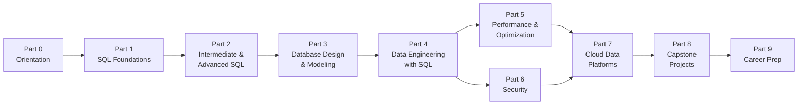

# 🚀 SQL for Data Engineers — Zero to Hero

A complete, hands-on, **free** learning path that takes you from *"what is a database?"*
to confidently designing, building, securing, and optimizing SQL-based data pipelines on
modern cloud data platforms.

This is not a list of syntax to memorize. It's a guided path with **definitions, diagrams,
worked examples, exercises with solutions, and real capstone projects** — everything runs
against one consistent sample dataset so you build real intuition instead of jumping between
disconnected toy examples.

> 💡 **New to programming or databases entirely?** Good — this repo assumes zero prior
> knowledge. Every technical term is defined the first time it's used, in plain English,
> before we ever show you a line of code.

---

## 🧭 How this repo works

- **One dataset, the whole way through.** [`datasets/`](datasets/) contains a small fictional
  e-commerce business, *NorthStar Retail*. You set it up once in Part 0 and reuse it in every
  single lesson, all the way to the capstone projects.
- **Every module follows the same shape**: a plain-English explanation → a diagram →
  worked examples → a "Try it yourself" exercise → a collapsible solution → a mini quiz.
- **Diagrams everywhere.** Entity-relationship diagrams, query execution flows, join
  diagrams, and architecture diagrams are all written in [Mermaid](https://mermaid.js.org/),
  which GitHub renders automatically — no tools required.
- **Definitions are never assumed.** Look for blocks like this:

  > **New term — index**: a data structure that lets the database find rows without
  > scanning the whole table, similar to the index at the back of a textbook.

- **Progress checklist.** Fork this repo and check off `- [ ]` boxes as you complete modules
  (see the syllabus table below) — GitHub renders checkboxes as clickable in your fork.
- **Commits are incremental.** This repo is built and improved module by module — check the
  commit history if you want to see how a topic evolved.

## ▶️ Getting started

1. Read [`00-orientation`](00-orientation/) — what data engineering is, why SQL is
   central to it, and how to install PostgreSQL (free) to run every example on your own machine.
2. Load the sample dataset: [`datasets/`](datasets/).
3. Start at [Part 1, Module 1](01-sql-foundations/01-databases-101/) and work down the
   syllabus in order — each part builds on the last.
4. Prefer a fully-detailed, time-estimated version of the path? See [`SYLLABUS.md`](SYLLABUS.md).

---

## 📚 Full syllabus

### Part 0 — Orientation
- [ ] [What is data engineering, and where does SQL fit?](00-orientation/)

### Part 1 — SQL Foundations
*Goal: read and write correct, useful SQL queries against a real schema.*
- [ ] [01. Databases 101](01-sql-foundations/01-databases-101/) — what a database/RDBMS/table actually is
- [ ] [02. Basic Queries](01-sql-foundations/02-basic-queries/) — `SELECT`, `WHERE`, `ORDER BY`, `LIMIT`
- [ ] [03. Filtering & Operators](01-sql-foundations/03-filtering-and-operators/) — `BETWEEN`, `IN`, `LIKE`, `NULL`
- [ ] [04. Aggregations](01-sql-foundations/04-aggregations/) — `GROUP BY`, `HAVING`, `COUNT/SUM/AVG`
- [ ] [05. Joins](01-sql-foundations/05-joins/) — `INNER/LEFT/RIGHT/FULL/CROSS/SELF` joins
- [ ] [06. Subqueries & CTEs](01-sql-foundations/06-subqueries-and-ctes/)
- [ ] [07. Set Operations](01-sql-foundations/07-set-operations/) — `UNION`, `INTERSECT`, `EXCEPT`
- [ ] [08. String, Date & Numeric Functions](01-sql-foundations/08-string-date-numeric-functions/)
- [ ] [09. CASE & Conditional Logic](01-sql-foundations/09-case-and-conditional-logic/)

### Part 2 — Intermediate & Advanced SQL
*Goal: the SQL that separates a beginner from a working data engineer.*
- [ ] [01. Window Functions](02-intermediate-advanced-sql/01-window-functions/) — `ROW_NUMBER`, `RANK`, `LAG/LEAD`
- [ ] [02. Advanced Aggregation](02-intermediate-advanced-sql/02-advanced-aggregation/) — `ROLLUP`, `CUBE`, `PIVOT`
- [ ] [03. Data Modification & Transactions](02-intermediate-advanced-sql/03-data-modification-and-transactions/) — `INSERT/UPDATE/DELETE/MERGE`, ACID
- [ ] [04. Views & Materialized Views](02-intermediate-advanced-sql/04-views-and-materialized-views/)
- [ ] [05. Stored Procedures, Functions & Triggers](02-intermediate-advanced-sql/05-stored-procedures-functions-triggers/)
- [ ] [06. JSON & Semi-Structured Data](02-intermediate-advanced-sql/06-json-and-semistructured-data/)

### Part 3 — Database Design & Data Modeling
*Goal: design schemas, not just query them.*
- [ ] [01. Normalization & Keys](03-database-design-and-modeling/01-normalization-and-keys/)
- [ ] [02. Dimensional Modeling](03-database-design-and-modeling/02-dimensional-modeling/) — star/snowflake schemas, SCDs
- [ ] [03. Warehouse vs. Lake vs. Lakehouse](03-database-design-and-modeling/03-warehouse-lake-lakehouse/)
- [ ] [04. Modern Modeling Patterns](03-database-design-and-modeling/04-modern-modeling-patterns/) — One Big Table, Data Vault, Medallion architecture

### Part 4 — Data Engineering with SQL
*Goal: use SQL as the engine of real pipelines, not just ad-hoc analysis.*
- [ ] [01. ETL vs. ELT](04-data-engineering-with-sql/01-etl-vs-elt/)
- [ ] [02. SQL for Pipelines](04-data-engineering-with-sql/02-sql-for-pipelines/) — incremental loads, CDC, idempotency
- [ ] [03. Orchestration Basics](04-data-engineering-with-sql/03-orchestration-basics/) — Airflow & dbt concepts
- [ ] [04. Data Quality & Testing](04-data-engineering-with-sql/04-data-quality-and-testing/)

### Part 5 — Performance & Optimization
*Goal: make queries and pipelines fast and cheap, on any scale of data.*
- [ ] [01. How Databases Execute Queries](05-performance-and-optimization/01-how-databases-execute-queries/) — `EXPLAIN`, the query planner
- [ ] [02. Indexing Strategies](05-performance-and-optimization/02-indexing-strategies/)
- [ ] [03. Partitioning & Clustering](05-performance-and-optimization/03-partitioning-and-clustering/)
- [ ] [04. Query Optimization Techniques](05-performance-and-optimization/04-query-optimization-techniques/)
- [ ] [05. Distributed Query Engines](05-performance-and-optimization/05-distributed-query-engines/) — how MPP warehouses scale
- [ ] [06. Cloud Cost Optimization](05-performance-and-optimization/06-cloud-cost-optimization/)

### Part 6 — Security
*Goal: never be the reason your company makes the news.*
- [ ] [01. SQL Injection & Prevention](06-security/01-sql-injection-and-prevention/)
- [ ] [02. Authentication & Authorization](06-security/02-authentication-and-authorization/) — RBAC, least privilege
- [ ] [03. Encryption](06-security/03-encryption/) — at rest, in transit, column-level
- [ ] [04. Data Masking & Row/Column Security](06-security/04-data-masking-and-row-column-security/)
- [ ] [05. Compliance & Governance](06-security/05-compliance-and-governance/) — GDPR, PII, auditing, lineage
- [ ] [06. Secrets Management](06-security/06-secrets-management/)

### Part 7 — Cloud Data Platforms
*Goal: map everything you've learned onto the platforms used in industry today.*
- [ ] [01. Cloud Warehousing Overview](07-cloud-data-platforms/01-cloud-warehousing-overview/)
- [ ] [02. Google BigQuery](07-cloud-data-platforms/02-google-bigquery/)
- [ ] [03. Snowflake](07-cloud-data-platforms/03-snowflake/)
- [ ] [04. AWS Redshift](07-cloud-data-platforms/04-aws-redshift/)
- [ ] [05. Azure Synapse & Fabric](07-cloud-data-platforms/05-azure-synapse-and-fabric/)
- [ ] [06. Databricks SQL](07-cloud-data-platforms/06-databricks-sql/)
- [ ] [07. Choosing the Right Platform](07-cloud-data-platforms/07-choosing-the-right-platform/)

### Part 8 — Real-World Projects
*Goal: prove it to yourself by building something end-to-end.*
- [ ] [01. Capstone: Build a Mini Data Warehouse](08-real-world-projects/01-capstone-mini-warehouse/)
- [ ] [02. Case Studies](08-real-world-projects/02-case-studies/)

### Part 9 — Career Prep
*Goal: get (and pass the interview for) the job.*
- [ ] [01. SQL Interview Questions](09-career-prep/01-interview-questions/)
- [ ] [02. Cheat Sheets](09-career-prep/02-cheat-sheets/)
- [ ] [03. Glossary of Terms](09-career-prep/03-glossary/)
- [ ] [04. Further Resources & What's Next](09-career-prep/04-further-resources/)

---

## 🗺️ What makes this "zero to hero"

| Stage | You'll be able to... |
|-------|------------------------|
| After Part 1 | Write correct `SELECT` queries with filtering, joins, and aggregation |
| After Part 2 | Use window functions and CTEs to solve problems basic SQL can't |
| After Part 3 | Design a normalized OLTP schema *and* a dimensional model for analytics |
| After Part 4 | Explain and build ETL/ELT pipelines, incremental loads, and data quality checks |
| After Part 5 | Read a query plan and fix a slow query with the right index or partitioning strategy |
| After Part 6 | Prevent SQL injection, apply least-privilege access, and design for compliance |
| After Part 7 | Work confidently in BigQuery, Snowflake, Redshift, Fabric, or Databricks SQL |
| After Part 8 | Point to a real, end-to-end project in your portfolio |
| After Part 9 | Walk into a data engineering interview prepared |

## 🤝 Contributing

Found an error, or want to suggest an improvement? Open an issue or a pull request —
this is a living resource.

## 📄 License

Released under the [MIT License](LICENSE) — free to use, share, and adapt for your own
learning or teaching.
