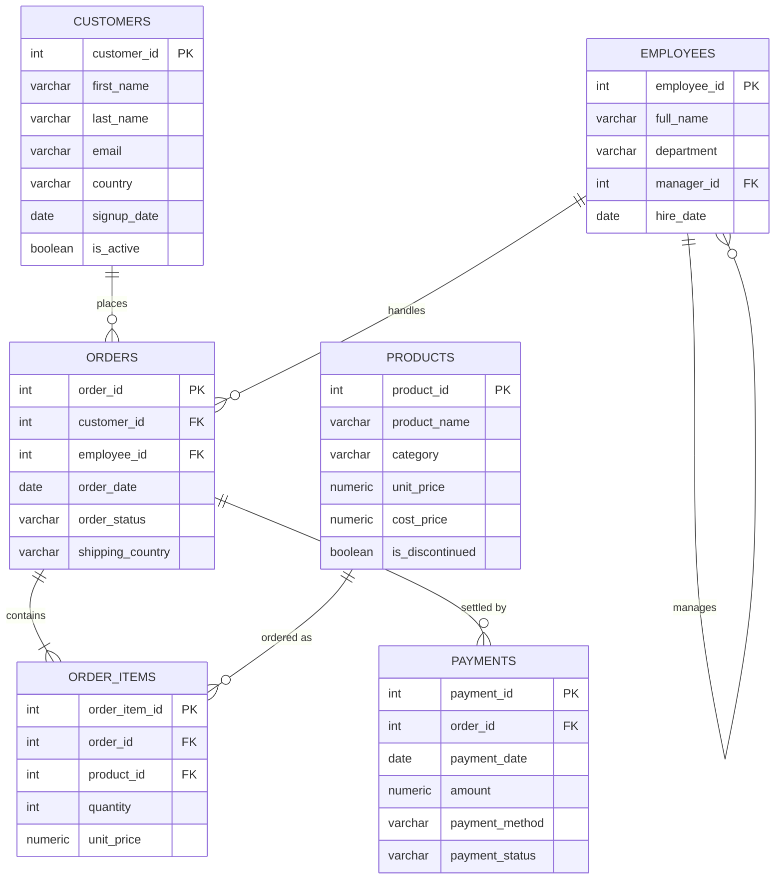

# The NorthStar Retail Dataset

Every lesson, exercise, and capstone project in this repo runs against **one** consistent
sample database: a small fictional e-commerce company called **NorthStar Retail**.

Using a single dataset end-to-end matters: in the real world you build deep intuition about
*your* company's data over months. We can't give you months, but we can give you one dataset
you get to know so well that by Part 5 (Performance) and Part 6 (Security) you're not learning
new tables *and* new concepts at the same time — just the concepts.

## Why an e-commerce dataset?

E-commerce is the "hello world" of data engineering: every company that sells anything online
produces this shape of data, and it naturally contains everything we need to teach:

- **Transactional (OLTP) structure** — customers place orders, orders contain items, payments settle orders.
- **A self-referencing hierarchy** — employees report to managers (great for recursive CTEs later).
- **Enough volume to matter** — thousands of orders, so indexing and query performance lessons are real, not theoretical.
- **A natural path to analytics** — in Part 3 you'll remodel this exact OLTP schema into a star schema data warehouse.

## Entity-Relationship Diagram



## Table reference

| Table          | Grain (one row =)                       | Row count (approx.) |
|----------------|------------------------------------------|----------------------|
| `customers`    | one person who can place orders          | 200                  |
| `employees`    | one staff member (sales rep or manager)  | 12                   |
| `products`     | one sellable product                     | 40                   |
| `orders`       | one order placed by a customer           | ~1,000               |
| `order_items`  | one product line within an order         | ~2,700               |
| `payments`     | one payment attempt against an order     | ~1,050               |

> **New term — grain**: in data modeling, the *grain* of a table is what a single row represents.
> Always know the grain of a table before you write a query against it — it's the #1 cause of
> accidental duplicate rows in joins (more on this in [`01-sql-foundations/05-joins`](../01-sql-foundations/05-joins/)).

## Setting it up

You'll need PostgreSQL running locally or in a free cloud sandbox — full instructions are in
[`00-orientation`](../00-orientation/). Once you have a connection open:

```bash
psql "your-connection-string" -f datasets/postgres/00_schema.sql
psql "your-connection-string" -f datasets/postgres/01_seed_data.sql
```

That creates a `northstar` schema with all six tables, fully populated with realistic,
reproducible sample data (we use `setseed()` so everyone gets the exact same rows — your query
results will match the tutorials exactly).

To wipe it and start over at any point:

```bash
psql "your-connection-string" -f datasets/postgres/02_reset.sql
```

| File | Purpose |
|------|---------|
| [`postgres/00_schema.sql`](postgres/00_schema.sql) | Creates the schema, tables, keys, and constraints |
| [`postgres/01_seed_data.sql`](postgres/01_seed_data.sql) | Generates reproducible sample data |
| [`postgres/02_reset.sql`](postgres/02_reset.sql) | Drops everything so you can rebuild from scratch |
| [`postgres/03_web_events_addon.sql`](postgres/03_web_events_addon.sql) | Adds a `web_events` table with JSONB payloads — only needed for [02-intermediate-advanced-sql/06-json-and-semistructured-data](../02-intermediate-advanced-sql/06-json-and-semistructured-data/) |

Later modules (cloud platforms, JSON/semi-structured data) include their own small add-on
scripts that build on top of this same schema — they'll tell you exactly when to run them.
